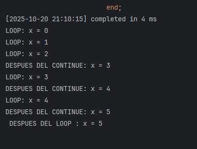
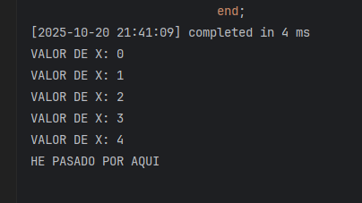
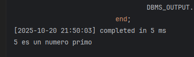

# 📝 PL/SQL Tutorial

# 🧾 PL/SQL — Bloques Anónimos y Funciones Básicas

---

--*******************************************************************************************************
--*                         CLASE 30 :  BEGIN - END BLOQUES ANONIMOS                                    *
--*******************************************************************************************************
```sql
BEGIN
NULL;-- NO HAGAS NADA

END;
```

---

--*******************************************************************************************************
--*                         CLASE 31 :  VISUALIZAR SALIDA POR PANTALLA DBMS_OUTPUT                      *
--*******************************************************************************************************
```sql
SET SERVEROUTPUT ON

BEGIN
    dbms_output.put_line(100);
    dbms_output.put_line('AAAA' || 'XXXX');-- CONCATENACION
END;
```

---

--*******************************************************************************************************
--*                         CLASE 32 :  PRACTICA BLOQUES ANONIMOS                                       *
--*******************************************************************************************************
```sql
SET SERVEROUTPUT ON

BEGIN
    dbms_output.put_line('GEORGE');
    dbms_output.put_line('CHINCHAYAN');
    dbms_output.put_line('GEORGE'
                         || ' '
                         || 'CHINCHAYAN');
END;
```

---

--*******************************************************************************************************
--*                         CLASE 33 :  VARIABLES                                                       *
--*******************************************************************************************************
```sql
SET SERVEROUTPUT ON

DECLARE
name     VARCHAR2(100);
    lastname VARCHAR2(100);
BEGIN
    name := 'GEORGE';
    lastname := 'CHINCHAYAN';
    dbms_output.put_line(name
                         || ' '
                         || lastname);
END;
```

---

--*******************************************************************************************************
--*                         CLASE 34 :  CONSTANTES - NULL                                               *
--*******************************************************************************************************
```sql
SET SERVEROUTPUT ON

DECLARE
x CONSTANT NUMBER := 10;-- ES CONSTANTE
    z NUMBER NOT NULL := 20;--NO ES CONSTANTE
BEGIN
    dbms_output.put_line(x);
    z := 30;
    dbms_output.put_line(z);
END;
```

---

--*******************************************************************************************************
--*                         CLASE 35 :  VARIABLE BOOLEAN                                                *
--*******************************************************************************************************
```sql
SET SERVEROUTPUT ON

DECLARE
b1 BOOLEAN;
BEGIN
    b1 := TRUE;
    b1 := FALSE;
    b1 := NULL;
END;
```
## EXPLICACION :
Sí. DBMS_OUTPUT.PUT_LINE no acepta valores BOOLEAN. Hay que convertir el BOOLEAN
a texto antes de imprimirlo. Ejemplo breve: usar un IF para mapear TRUE/FALSE/NULL,
o crear una función que devuelva VARCHAR2.

```sql

-- sql
-- Ejemplo A: mapeo con IF
DECLARE
b1 BOOLEAN := TRUE; -- probar TRUE, FALSE, NULL
BEGIN
    IF b1 IS NULL THEN
        dbms_output.put_line('NULL');
    ELSIF b1 THEN
        dbms_output.put_line('TRUE');
ELSE
        dbms_output.put_line('FALSE');
END IF;
END;
/

-- Ejemplo B: función reutilizable para convertir BOOLEAN a VARCHAR2
DECLARE
FUNCTION bool_to_str(p_bool BOOLEAN) RETURN VARCHAR2 IS
BEGIN
        IF p_bool IS NULL THEN
            RETURN 'NULL';
        ELSIF p_bool THEN
            RETURN 'TRUE';
ELSE
            RETURN 'FALSE';
END IF;
END;
    b1 BOOLEAN := FALSE;
BEGIN
    dbms_output.put_line(bool_to_str(b1));
END;
/

```
Tienes razón, déjame explicar mejor el tema de `BOOLEAN` en PL/SQL:

## ❌ Problema con BOOLEAN

En PL/SQL **no puedes imprimir directamente un `BOOLEAN`** con `DBMS_OUTPUT.PUT_LINE`:

```sql
DECLARE
b1 BOOLEAN := TRUE;
BEGIN
    dbms_output.put_line(b1); -- ❌ ERROR: no se puede imprimir BOOLEAN
END;
```

## ✅ Solución: Convertir BOOLEAN a texto

Necesitas convertir el valor `BOOLEAN` a `VARCHAR2` antes de imprimirlo:
```sql
DECLARE
    b1 BOOLEAN := TRUE;
BEGIN
    -- Opción 1: Con IF-ELSIF-ELSE
    IF b1 IS NULL THEN
        dbms_output.put_line('NULL');
    ELSIF b1 THEN
        dbms_output.put_line('TRUE');
    ELSE
        dbms_output.put_line('FALSE');
    END IF;
END;
/
```

## 🔄 Función reutilizable

Para no repetir código, puedes crear una función que convierta `BOOLEAN` a texto:

```sql
DECLARE
    FUNCTION bool_to_str(p_bool BOOLEAN) RETURN VARCHAR2 IS
    BEGIN
        IF p_bool IS NULL THEN RETURN 'NULL';
        ELSIF p_bool THEN RETURN 'TRUE';
        ELSE RETURN 'FALSE';
        END IF;
    END;
    
    b1 BOOLEAN := FALSE;
BEGIN
    dbms_output.put_line(bool_to_str(b1)); -- Imprime: FALSE
END;
/
```

## 📋 Resumen

- **BOOLEAN** en PL/SQL puede tener 3 valores: `TRUE`, `FALSE`, `NULL`
- **No se puede imprimir directamente** con `DBMS_OUTPUT.PUT_LINE`
- **Debes convertirlo a texto** usando `IF` o una función auxiliar

--*******************************************************************************************************
--*                         CLASE 37 :  %TYPE es del tipo                                               *
--*******************************************************************************************************
```sql
SET SERVEROUTPUT ON

DECLARE
    x     NUMBER;
    z     x%TYPE;
    emple employees.salary%TYPE;--TABLA + COLUMNA Y TIPO
BEGIN
    emple := 100;
END;
```

---

--*******************************************************************************************************
--*                         CLASE 38 :  Operadores                                                      *
--*******************************************************************************************************
```sql
/*

+ SUMA
- RESTA
/ DIVISION
* MULTIPLICACION
** EXPONENTE
|| CONCATENAR

CONSIDERAR QUE CUALQUIER VARIABLE QUE NO SE INICIALICE VA A DEVOLVER UN NULL
*/
SET SERVEROUTPUT ON

DECLARE
    x NUMBER := 5;
    z NUMBER := 10;
    a VARCHAR2(100) := 'EXAMPLE';
    d DATE := '10-01-1990';
BEGIN
    dbms_output.put_line(x * z);
    dbms_output.put_line(a || ' HELLO');
    dbms_output.put_line(d + 1);
    dbms_output.put_line(sysdate);
END;
```

---

--*******************************************************************************************************
--                     CLASE 41 :  BLOQUES ANIDADOS                                                     *
--*******************************************************************************************************
-- ES UN BLOQUE HIJO PRACTICAMENTE UN BLOQUE ANIDADO-
```sql
SET SERVEROUTPUT ON;

BEGIN
    dbms_output.put_line('EN EL PRIMER BLOQUE');
    DECLARE
        x NUMBER := 10;
    BEGIN
        dbms_output.put_line(x);
    END;
END;   
```

---

--*******************************************************************************************************
--                     CLASE 42 :  AMBITOS DE VARIABLES EN BLOQUES ANIDADOS                             *
--*******************************************************************************************************
```sql
SET SERVEROUTPUT ON;

DECLARE
    x NUMBER := 20; --GLOBAL
    z NUMBER := 30;
BEGIN
    dbms_output.put_line('X:=' || x);
    DECLARE
        x NUMBER := 10; --LOCAL
        z NUMBER := 100;
        y NUMBER := 200; -- LAS VARIABLES LOCALES NO TIENEN ACCESO LOS PADRES PERO SI ALREVEZ
    BEGIN
        dbms_output.put_line('X:=' || x);
        dbms_output.put_line('Z:=' || z);
    END;

    --dbms_output.put_line('Y:=' || y); no puede imprimirse por que es una variable hija
END;
```

---

--*******************************************************************************************************
--                     CLASE  :  USO DE FUNCIONES SQL DENTRO DE PL/SQL                                  *
--*******************************************************************************************************
```sql
SET SERVEROUTPUT ON;

DECLARE
    x     VARCHAR(50);
    mayus VARCHAR(100);
    fecha DATE;
    z     NUMBER := 109.80;
BEGIN
    x := 'Ejemplo';
    dbms_output.put_line(substr(x, 2, 4));
    mayus := upper(x);
    dbms_output.put_line(mayus);
    fecha := sysdate;
    dbms_output.put_line(fecha);
    dbms_output.put_line(floor(z));
END;
```

---
# ⚡ CLASE 46: OPERADORES LÓGICOS Y RELACIONALES

---

## 🟢 Comando IF

```sql
DECLARE
    x NUMBER := 10;
BEGIN
    IF x = 10 THEN
        dbms_output.put_line('X:=10');
    ELSE
        dbms_output.put_line('X:=OTHER VALUE');
    END IF;
END;
```

---

## 🟡 Comando ELSIF

```sql
DECLARE
    sales NUMBER := 51000;
    bonus NUMBER := 0;
BEGIN
    IF sales > 50000 THEN
        bonus := 1500;
    ELSIF sales > 35000 THEN
        bonus := 500;
    ELSIF sales > 20000 THEN
        bonus := 1500;
    ELSE
        bonus := 100;
    END IF;

    dbms_output.put_line('Sales ='
        || sales
        || ', bonus= '
        || bonus
        || '.');

END;
```

---

# 🛠️ PRACTICA COMANDO IF

---

## 1. Práctica 1 — Número Par o Impar

```sql
-- Debemos hacer un bloque PL/SQL anónimo, donde declaramos una variable
-- NUMBER y la ponemos algún valor.
-- Debe indicar si el número es PAR o IMPAR. Es decir debemos usar IF..... ELSE
-- para hacer el ejercicio
-- Como pista, recuerda que hay una función en SQL denominada MOD, que
-- permite averiguar el resto de una división.
-- Por ejemplo MOD(10,4) nos devuelve el resto de dividir 10 por 4.

-- SOLUCION :
DECLARE
    x NUMBER := 3;
BEGIN
    IF MOD(X, 2) = 0 THEN
        dbms_output.put_line('EL NUMERO ES PAR');
    ELSE
        dbms_output.put_line('EL NUMERO ES IMPAR');
    END IF;
END;
```

---

## 2. Práctica 2 — Tipo de Producto

```sql
--• Crear una variable CHAR(1) denominada TIPO_PRODUCTO.
--• Poner un valor entre "A" Y "E"
--• Visualizar el siguiente resultado según el tipo de producto
--o 'A' --> Electronica
--o 'B' --> Informática
--o 'C' --> Ropa
--o 'D' --> Música
--o 'E' --> Libros
--o Cualquier otro valor debe visualizar "El código es incorrecto
-- SOLUCION :

DECLARE
    TIPO_PRODUCTO CHAR(1);
BEGIN
    TIPO_PRODUCTO := UPPER('A');
    IF TIPO_PRODUCTO = 'A' THEN
        DBMS_OUTPUT.PUT_LINE('ELECTRÓNICA');
    ELSIF TIPO_PRODUCTO = 'B' THEN
        DBMS_OUTPUT.PUT_LINE('INFORMÁTICA');
    ELSIF TIPO_PRODUCTO = 'C' THEN
        DBMS_OUTPUT.PUT_LINE('ROPA');
    ELSIF TIPO_PRODUCTO = 'D' THEN
        DBMS_OUTPUT.PUT_LINE('MÚSICA');
    ELSIF TIPO_PRODUCTO = 'E' THEN
        DBMS_OUTPUT.PUT_LINE('LIBRO');
    ELSE
        DBMS_OUTPUT.PUT_LINE('EL CÓDIGO ES INCORRECTO');
    END IF;
END;
```

---

# 🟣 CLASE 49: COMANDO CASE

```sql
-- SET SERVEROUTPUT ON;
DECLARE
    v1 CHAR(1);
BEGIN
    v1 := 'B';
    CASE v1
        WHEN 'A' THEN dbms_output.put_line('EXCELLENT');
        WHEN 'B' THEN dbms_output.put_line('VERY GOOD');
        WHEN 'C' THEN dbms_output.put_line('GOOD');
        WHEN 'D' THEN dbms_output.put_line('FAIR');
        WHEN 'E' THEN dbms_output.put_line('POOR');
        ELSE dbms_output.put_line('NO SUCH VALUE');
        END CASE;

END;
```

---

# 🟤 CLASE 50: SEARCHED CASE (Búsquedas más complejas)

```sql
-- SET SERVEROUTPUT ON;

DECLARE
    bonus NUMBER;
BEGIN
    bonus := 100;
    CASE
        WHEN bonus > 500 THEN DBMS_OUTPUT.PUT_LINE('EXCELLENT');
        WHEN bonus <= 500 AND bonus > 250 THEN DBMS_OUTPUT.PUT_LINE('VERY GOOD');
        WHEN bonus <= 250 AND bonus > 100 THEN DBMS_OUTPUT.PUT_LINE('GOOD');
        ELSE DBMS_OUTPUT.PUT_LINE('POOR!!!');
        END CASE;
END;
```

---

# 📝 PRACTICA CON CASE

```sql
SET SERVEROUTPUT ON;

DECLARE
    usuario VARCHAR2(40);
BEGIN
    usuario := user;
    CASE
        WHEN usuario = 'SYS' THEN dbms_output.put_line('USUARIO SUPERADMINISTRADOR');
        WHEN usuario = 'SYSTEM' THEN dbms_output.put_line('ERES ADMINISTRADOR NORMAL');
        WHEN usuario = 'HR' THEN dbms_output.put_line('ERES RECURSOS HUMANOS');
        ELSE dbms_output.put_line('USUARIO NO AUTORIZADO');
        END CASE;
END;
```

```sql
--*********** PARA SABER TU USUARIO ACTUAL CONECTADO ES HR
SELECT USER
FROM DUAL;
```

```sql
--*********** PARA SABER TU USUARIO ACTUAL CONECTADO ES HR USANDO BLOQUE PLSQL
-- En un bloque PL/SQL
DECLARE
    usuario VARCHAR2(128);
BEGIN
    usuario := USER;
    DBMS_OUTPUT.PUT_LINE('Usuario actual: ' || usuario);
END;
```

---

# 🔁 CLASE 52: BUCLE LOOP

```sql
DECLARE
    X NUMBER := 1;
BEGIN
    LOOP
        DBMS_OUTPUT.PUT_LINE('VALOR DE X: ' || X);
        X := X + 1;
        /*IF X = 11
        THEN
            EXIT;
        END IF;*/
        EXIT WHEN X = 11;
    END LOOP;
END;
```

---

# 🔂 CLASE 53: BUCLE LOOP ANIDADO

```sql
DECLARE
    s PLS_INTEGER := 0;
    i PLS_INTEGER := 0;
    j PLS_INTEGER ;
BEGIN
    <<parent>>
    LOOP
        -- Print Parent
        i := i + 1;
        j := 100;
        DBMS_OUTPUT.PUT_LINE('PARENT LOOP ITERATION: ' || i);
        <<child>>
        LOOP
            -- Print Child
            EXIT parent WHEN (i > 3);
            DBMS_OUTPUT.PUT_LINE('Child:' || j);
            j := j + 1;
            EXIT child WHEN (j > 105);
        END LOOP child;
    END LOOP parent;
    DBMS_OUTPUT.PUT_LINE('FINISH!!!');
END;
```

```sql
/*     explicacion
El error principal en el código es un **error tipográfico** en la última línea:

## ❌ Error encontrado

```sql
DBMS_OUPUT.PUT_LINE('FINISH!!!');
```

**Falta la letra 'T'** en `DBMS_OUTPUT`. Debería ser:

```sql
DBMS_OUTPUT.PUT_LINE('FINISH!!!');
```

## ✅ Código corregido

```sql
DECLARE
    s PLS_INTEGER := 0;
    i PLS_INTEGER := 0;
    j PLS_INTEGER;
BEGIN
    <<parent>>
    LOOP
        -- Print Parent
        i := i + 1;
        j := 100;
        DBMS_OUTPUT.PUT_LINE('PARENT LOOP ITERATION: ' || i);
        <<child>>
        LOOP
            -- Print Child
            EXIT parent WHEN (i > 3);
            DBMS_OUTPUT.PUT_LINE('Child:' || j);
            j := j + 1;
            EXIT child WHEN (j > 105);
        END LOOP child;
    END LOOP parent;
    DBMS_OUTPUT.PUT_LINE('FINISH!!!'); -- ✅ Corregido: agregada la 'T'
END;
/
```

## 📋 Otros problemas menores

- La variable `s` se declara pero nunca se usa
- Falta el separador `/` al final del bloque para ejecutarlo correctamente en Oracle

Este error tipográfico causará un **error de compilación** porque Oracle no reconocerá el procedimiento `DBMS_OUPUT` (sin la 'T').

## NOTA
Sí. PLS_INTEGER es un tipo de datos entero nativo de PL/SQL,
optimizado para rendimiento (más rápido que NUMBER en operaciones
enteras). Rango típico: aproximadamente -2.147.483.647 a 2.147.483.647.
Se usa para contadores y cálculos enteros; si hay desbordamiento se
lanza VALUE_ERROR.

# ⏭️ CLASE 54: COMANDO CONTINUE

```sql

DECLARE
    x NUMBER := 0;
BEGIN
    LOOP
        -- con continue saltamos aqui
        DBMS_OUTPUT.PUT_LINE('LOOP: x = ' || TO_CHAR(x));
        x := x + 1;
        /*IF x < 3 THEN
            CONTINUE;
        end if;*/
        CONTINUE WHEN x < 3;
        DBMS_OUTPUT.PUT_LINE('DESPUES DEL CONTINUE: x = ' || TO_CHAR(x));
        EXIT WHEN x = 5;
    end loop;
    DBMS_OUTPUT.PUT_LINE(' DESPUES DEL LOOP : x = ' || TO_CHAR(x));
end;


```


---

### EXPLICACION

Este bloque PL/SQL crea una variable `x` y ejecuta un bucle que imprime el valor de `x` en cada iteración. Si `x` es menor que 3, la instrucción `CONTINUE WHEN x < 3;` salta el resto del código en esa iteración y pasa a la siguiente. Cuando `x` llega a 5, el bucle termina y se imprime el valor final.

**Sobre `TO_CHAR()`**:  
La función `TO_CHAR()` convierte un valor numérico, de fecha o de otro tipo a una cadena de texto (string). Así puedes mostrar el valor en pantalla usando `DBMS_OUTPUT.PUT_LINE`.

**Ejemplo:**  
Si `x = 2`, `TO_CHAR(x)` devuelve `'2'` (como texto).  
Si `x = 3.5`, `TO_CHAR(x)` devuelve `'3.5'`.

---

# 🔄 CLASE 55: BUCLE FOR

---

```sql
-- SET SERVEROUTPUT ON;
DECLARE
    I VARCHAR2(100) := 'aaaa';
BEGIN
    FOR i IN 5..15 LOOP -- PLS INTEGER IMPLICITO NO SE DECLARA LA i
        DBMS_OUTPUT.PUT_LINE('VALOR DE I: ' || TO_CHAR(i));
        EXIT WHEN i=10;-- aqui sale del loop
        end loop;
    DBMS_OUTPUT.PUT_LINE(i);-- ERROR PORQUE i NO ES VISIBLE FUERA DEL LOOP
end;
```

---

## 📝 EXPLICACION

Tienes razón, el código **SÍ funciona** y **SÍ imprime** `'aaaa'` al final.

**Lo que realmente sucede:**

- Oracle **NO distingue mayúsculas y minúsculas** en los identificadores (nombres de variables, procedimientos, etc.) cuando no están entre comillas dobles.
- Por eso:
    - `I` (mayúscula) e `i` (minúscula) son **la misma variable** para Oracle.
    - La variable `i` del bucle `FOR` **sobrescribe temporalmente** la variable `I` declarada.
    - Fuera del bucle, `i` vuelve a hacer referencia a la variable original `I` con valor `'aaaa'`.

**Resultado correcto:**
```
VALOR DE I: 5
VALOR DE I: 6
VALOR DE I: 7
VALOR DE I: 8
VALOR DE I: 9
VALOR DE I: 10
aaaa
```

---

## 🛠️ Explicación técnica

- Durante el bucle: `i` es la variable de control (valores 5-10).
- Fuera del bucle: `i` hace referencia a la variable original `I` (`'aaaa'`).
- Oracle trata ambos identificadores como el mismo nombre.

> Mi explicación anterior sobre distinción de mayúsculas/minúsculas era incorrecta. Oracle **NO** distingue mayúsculas y minúsculas en identificadores no entrecomillados.

---

# 🔁 CLASE 56: WHILE

---

## 🌀 ¿Qué es WHILE?

> WHILE nos permite hacer **bucles** mientras una condición sea verdadera.

---

```sql
-- SET SERVEROUTPUT ON;
DECLARE
    done BOOLEAN := FALSE;
    x    NUMBER  := 0;
BEGIN
    WHILE x < 10
        LOOP
            DBMS_OUTPUT.PUT_LINE('VALOR DE X: ' || TO_CHAR(x));
            x := x + 1;
            EXIT WHEN x=5;-- AQUI SALE DEL LOOP
        end loop;
    WHILE done
        LOOP
            dbms_output.put_line('NO IMPRIME ESTO');
            done := TRUE;-- CAMBIAMOS LA CONDICION PARA QUE NO SEA VERDADERA Y SALGA DEL LOOP
        end loop;

    WHILE NOT done
        LOOP
            DBMS_OUTPUT.PUT_LINE('HE PASADO POR AQUI');
            done := TRUE;-- CAMBIAMOS LA CONDICION PARA QUE NO SEA VERDADERA Y SALGA DEL LOOP
        end loop;
end;
```


---

# 🚦 CLASE 57: COMANDO GOTO

---

## ⚠️ **Advertencia:**
> NO ES RECOMENDABLE USAR GOTO PORQUE GENERA CÓDIGO SPAGUETI

---

```sql
-- SET SERVEROUTPUT ON;
DECLARE
    p VARCHAR2(30);
    n PLS_INTEGER := 5;
BEGIN
    FOR j in 2..ROUND(SQRT(n))
        LOOP
            IF n MOD j = 0 THEN
                p := ' no es un numero primo';
                GOTO primt_now;
            end if;
        end loop;
    p := ' es un numero primo';
    <<primt_now>>
        DBMS_OUTPUT.PUT_LINE(TO_CHAR(n) || p);
end;
```


---

# 🧠 Explicación del código

Este código implementa un **algoritmo para verificar si un número es primo** usando la sentencia `GOTO`.

## ¿Qué hace el código?

Verifica si el número `n = 5` es primo o no.

## Explicación paso a paso

```sql
DECLARE
    p VARCHAR2(30);     -- Variable para almacenar el resultado
    n PLS_INTEGER := 5; -- Número a verificar (5)
BEGIN
    -- Bucle desde 2 hasta la raíz cuadrada de n
    FOR j in 2..ROUND(SQRT(n)) LOOP  -- j va de 2 a 2 (SQRT(5) ≈ 2.2, redondeado = 2)
        IF n MOD j = 0 THEN          -- Si n es divisible por j
            p := ' no es un numero primo';
            GOTO primt_now;          -- Salta directamente a la etiqueta
        END IF;
    END LOOP;
    
    -- Si llega aquí, no encontró divisores
    p := ' es un numero primo';
    
    <<primt_now>>  -- Etiqueta de destino del GOTO
        DBMS_OUTPUT.PUT_LINE(TO_CHAR(n) || p);
END;
```

---

## 📝 Ejecución con n = 5

1. **Bucle FOR**: `j` va de `2` a `2` (solo una iteración)
2. **Verificación**: `5 MOD 2 = 1` (no es 0, entonces 5 no es divisible por 2)
3. **Continúa**: Como no encontró divisores, ejecuta `p := ' es un numero primo';`
4. **Imprime**: `"5 es un numero primo"`

---

## 🧮 ¿Por qué usa SQRT(n)?

**Optimización matemática**: Si un número tiene divisores, al menos uno debe ser ≤ √n.

- Para verificar si 25 es primo, solo necesitas probar divisores hasta √25 = 5
- No necesitas probar 6, 7, 8... hasta 24

---

## ✅ Resultado

```
5 es un numero primo
```

---

## 📝 Nota

Como menciona el comentario, `GOTO` no es recomendable porque genera "código espagueti" difícil de mantener.  
Es mejor usar estructuras de control normales.

---

## EXPLICACION
Te explico paso a paso esta línea que parece confusa:

## 🔢 Desglosando `FOR j in 2..ROUND(SQRT(n))`

Vamos con `n = 5`:

### 1️⃣ **SQRT(n)** - Raíz cuadrada
```sql
SQRT(5) = 2.236...
```

### 2️⃣ **ROUND(SQRT(n))** - Redondear
```sql
ROUND(2.236...) = 2
```

### 3️⃣ **2..ROUND(SQRT(n))** - Rango del bucle
```sql
2..2  -- Va desde 2 hasta 2 (solo UNA iteración)
```

### 4️⃣ **El bucle FOR**
```sql
FOR j in 2..2 LOOP  -- j solo toma el valor 2
    -- Solo se ejecuta UNA vez con j = 2
END LOOP;
```

---

## 🧮 ¿Por qué hasta la raíz cuadrada?

**Concepto matemático**: Para verificar si un número es primo, solo necesitas probar divisores hasta su raíz cuadrada.

### Ejemplo con números más grandes:

**Para n = 25:**
- `SQRT(25) = 5`
- Bucle: `FOR j in 2..5` (prueba: 2, 3, 4, 5)
- Si 25 fuera divisible por 6, también sería divisible por 25/6 ≈ 4.16
- Como ya probamos hasta 5, no necesitamos probar 6, 7, 8...

**Para n = 100:**
- `SQRT(100) = 10`
- Solo prueba divisores del 2 al 10
- No necesita probar 11, 12, 13... hasta 99

---

## 📝 En nuestro caso (n = 5):

```sql
FOR j in 2..2 LOOP  -- j = 2 (una sola vez)
    IF 5 MOD 2 = 0 THEN  -- ¿5 es divisible por 2?
        -- 5 ÷ 2 = 2 resto 1, entonces MOD = 1
        -- 1 ≠ 0, entonces NO entra en el IF
    END IF;
END LOOP;
```

Como no encontró divisores, **5 es primo**.

## MAS DETALLE
Este código verifica si un número (`n`) es primo o no.  
La parte `IF n MOD j = 0 THEN` significa:

- `MOD` es el operador de módulo (resto de la división).
- `n MOD j` calcula el resto de dividir `n` entre `j`.
- Si el resto es `0`, significa que `j` es un divisor de `n` (aparte de 1 y `n`).

Por ejemplo, si `n = 5` y `j = 2`, `5 MOD 2 = 1` (no entra al IF).  
Si algún `j` divide exactamente a `n` (resto 0), entonces `n` no es primo.

**Explicación paso a paso:**
1. Declara variables: `p` (mensaje) y `n` (número a analizar).
2. Recorre con un FOR desde 2 hasta la raíz cuadrada de `n`.
3. Si encuentra un divisor exacto (`n MOD j = 0`), pone el mensaje "no es un número primo" y salta a imprimir.
4. Si no encuentra divisores, pone el mensaje "es un número primo".
5. Imprime el resultado.

**Resumen:**  
`IF n MOD j = 0 THEN` pregunta: ¿`j` divide exactamente a `n`? Si sí, entonces `n` no es primo.
