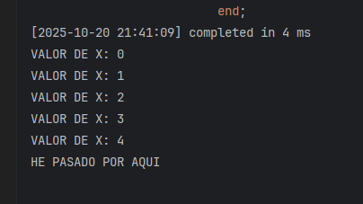

<details>
<summary><strong>üìù SQL</strong></summary>
# 📖 SQL — Consultas, Operadores y Funciones

Un archivo con estilo para tu GitHub, manteniendo todo tu contenido original y enriqueciéndolo con títulos, secciones, y emojis para facilitar su lectura y uso.

---

## üìù Cambiar Formato de Columnas

```sql
-- Entre comillas si deseas cambiar el formato ""
SELECT FIRST_NAME, last_name, salary AS "Salario Empleado" FROM EMPLOYEES;
```

---

## ‚ûï Operadores B√°sicos

```
+ SUMA
- RESTA
* MULTIPLICACION
/ DIVISION
```

```sql
SELECT FIRST_NAME, SALARY, SALARY*12 AS "Salario Anual", 20*10 AS "EJEMPLO" FROM EMPLOYEES;
```

---

## 🏷️ CLASE 45 — LITERALES

```sql
SELECT 'NOMBRE:', FIRST_NAME FROM EMPLOYEES;

SELECT 'NOMBRE:' || FIRST_NAME || ' ' || LAST_NAME AS "NOMBRE EMPLEADO" FROM EMPLOYEES;
```

---

## 🧮 CLASE 47 — TABLA DUAL

```sql
SELECT 4+3, FIRST_NAME FROM EMPLOYEES;

SELECT 4+3, 'ES EL RESULTADO' FROM DUAL;

DESC DUAL;
```

---

## ⚠️ CLASE 48 — NULOS (NULL)

```sql
SELECT FIRST_NAME, SALARY, COMMISSION_PCT, SALARY*COMMISSION_PCT AS "SALARIO TOTAL" FROM EMPLOYEES;
```

---

## 🔁 CLASE 49 — DISTINCT (Agrupa datos duplicados)

```sql
SELECT * FROM EMPLOYEES;

SELECT FIRST_NAME, DEPARTMENT_ID FROM EMPLOYEES;

SELECT DISTINCT DEPARTMENT_ID FROM EMPLOYEES;

SELECT DISTINCT DEPARTMENT_ID, JOB_ID FROM EMPLOYEES;
```

---

## 🔍 CLASE 52 — WHERE (Filtrar filas por condición)

/*
OPERADORES DE COMPARACION MAS COMUNES:
= , >=, <, >, <=, <>
*/

```sql
SELECT * FROM EMPLOYEES WHERE DEPARTMENT_ID = 50;

SELECT FIRST_NAME, SALARY FROM EMPLOYEES WHERE SALARY = 4000;

SELECT FIRST_NAME FROM EMPLOYEES WHERE DEPARTMENT_ID <> 50;
```

---

## 🔢 CLASE 53 — Condiciones con Literales

```sql
SELECT FIRST_NAME, LAST_NAME FROM EMPLOYEES WHERE FIRST_NAME = 'John';
```

---

## 📆 CLASE 54 — Comparar Fechas

```sql
SELECT * FROM EMPLOYEES;

SELECT * FROM EMPLOYEES WHERE HIRE_DATE = '21-09-05';

SELECT * FROM EMPLOYEES WHERE HIRE_DATE > '21-09-05';
```

---

## 🔁 CLASE 56 — BETWEEN (Rangos en Comparación)

```sql
SELECT * FROM EMPLOYEES WHERE SALARY BETWEEN 5000 AND 6000;

SELECT * FROM EMPLOYEES WHERE HIRE_DATE BETWEEN '01-01-07' AND '01-01-09';

SELECT * FROM EMPLOYEES WHERE FIRST_NAME BETWEEN 'Douglas' AND 'Steven';
```

---

## 🎯 CLASE 57 — IN (Buscar valores en una lista)

```sql
SELECT * FROM EMPLOYEES WHERE DEPARTMENT_ID IN(50,60);

SELECT * FROM EMPLOYEES WHERE JOB_ID IN ('SH_CLERK','ST_CLERK','ST_MAN');
```

### üß™ Pr√°ctica BETWEEN & IN

```sql
SELECT * FROM EMPLOYEES WHERE DEPARTMENT_ID BETWEEN 50 AND 60;

SELECT * FROM EMPLOYEES WHERE HIRE_DATE BETWEEN '01-01-02' AND '31-12-04';

SELECT * FROM EMPLOYEES WHERE LAST_NAME BETWEEN 'D' AND 'H';

SELECT * FROM EMPLOYEES WHERE DEPARTMENT_ID IN(30,60,90);

SELECT * FROM EMPLOYEES WHERE JOB_ID IN('IT_PROG','PU_CLERK');

SELECT * FROM LOCATIONS;

SELECT * FROM LOCATIONS WHERE COUNTRY_ID IN('UK','JP');
```

---

## 🔎 CLASE 59 — LIKE (Buscar patrones en cadenas)

```
LIKE 'PATRON'
% (cualquier n√∫mero de caracteres)
_ (un solo caracter)
```

```sql
SELECT * FROM EMPLOYEES WHERE FIRST_NAME LIKE 'J%';

SELECT * FROM EMPLOYEES WHERE FIRST_NAME LIKE '_e%';

SELECT * FROM EMPLOYEES WHERE FIRST_NAME LIKE '%te%';
```

> **Nota:** LIKE consume mucha memoria, √∫salo con cuidado.

### üß™ Pr√°ctica LIKE

```sql
SELECT * FROM EMPLOYEES WHERE FIRST_NAME LIKE 'J%';
SELECT * FROM EMPLOYEES WHERE FIRST_NAME LIKE 'S%n';
SELECT * FROM COUNTRIES;
SELECT * FROM COUNTRIES WHERE COUNTRY_NAME LIKE '_r%';
```

---

## ❓ CLASE 61 — IS NULL / IS NOT NULL

```sql
SELECT * FROM EMPLOYEES WHERE COMMISSION_PCT = NULL; -- No tiene sentido

SELECT * FROM EMPLOYEES WHERE COMMISSION_PCT IS NULL;

SELECT * FROM LOCATIONS;
SELECT * FROM LOCATIONS WHERE STATE_PROVINCE IS NULL;

SELECT * FROM EMPLOYEES;
SELECT FIRST_NAME, SALARY, COMMISSION_PCT, SALARY+(SALARY*COMMISSION_PCT) AS "Salario Total"
FROM EMPLOYEES WHERE COMMISSION_PCT IS NOT NULL;
```

---

## 🔗 CLASE 63 — AND, OR, NOT (Múltiples condiciones)

/*
AND C1 AND C2 --> TRUE
OR  C1 OR C2  --> TRUE
NOT C1 --> TRUE para negar una condición
*/

```sql
SELECT * FROM EMPLOYEES WHERE SALARY > 5000 AND DEPARTMENT_ID = 50;

SELECT * FROM EMPLOYEES WHERE SALARY > 5000 OR DEPARTMENT_ID = 50;

SELECT * FROM EMPLOYEES WHERE DEPARTMENT_ID NOT IN(50,60);
```

---

## 🔀 CLASE 64 — Combinaciones de AND / OR

/*
C1 AND C2 TRUE TRUE   --> TRUE
C1 AND C2 TRUE FALSE  --> FALSE
C1 AND C2 FALSE FALSE --> FALSE
C1 OR C2  TRUE TRUE   --> TRUE
C1 OR C2  TRUE FALSE  --> TRUE
C1 OR C2 FALSE FALSE  --> FALSE
*/

```sql
SELECT FIRST_NAME, SALARY, DEPARTMENT_ID, HIRE_DATE FROM EMPLOYEES
WHERE SALARY > 5000 AND DEPARTMENT_ID = 50 AND HIRE_DATE > '01-01-05';
```

### üß™ Pr√°ctica AND / OR / NOT

```sql
SELECT * FROM EMPLOYEES;
SELECT FIRST_NAME, HIRE_DATE, JOB_ID FROM EMPLOYEES WHERE JOB_ID = 'IT_PROG' AND SALARY > 6000;

SELECT * FROM EMPLOYEES WHERE FIRST_NAME LIKE 'S%' AND SALARY > 3000 AND (DEPARTMENT_ID = 50 OR DEPARTMENT_ID = 80);

SELECT * FROM EMPLOYEES WHERE JOB_ID = 'IT_PROG' AND PHONE_NUMBER LIKE '5%' AND HIRE_DATE BETWEEN '01-01-07' AND '31-12-07';
```

---

## 🧩 CLASE 66 — ORDER BY (Ordenar resultados)

```sql
SELECT * FROM EMPLOYEES ORDER BY SALARY DESC;

SELECT FIRST_NAME, LAST_NAME, SALARY FROM EMPLOYEES
WHERE FIRST_NAME = 'David'
ORDER BY FIRST_NAME, LAST_NAME;

SELECT FIRST_NAME, LAST_NAME, SALARY FROM EMPLOYEES
WHERE FIRST_NAME = 'David'
ORDER BY FIRST_NAME, SALARY DESC;

SELECT FIRST_NAME, SALARY*12 AS SALARIO FROM EMPLOYEES
ORDER BY SALARIO;

SELECT FIRST_NAME, SALARY*12 FROM EMPLOYEES
ORDER BY 2;

SELECT FIRST_NAME, SALARY*12 AS TOTAL FROM EMPLOYEES
ORDER BY TOTAL DESC;
```

---

## 🎯 CLASE 68 — FETCH (Limitar el número de filas)

```sql
SELECT FIRST_NAME, SALARY FROM EMPLOYEES;

SELECT FIRST_NAME, SALARY FROM EMPLOYEES ORDER BY SALARY DESC FETCH FIRST 5 ROWS ONLY;

SELECT FIRST_NAME, SALARY FROM EMPLOYEES ORDER BY SALARY DESC FETCH FIRST 7 ROWS WITH TIES;

SELECT FIRST_NAME, SALARY FROM EMPLOYEES ORDER BY SALARY DESC OFFSET 5 ROWS FETCH FIRST 5 ROWS WITH TIES;

SELECT * FROM EMPLOYEES FETCH FIRST 20 PERCENT ROWS ONLY;
```

---

## 📚 CLASE 69 — FUNCIONES

```
- Permiten operaciones y expresiones en SQL
- Tipos: numéricas, de cadenas, fechas, propósito general
- Formato: SELECT COLUMNA, FUNCION(PARAMETRO) FROM TABLA
- Sin par√°metros: SYSDATE, USER
- Varios argumentos: SUBSTR(CADENA,POSICION,LONGITUD)
- Anidamiento: se pueden anidar funciones
- Ejemplo: 
    SUBSTR('hola',1,2) -> ho
    UPPER(SUBSTR('hola',1,2)) -> HO
```

---

## 🔡 CLASE 70 — Funciones UPPER, LOWER, INITCAP

```sql
SELECT EMAIL, LOWER(EMAIL) FROM EMPLOYEES;

SELECT FIRST_NAME, UPPER(FIRST_NAME) FROM EMPLOYEES;

SELECT INITCAP('ESTO ES UNA PRUEBA') FROM DUAL; -- Pone de tipo oración
```

---

## 🗃️ CLASE 71 — Funciones en la cláusula WHERE

```sql
SELECT FIRST_NAME, LAST_NAME FROM EMPLOYEES
WHERE UPPER(FIRST_NAME) = 'DAVID';
```

---

## 🔗 CLASE 72 — Funciones CONCAT y anidamiento

```sql
SELECT FIRST_NAME || ' ' || LAST_NAME FROM EMPLOYEES;

SELECT CONCAT(FIRST_NAME, LAST_NAME) FROM EMPLOYEES;

SELECT CONCAT(FIRST_NAME, CONCAT(' ', LAST_NAME)) FROM EMPLOYEES;
```

---

## 🔢 CLASE 73 — Función LENGTH (Longitud de cadenas)

```sql
SELECT FIRST_NAME, LENGTH(FIRST_NAME) FROM EMPLOYEES;

SELECT FIRST_NAME FROM EMPLOYEES WHERE LENGTH(FIRST_NAME) = 6;
```

---

## ✂️ CLASE 74 — Función SUBSTR (Subcadenas)

```sql
SELECT FIRST_NAME, SUBSTR(FIRST_NAME, 1, 3) FROM EMPLOYEES;

SELECT FIRST_NAME, SUBSTR(FIRST_NAME, 3) FROM EMPLOYEES;

SELECT FIRST_NAME, SUBSTR(FIRST_NAME, LENGTH(FIRST_NAME), 1) FROM EMPLOYEES;
```

---

## 📍 CLASE 75 — Función INSTR (Posición de subcadena)

```sql
SELECT FIRST_NAME, INSTR(FIRST_NAME, 'a') FROM EMPLOYEES;

SELECT FIRST_NAME, INSTR(FIRST_NAME, 'a') FROM EMPLOYEES
WHERE INSTR(FIRST_NAME, 'a') <> 0;

SELECT FIRST_NAME, INSTR(LOWER(FIRST_NAME), 'a') FROM EMPLOYEES
WHERE INSTR(LOWER(FIRST_NAME), 'a') <> 0;

/* 
Explicación: 
- Busca empleados cuyo nombre contiene 'a' (min√∫scula o may√∫scula)
- Muestra la posición donde aparece por primera vez
- LOWER() permite buscar sin importar may√∫sculas/min√∫sculas
*/
SELECT FIRST_NAME, INSTR(UPPER(FIRST_NAME), 'A') FROM EMPLOYEES
WHERE INSTR(FIRST_NAME, 'A') <> 0;

SELECT FIRST_NAME, INSTR(LOWER(FIRST_NAME), 'a', 4) FROM EMPLOYEES
WHERE INSTR(LOWER(FIRST_NAME), 'a', 4) <> 0;
```

---

## ⬅️➡️ CLASE 76 — LPAD/RPAD (Rellenar cadenas)

```sql
SELECT FIRST_NAME FROM EMPLOYEES;
SELECT RPAD(FIRST_NAME, 20, '*') FROM EMPLOYEES; -- derecha
SELECT LPAD(FIRST_NAME, 20, '*') FROM EMPLOYEES; -- izquierda
```

---

## 🧼 CLASE 77 — Funciones REPLACE, LTRIM, RTRIM

```sql
SELECT REPLACE(FIRST_NAME, 'a', '*') FROM EMPLOYEES;

SELECT RTRIM('HOLA         ') || ' ADIOS' FROM DUAL;

SELECT 'ALBERTO ' || LTRIM('                 PEREZ') FROM DUAL;

SELECT FIRST_NAME, RTRIM(FIRST_NAME, 'm') FROM EMPLOYEES;
```

---

## 📝 PRÁCTICA — Funciones de tipo carácter

*(Agrega aquí tus propias consultas de práctica)*

-- • En la tabla LOCATIONS, averiguar las ciudades que son de Canada o
-- Estados unidos (Country_id=CA o US) y que la longitud del nombre de la
-- calle sea superior a 15.

SELECT CITY,COUNTRY_ID
FROM LOCATIONS
WHERE COUNTRY_ID IN('CA','US')
AND LENGTH(STREET_ADDRESS) >15;

/*
• Muestra la longitud del nombre y el salario anual (por 14) para los
empleados cuyo apellido contenga el carácter 'b' después de la 3ª
posición.
*/
SELECT FIRST_NAME, LENGTH(FIRST_NAME), LAST_NAME, SALARY * 14 AS "SALARIO ANUAL"
FROM EMPLOYEES
WHERE INSTR(LAST_NAME, 'b') > 3;

/*
Averiguar los empleados que ganan entre 4000 y 7000 euros y que
tienen alguna 'a' en el nombre. (Debemos usar INSTR y da igual que sea
mayúscula que minúsculas) y que tengan comisión.
*/

SELECT *
FROM EMPLOYEES
WHERE SALARY BETWEEN 4000 AND 7000
AND INSTR(LOWER(FIRST_NAME), 'a') <> 0
AND COMMISSION_PCT IS NOT NULL;

# EXPLICACION
Si no pones `<> 0` en la función INSTR, obtienes un resultado diferente:

## Sin `<> 0`:
```sql
SELECT *
FROM EMPLOYEES
WHERE SALARY BETWEEN 4000 AND 7000
  AND INSTR(LOWER(FIRST_NAME), 'a')
  AND COMMISSION_PCT IS NOT NULL;
```

## ¿Qué ocurre?

**INSTR** devuelve:
- **0** = La letra 'a' NO est√° en el nombre
- **Número positivo** = La posición donde está la letra 'a'

En Oracle, las condiciones se eval√∫an como:
- **0** = FALSE
- **Cualquier n√∫mero distinto de 0** = TRUE

## Resultado pr√°ctico:

**CON `<> 0`**: Busca empleados que tienen la letra 'a' en el nombre
**SIN `<> 0`**: También busca empleados que tienen la letra 'a' en el nombre

En este caso específico, **el resultado es el mismo** porque:
- Si INSTR encuentra 'a', devuelve posición (1,2,3...) = TRUE
- Si INSTR no encuentra 'a', devuelve 0 = FALSE

## Diferencia importante:

```sql
-- Estas dos consultas dan el mismo resultado:
WHERE INSTR(LOWER(FIRST_NAME), 'a') <> 0  -- Explícito
WHERE INSTR(LOWER(FIRST_NAME), 'a')       -- Implícito
```

La versión `<> 0` es más clara y explícita para entender qué estás buscando, pero funcionalmente son equivalentes en Oracle.


- Visualizar las iniciales de nombre y apellidos separados por puntos. Por
### ejemplo:


### Solucion :

```sql
SELECT FIRST_NAME,
       LAST_NAME,
       SUBSTR(FIRST_NAME, 1, 1) || '.' || SUBSTR(LAST_NAME, 1, 1) || '.' AS "INICIALES"
FROM EMPLOYEES;


```


---

- MOSTRAR EMPLEADOS DONDE EL NOMBRE O APELLIDO COMIENZA CON 'S'

```sql
SELECT * FROM EMPLOYEES
WHERE FIRST_NAME LIKE 'S%' OR LAST_NAME LIKE 'S%';


```


-- Visualizar el nombre del empleado, su salario, y con asteriscos, el
-- número miles de dólares que gana. Se asocia ejemplo. (PISTA: se
-- puede usar RPAD. Ordenado por salario

```sql

SELECT FIRST_NAME,
       SALARY,
       RPAD('*', SALARY / 1000, '*') AS RANKING
FROM EMPLOYEES
ORDER BY SALARY DESC;

```

### EXPLICACION

La función `RPAD` rellena una cadena por la derecha hasta alcanzar una longitud específica. Te explico cada parámetro:

## Sintaxis de RPAD:
```sql
RPAD(cadena_original, longitud_total, car√°cter_relleno)
```

## En tu ejemplo:
```sql
RPAD('*', SALARY / 1000, '*')
```

### Par√°metros:
1. **`'*'`** - Cadena original (un asterisco)
2. **`SALARY / 1000`** - Longitud total deseada (salario dividido entre 1000)
3. **`'*'`** - Car√°cter para rellenar (asterisco)

### Funcionamiento:
- Si un empleado gana **5000**, entonces `SALARY / 1000 = 5`
- RPAD toma el primer `'*'` y lo rellena hasta llegar a 5 caracteres usando `'*'`
- Resultado: `*****` (5 asteriscos)

- Si gana **12000**, entonces `SALARY / 1000 = 12`
- Resultado: `************` (12 asteriscos)

## Ejemplo pr√°ctico:
```sql
-- Si SALARY = 8000
RPAD('*', 8000/1000, '*') = RPAD('*', 8, '*') = '********'

-- Si SALARY = 3500  
RPAD('*', 3500/1000, '*') = RPAD('*', 3, '*') = '***'
```

## Propósito:
Crear una representación visual del salario donde cada asterisco representa 1000 dólares, facilitando comparar salarios de forma gráfica.


---

## ⬅️➡️ CLASE 79 — FUNCIONES NUMERICAS : ROUND - TRUNC - MOD - POWER

-- ROUND REDONDEAR
SELECT ROUND(50.920, 2)
FROM DUAL;
--50.92

-- TRUNC TRUNCAR
SELECT TRUNC(50.9790, 2)
FROM DUAL;
--50.90

--MOD(A,B)
SELECT MOD(10, 3)
FROM DUAL;

-- POWER(A,B)
SELECT POWER(10, 2)
FROM DUAL;
--10^2=100
--*******************************************************************************************************
/*
PRACTICA -->
1. Funciones numéricas
   • Visualizar el nombre y salario de los empleados de los que el número de
   empleado es impar (PISTA: MOD)
   • Prueba con los siguientes valores aplicando las funciones TRUNC y
   ROUND, con 1 y 2 decimales.

*/

```sql

SELECT EMPLOYEE_ID, FIRST_NAME, SALARY
FROM EMPLOYEES
WHERE MOD(EMPLOYEE_ID, 2) <> 0;

```


---
# 📅 SQL — Práctica de Funciones Numéricas y de Fechas

---

## 🧮 1. Funciones Numéricas

> Visualizar el nombre y salario de los empleados cuyo n√∫mero de empleado es **impar** (`MOD`).

```sql
SELECT EMPLOYEE_ID, FIRST_NAME, SALARY
FROM EMPLOYEES
WHERE MOD(EMPLOYEE_ID, 2) <> 0;
```

> Prueba con los siguientes valores aplicando las funciones `TRUNC` y `ROUND`, con 1 y 2 decimales.

*(Agrega aquí tus valores de prueba y ejemplos de TRUNC/ROUND)*

---

## 📆 CLASE 81 : Funciones de Fechas

```sql
SELECT FIRST_NAME, HIRE_DATE
FROM EMPLOYEES;

SELECT SYSDATE
FROM DUAL;
```

---

## ➕➖ CLASE 82 : Aritmética de Fechas

```sql
SELECT FIRST_NAME, HIRE_DATE
FROM EMPLOYEES;

SELECT SYSDATE
FROM DUAL;

-- Sumar días
SELECT SYSDATE + 2 FROM DUAL; -- Suma 2 días

-- Restar días
SELECT SYSDATE - 2 FROM DUAL; -- Resta 2 días

-- Restar fechas
SELECT HIRE_DATE, SYSDATE - HIRE_DATE AS "DIAS TRABAJADOS"
FROM EMPLOYEES;
```

---

## üìÖ CLASE 83 : MONTHS_BETWEEN, NEXT_DAY, ADD_MONTHS

```sql
-- MONTHS_BETWEEN(FECHA1, FECHA2)
SELECT HIRE_DATE, MONTHS_BETWEEN(SYSDATE, HIRE_DATE) AS "MESES TRABAJADOS"
FROM EMPLOYEES;

-- ADD_MONTHS(FECHA, NUMERO_MESES)
SELECT SYSDATE, ADD_MONTHS(SYSDATE, 3), SYSDATE + 90
FROM DUAL;

-- NEXT_DAY(FECHA, 'DIA_DE_LA_SEMANA')
SELECT NEXT_DAY(SYSDATE, 'MIÉRCOLES')
FROM DUAL;
```

---

## ‚è≥ CLASE 84 : LAST_DAY, ROUND, TRUNC

```sql
-- LAST_DAY(FECHA): último día del mes de la fecha
SELECT SYSDATE, LAST_DAY(SYSDATE)
FROM DUAL;

-- ROUND(FECHA, 'FORMATO'), TRUNC(FECHA, 'FORMATO')
SELECT SYSDATE, ROUND(SYSDATE, 'MONTH'), ROUND(SYSDATE, 'YEAR')
FROM DUAL;

SELECT SYSDATE, TRUNC(SYSDATE, 'MONTH'), TRUNC(SYSDATE, 'YEAR')
FROM DUAL;
```

---

 ## üöÄ **SQL-LAST_DAY, ROUND, TRUNC COMO FUNCIONAN!**
- Estas consultas muestran la fecha actual (SYSDATE) y aplican funciones de redondeo y truncamiento sobre ella:

- ROUND(SYSDATE, 'MONTH'): Redondea la fecha al mes más cercano. Si el día es 16 o mayor, pasa al siguiente mes.

- ROUND(SYSDATE, 'YEAR'): Redondea la fecha al año más cercano. Si el mes es julio o mayor, pasa al siguiente año.

- TRUNC(SYSDATE, 'MONTH'): Trunca la fecha al primer día del mes actual.

- TRUNC(SYSDATE, 'YEAR'): Trunca la fecha al primer día del año actual.

## PRACTICA

-- SOLCION :

-- • Indicar el número de días que los empleados llevan en la empresa

SELECT FIRST_NAME, HIRE_DATE - SYSDATE AS "DIAS EN LA EMPRESA"
FROM EMPLOYEES;

-- • Indicar la fecha que será dentro de 15 días

SELECT SYSDATE + 15 AS "FECHA DENTRO DE 15 DIAS"
FROM DUAL;
-- 2025-11-07 21:21:02

--• ¿Cuántos MESES faltan para la navidad? La cifra debe salir
-- redondeada, con 1 decimal

SELECT ROUND(MONTHS_BETWEEN('25-12-2025', SYSDATE), 1)
FROM DUAL;
-- 2

-- • Indicar la fecha de entrada de un empleado y el último día del mes que
-- entró

SELECT FIRST_NAME, HIRE_DATE, LAST_DAY(HIRE_DATE) AS "ULTIMO DIA DEL MES DE ENTRADA"
FROM EMPLOYEES;

-- Steven,2003-06-17,2003-06-30

-- • Utilizando la función ROUND, indicar los empleados que entraron en los
-- últimos 15 días de cada mes

SELECT FIRST_NAME, HIRE_DATE, ROUND(HIRE_DATE, 'MONTH') AS "ULTIMOS 15 DIAS"
FROM EMPLOYEES
WHERE ROUND(HIRE_DATE, 'MONTH') > HIRE_DATE;

# ✨ Funciones de Conversión en Oracle SQL

---

## 🏷️ **Clase 86: LAST_DAY - ROUND - TRUNC**
### 🔄 Funciones de Conversión Básicas

- `TO_CHAR`
- `TO_DATE`
- `TO_NUMBER`

```sql
SELECT '10' + 10 FROM DUAL;
-- 🟢 Resultado: 20

SELECT MONTHS_BETWEEN(SYSDATE, '10-10-18') FROM DUAL;
-- 🟢 Respuesta: 84.449096...

SELECT 10 || '10' FROM DUAL;
-- 🟢 Resultado: 1010

SELECT 'HOY ES:' || SYSDATE FROM DUAL;
-- 🟢 Rpta: HOY ES:23/10/25
```

---

## 🗓️ **Clase 87: Convertir Fechas a Texto — `TO_CHAR`**
> `TO_CHAR(DATE/NUMBER, 'FORMATO')` convierte y da formato personalizado.

### üìÖ Formatos principales:
- `YYYY` ➡️ Año en 4 dígitos
- `YEAR` ➡️ Año en texto (inglés)
- `MM` ➡️ Mes en 2 dígitos
- `MONTH` ➡️ Nombre del mes (texto)
- `MON` ➡️ Mes abreviado
- `DY` ➡️ Día abreviado
- `DAY` ➡️ Día en texto
- `DD` ➡️ Número del día

```sql
SELECT SYSDATE, TO_CHAR(SYSDATE, 'YYYY') FROM DUAL;
-- 🟢 Rpta: 2025

SELECT SYSDATE, TO_CHAR(SYSDATE, 'MONTH') FROM DUAL;
-- 🟢 Rpta: OCTUBRE

SELECT SYSDATE, TO_CHAR(SYSDATE, 'YEAR') FROM DUAL;
-- 🟢 Rpta: TWENTY TWENTY-FIVE

SELECT SYSDATE, TO_CHAR(SYSDATE, 'DAY') FROM DUAL;
-- 🟢 Rpta: JUEVES
```

---

## 🕒 **Clase 88: TO_CHAR Fechas — Parte 2**
### ‚è∞ Formatos adicionales:
- `AM`/`PM` ➡️ Meridian
- `HH` ➡️ Hora (12h)
- `HH24` ➡️ Hora (24h)
- `MI` ➡️ Minutos
- `SS` ➡️ Segundos

```sql
SELECT SYSDATE, TO_CHAR(SYSDATE, 'HH') FROM DUAL;
-- 🟢 Rpta: 10

SELECT SYSDATE, TO_CHAR(SYSDATE, 'HH24') FROM DUAL;
-- 🟢 Rpta: 22

SELECT SYSDATE, TO_CHAR(SYSDATE, 'MI') FROM DUAL;
-- 🟢 Rpta: 21

SELECT SYSDATE, TO_CHAR(SYSDATE, '"Son las" HH24:MI " del dia de hoy" YYYY') FROM DUAL;
-- 🟢 Rpta: Son las 22:24 del dia de hoy 2025
```

---

## 🔢 **Clase 89: Convertir Números a Texto — `TO_CHAR`**
> `TO_CHAR(NUMERO, 'FORMATO')`

### 🧮 Caracteres de formato:
- `9` ➡️ Posición de número
- `0` ➡️ Número con relleno de ceros
- `D` ➡️ Separador decimal
- `,` ➡️ Separador de miles
- `$` ➡️ Símbolo de moneda
- `L` ➡️ Moneda local
- `.` ➡️ Punto decimal

```sql
SELECT SALARY, TO_CHAR(SALARY, '99999') FROM EMPLOYEES;
-- 🟢 Rpta: 24000

SELECT SALARY
     , TO_CHAR(SALARY, '99999')
     , TO_CHAR(SALARY, '00000')
     , TO_CHAR(SALARY, 'L00009.99')
FROM EMPLOYEES;
-- 🟢 Rpta: 24000, 24000, S/24000.00
```

---

## 🗓️ **Clase 91: Convertir Texto a Fecha — `TO_DATE`**
> `TO_DATE(STRING, 'FORMATO')`

```sql
SELECT TO_DATE('10-01-89') FROM DUAL; -- 🟢 1989-01-10
SELECT TO_DATE('10-01-1989') FROM DUAL; -- 🟢 1989-01-10
SELECT TO_DATE('10-JAN-89') FROM DUAL; -- 🔴 Error
SELECT TO_DATE('12-22-1989', 'mm-dd-yy') FROM DUAL; -- 🟢 2089-12-22
SELECT TO_DATE('JAN-22-89', 'MON-DD-YY', 'NLS_DATE_LANGUAGE=ENGLISH') FROM DUAL; -- 🟢 2089-01-22
SELECT TO_DATE('ENE-22-89', 'MON-DD-YY') FROM DUAL; -- 🔴 Error (idioma)

-- üìÖ RR: Formato siglo actual o anterior
/*
YY: 2 dígitos - siglo actual
RR: 2 dígitos - siglo actual o anterior
  0-49 ➡️ 2000+
  50-99 ➡️ 1900+
*/

SELECT TO_CHAR(TO_DATE('10-01-89', 'DD-MM-RR'), 'DD-MM-YYYY') FROM DUAL;
-- 🟢 10-01-1989
```

---

## #️⃣ **Clase 92: Convertir Texto a Número — `TO_NUMBER`**
> `TO_NUMBER(STRING, 'FORMATO')`

```sql
SELECT TO_NUMBER('1000.89', '9999.99') FROM DUAL;
-- 🟢 1000.89

SELECT TO_NUMBER('S/1000', 'L9999') FROM DUAL;
-- 🟢 1000
```

---

  ## #️⃣📚**Clase 94: NVL — NULOS **
- Cuando encuentra un nulo escoge el siguiente por ejemplo como una opcion devuelve ADIOS 
- o en el otro Ejemplo 0.

```sql

SELECT NVL(NULL, 'ADIOS')
FROM DUAL;

SELECT FIRST_NAME, COMMISSION_PCT
FROM EMPLOYEES;

SELECT FIRST_NAME, NVL(COMMISSION_PCT, 0)
FROM EMPLOYEES;

SELECT FIRST_NAME, COMMISSION_PCT * SALARY , NVL(COMMISSION_PCT, 0) * SALARY
FROM EMPLOYEES;
```


---
## #️⃣📚**Clase 95: TRATAR NULOS : NVL2 — NULOS **

-- TRATAR NULOS NVL2 ->

-- NVL2 (EXPRESION,VALOR1,VALOR2)

Esta consulta selecciona el nombre, salario, porcentaje de comisión y un cálculo condicional para cada empleado:

- Si `COMMISSION_PCT` **no es nulo**, muestra `SALARY * COMMISSION_PCT`.
- Si `COMMISSION_PCT` **es nulo**, muestra `SALARY * 0.1`.

La función `NVL2` permite este comportamiento condicional en Oracle SQL.

```sql
SELECT FIRST_NAME,
       SALARY,
       COMMISSION_PCT,
       NVL2(COMMISSION_PCT, SALARY * COMMISSION_PCT, SALARY * 0.1) AS CM
FROM EMPLOYEES;
```

Esto ayuda a calcular una comisión real o un valor por defecto si no existe comisión.

```SQL

SELECT FIRST_NAME, SALARY,COMMISSION_PCT, NVL2(COMMISSION_PCT, SALARY * COMMISSION_PCT, SALARY * 0.1) AS CM
FROM EMPLOYEES;

```


---
## #️⃣📚**Clase 96: TRATAR NULOS : NULLIF **

La función `NULLIF` en Oracle SQL compara dos expresiones:

- Si **son iguales**, devuelve `NULL`.
- Si **son diferentes**, devuelve el valor de la primera expresión.

**Sintaxis:**
```sql
NULLIF(expr1, expr2)
```

**Ejemplo:**
```sql
SELECT NULLIF(10, 10) FROM DUAL; -- Devuelve: NULL
SELECT NULLIF(10, 20) FROM DUAL; -- Devuelve: 10
```

**Uso típico:**  
Evitar divisiones por cero:
```sql
SELECT SALARY / NULLIF(COMMISSION_PCT, 0) FROM EMPLOYEES;
```
Si `COMMISSION_PCT` es 0, devuelve `NULL` y evita el error de división por cero.

---

```sql

SELECT COUNTRY_ID,
       UPPER(SUBSTR(COUNTRY_NAME, 1, 2)),--RPTA AR,AR
       NULLIF(COUNTRY_ID, UPPER(SUBSTR(COUNTRY_NAME, 1, 2))),
       NVL2(NULLIF(COUNTRY_ID, UPPER(SUBSTR(COUNTRY_NAME, 1, 2))), 'SON IGUALES', 'SON DISTINTOS') AS COMPARACION
FROM COUNTRIES;--RPTA

```


---
## #️⃣📚**Clase 97: TRATAR NULOS : COALESCE **

La función `COALESCE` en Oracle SQL (y otros motores) devuelve el **primer valor no nulo** de una lista de expresiones. 
Es √∫til para tratar valores nulos y establecer valores por defecto.

**Sintaxis:**
```sql
COALESCE(expr1, expr2, ..., exprN)
```
- Devuelve el primer valor que **no es NULL**.
- Si todos son NULL, devuelve NULL.

**Ejemplo:**
```sql
SELECT COALESCE(NULL, NULL, 'Hola', 'Mundo') FROM DUAL; -- Devuelve: Hola

SELECT FIRST_NAME, COALESCE(COMMISSION_PCT, 0) AS COMISION
FROM EMPLOYEES;
```
En el segundo ejemplo, si `COMMISSION_PCT` es NULL, devuelve 0.

**Resumen:**  
`COALESCE` es ideal para manejar m√∫ltiples posibles valores nulos y elegir el primero que exista.

```sql

SELECT COALESCE(NULL, NULL, 'VALOR3')
FROM DUAL;

SELECT FIRST_NAME, COMMISSION_PCT, TO_CHAR(COMMISSION_PCT)
FROM EMPLOYEES;--RPTA John,0.40,",4"

SELECT FIRST_NAME, MANAGER_ID, TO_CHAR(COMMISSION_PCT), TO_CHAR(MANAGER_ID)
FROM EMPLOYEES;

SELECT FIRST_NAME, COALESCE(TO_CHAR(COMMISSION_PCT), TO_CHAR(MANAGER_ID), 'SIN JEFE NI COMISION')
FROM EMPLOYEES;

```


---

## #️⃣📚**Clase 98: TRATAR NULOS : COALESCE **

La función `COALESCE` en SQL devuelve el **primer valor que no es NULL** de una lista de expresiones. 
Es √∫til para manejar valores nulos y establecer valores por defecto.

**Sintaxis:**
```sql
COALESCE(expr1, expr2, ..., exprN)
```
- Devuelve el primer valor **no nulo** de la lista.
- Si todos son NULL, devuelve NULL.

**Ejemplo:**
```sql
SELECT COALESCE(NULL, NULL, 'Hola', 'Mundo') FROM DUAL; -- Devuelve: Hola

SELECT FIRST_NAME, COALESCE(COMMISSION_PCT, 0) AS COMISION
FROM EMPLOYEES;
```
En el segundo ejemplo, si `COMMISSION_PCT` es NULL, devuelve 0.

**Resumen:**  
`COALESCE` es ideal para elegir el primer valor disponible entre varios posibles nulos.

```sql
SELECT COALESCE(NULL, NULL, 'VALOR3')
FROM DUAL;

SELECT FIRST_NAME, COMMISSION_PCT, TO_CHAR(COMMISSION_PCT)
FROM EMPLOYEES;--RPTA John,0.40,",4"

SELECT FIRST_NAME, MANAGER_ID, TO_CHAR(COMMISSION_PCT), TO_CHAR(MANAGER_ID)
FROM EMPLOYEES;

SELECT FIRST_NAME, COALESCE(TO_CHAR(COMMISSION_PCT), TO_CHAR(MANAGER_ID), 'SIN JEFE NI COMISION')
FROM EMPLOYEES;

```
---

## #️⃣📚**Clase 99: EXPRESIONES CONDICIONALES : CASE **


-- CASE CLAUSULA QUE NOS PERMITE COMPROBAR DISTINTAS CONDICIONES Y DEVOLVER UN VALOR SEGUN CADA CONDICION
-- FORMATO :
/*
CASE
    WHEN CONDICION1 THEN VALOR1
    WHEN CONDICION2 THEN VALOR2
    ...
    ELSE VALOR_POR_DEFECTO
END
 */

```sql
SELECT FIRST_NAME,
       JOB_ID,
       CASE JOB_ID
           WHEN 'SH_CLERK' THEN 'TIPO 1'
           WHEN 'ST_MAN' THEN 'TIPO 2'
           WHEN 'ST_CLERK' THEN 'TIPO 3'
           ELSE 'SIN TIPO'
           END AS "TIPO DE TRABAJO"
FROM EMPLOYEES
WHERE DEPARTMENT_ID = 50;

```


---

## #️⃣📚**Clase 100: CASE SEARCHED **

-- DIREFENCIA CON CASE SIMPLE Y EL CASE SEARCHED ES POR QUE PUEDO PONER CONDICIONES MAS COMPLEJAS
-- FORMATO :

```sql

SELECT FIRST_NAME,
SALARY,
CASE
WHEN SALARY BETWEEN 0 AND 3000 THEN 'GANAS POCO'
WHEN SALARY BETWEEN 3001 AND 5000 THEN 'GANAS COMO LA MEDIA'
WHEN SALARY > 5001 THEN 'GANAS BASTANTE'
ELSE 'NO GANAS'
END AS "RANGO SALARIAL"
FROM EMPLOYEES;

```


---

## #️⃣📚**Clase 101: DECODE **

--DECODE ES UNA FUNCION QUE SIMULA UN CASE SIMPLE
-- FORMATO :
/*
DECODE(EXPRESION,VALOR1,RESULTADO1,VALOR2,RESULTADO2,...,VALOR_POR_DEFECTO)

*/

```sql

SELECT FIRST_NAME,
       DEPARTMENT_ID,
       DECODE(DEPARTMENT_ID, 50, 'INFORMATICA', 10, 'VENTAS', 'OTRO TRABAJO') AS "DEPARTAMENTO"
FROM EMPLOYEES;

```
---
# üìö SQL Pr√°cticas: Funciones Condicionales, Agrupamientos y M√°s

---

## üåü **CLASE 102 : Expresiones Condicionales - Pr√°ctica**

### 🎯 CASE y DECODE

```sql
-- Visualizar el nombre y el departamento
SELECT FIRST_NAME,
       DEPARTMENT_ID,
       DECODE(DEPARTMENT_ID, 50, 'TRANSPORTE', 90, 'DIRECCION', 'OTRO DEPARTAMENTO') AS "DEPARTAMENTO"
FROM EMPLOYEES;
```

```sql
-- Mostrar ciudad y país agrupado en zonas específicas
SELECT CITY,
       COUNTRY_ID,
       CASE
           WHEN COUNTRY_ID IN ('US', 'CA') THEN 'AMERICA DEL NORTE'
           WHEN COUNTRY_ID IN ('CH', 'UK') THEN 'EUROPA'
           WHEN COUNTRY_ID = 'BR' THEN 'AMERICA DEL SUR'
           ELSE 'OTRA ZONA'
       END AS "ZONA"
FROM LOCATIONS;
```

---

## üìà **CLASE 103 : Funciones de Grupo AVG, MAX, MIN**

```sql
SELECT AVG(SALARY) AS PROMEDIO FROM EMPLOYEES;
SELECT MAX(SALARY) AS "MAXIMO_SALARIO" FROM EMPLOYEES;
SELECT MIN(SALARY) AS "MINIMO_SALARIO" FROM EMPLOYEES;
SELECT AVG(SALARY), MAX(SALARY), MIN(SALARY) FROM EMPLOYEES;
SELECT AVG(SALARY), MAX(SALARY), MIN(SALARY) FROM EMPLOYEES WHERE DEPARTMENT_ID = 50;
SELECT MAX(HIRE_DATE), MIN(HIRE_DATE) FROM EMPLOYEES;
SELECT MAX(FIRST_NAME), MIN(FIRST_NAME) FROM EMPLOYEES;
```

> ⚠️ **Nota:** No se pueden mezclar funciones de grupo con columnas simples en una misma consulta
>
> ```sql
> -- Esto genera error
> SELECT FIRST_NAME, AVG(SALARY), MAX(SALARY), MIN(SALARY) FROM EMPLOYEES;
> ```

---

## 🔢 **CLASE 104 : Función COUNT y Otros**

```sql
SELECT COUNT(FIRST_NAME) FROM EMPLOYEES;
SELECT COUNT(SALARY), COUNT(COMMISSION_PCT) FROM EMPLOYEES;
SELECT COUNT(EMPLOYEE_ID) FROM EMPLOYEES; -- Recomendado para contar empleados (ej: 107)
SELECT COUNT(*) FROM EMPLOYEES;
SELECT COUNT(*) FROM EMPLOYEES WHERE DEPARTMENT_ID = 60; -- Ej: 5
SELECT COUNT(*) FROM EMPLOYEES WHERE SALARY > 6000;      -- Ej: 55
SELECT COUNT(DISTINCT FIRST_NAME) FROM EMPLOYEES;        -- Ej: 91
SELECT COUNT(DISTINCT DEPARTMENT_ID) FROM EMPLOYEES;     -- Ej: 11

-- Para ver qué departamentos tienen empleados:
SELECT DISTINCT DEPARTMENT_ID FROM EMPLOYEES ORDER BY DEPARTMENT_ID;
```

> ℹ️ **Notas sobre COUNT y DISTINCT**
>
> - `COUNT(DISTINCT DEPARTMENT_ID)` cuenta solo los departamentos con empleados.
> - El total de departamentos puede ser mayor en la base de datos, pero sólo aquellos presentes en la tabla `EMPLOYEES` (con empleados asignados) serán contados.
>
> ```sql
> SELECT DISTINCT DEPARTMENT_ID FROM EMPLOYEES ORDER BY DEPARTMENT_ID;
> ```

---

## ‚ûï **CLASE 106 : SUM y Otros Ejercicios**

```sql
SELECT SUM(SALARY)      AS "SALARY",
       SUM(SALARY) * 12 AS "SUMA SALARIOS ANUALES",
       COUNT(*)         AS "NUMERO DE EMPLEADOS",
       AVG(SALARY)      AS "PROMEDIO"
FROM EMPLOYEES
WHERE DEPARTMENT_ID = 50;
```

```sql
-- Diferencia entre el salario más alto y el mínimo
SELECT MAX(SALARY) - MIN(SALARY) FROM EMPLOYEES;
```

---

## 🗂️ **CLASE 107 : GROUP BY**

```sql
SELECT DEPARTMENT_ID FROM EMPLOYEES GROUP BY DEPARTMENT_ID;
```

```sql
-- Agrupando y sumando salarios por departamento y puesto
SELECT DEPARTMENT_ID,
       JOB_ID,
       COUNT(*),
       SUM(SALARY) AS "SUM SALARIO"
FROM EMPLOYEES
GROUP BY DEPARTMENT_ID, JOB_ID
ORDER BY DEPARTMENT_ID;
```
> üìù **Tip:** Usar `GROUP BY` permite aplicar funciones de grupo a subconjuntos de datos.

---

## 🛡️ **CLASE 108 : HAVING**

```sql
SELECT DEPARTMENT_ID,
       JOB_ID,
       COUNT(*),
       SUM(SALARY) AS "SUM SALARIO"
FROM EMPLOYEES
GROUP BY DEPARTMENT_ID, JOB_ID
HAVING SUM(SALARY) > 25000
   AND COUNT(*) > 10
ORDER BY DEPARTMENT_ID;
```
> üìå **HAVING** permite filtrar sobre los grupos generados, a diferencia de `WHERE` que filtra sobre filas individuales.

---

## 🏆 **CLASE 109 : Prácticas de Agrupaciones**

- 🔢 **N° de empleados en el departamento 50:**
    ```sql
    SELECT DEPARTMENT_ID AS "DEPARTAMENTO", COUNT(*) AS "NUMERO DE EMPLEADOS"
    FROM EMPLOYEES
    HAVING DEPARTMENT_ID = 50
    GROUP BY DEPARTMENT_ID;

    -- o directo con WHERE
    SELECT COUNT(*) AS "NUMERO DE EMPLEADOS" FROM EMPLOYEES WHERE DEPARTMENT_ID = 50;
    ```

- ‚è≥ **Empleados ingresados en 2007:**
    ```sql
    SELECT COUNT(*) AS "NUMERO DE EMPLEADOS 2007"
    FROM EMPLOYEES
    WHERE HIRE_DATE BETWEEN '01-01-2007' AND '31-12-2007';

    -- Otra forma
    SELECT COUNT(*) AS "NUMERO DE EMPLEADOS 2007"
    FROM EMPLOYEES
    WHERE TO_CHAR(HIRE_DATE, 'YYYY') = '2007';
    ```

- 💰 **Diferencia entre el sueldo más alto y el mínimo:**
    ```sql
    SELECT MAX(SALARY), MIN(SALARY), MAX(SALARY) - MIN(SALARY) AS "DIFERENCIA"
    FROM EMPLOYEES;
    ```

- üíµ **Suma del salario del departamento 100:**
    ```sql
    SELECT SUM(SALARY) AS "SUMA SALARIO DPTO 100"
    FROM EMPLOYEES
    WHERE DEPARTMENT_ID = 100;
    ```

- üíπ **Salario medio por departamento (2 decimales):**
    ```sql
    SELECT DEPARTMENT_ID, ROUND(AVG(SALARY), 2) AS "SALARIO MEDIO"
    FROM EMPLOYEES
    GROUP BY DEPARTMENT_ID
    ORDER BY DEPARTMENT_ID;
    ```

- 🗺️ **País y número de ciudades:**
    ```sql
    SELECT COUNTRY_ID, COUNT(DISTINCT CITY) AS "NUMERO DE CIUDADES"
    FROM LOCATIONS
    GROUP BY COUNTRY_ID;
    ```

- 📈 **Promedio salarial en departamentos con comisión:**
    ```sql
    SELECT DEPARTMENT_ID, ROUND(AVG(SALARY), 2) AS "PROMEDIO SALARIAL"
    FROM EMPLOYEES
    HAVING COUNT(COMMISSION_PCT) > 0
    GROUP BY DEPARTMENT_ID;
    ```

- 📅 **Años donde ingresaron más de 10 empleados:**
    ```sql
    SELECT TO_CHAR(HIRE_DATE, 'YYYY') AS "AÑO INGRESADO", COUNT(*)
    FROM EMPLOYEES
    HAVING COUNT(*) > 10
    GROUP BY TO_CHAR(HIRE_DATE, 'YYYY')
    ORDER BY "AÑO INGRESADO";
    ```

- 🏢 **Número de empleados por departamento y año de ingreso:**
    ```sql
    SELECT DEPARTMENT_ID,
           TO_CHAR(HIRE_DATE, 'YYYY') AS "AÑO INGRESO",
           COUNT(*)                   AS "NUMERO DE EMPLEADOS"
    FROM EMPLOYEES
    GROUP BY DEPARTMENT_ID, TO_CHAR(HIRE_DATE, 'YYYY')
    ORDER BY DEPARTMENT_ID, "AÑO INGRESO";
    ```

- üëî **Departamentos cuyos managers tienen m√°s de 5 empleados a cargo:**
    ```sql
    SELECT DEPARTMENT_ID AS "DEPARTAMENTO",
           MANAGER_ID    AS "JEFE",
           COUNT(*)      AS "NUMERO_EMPLEADOS"
    FROM EMPLOYEES
    GROUP BY DEPARTMENT_ID, MANAGER_ID
    HAVING COUNT(*) > 5
    ORDER BY DEPARTMENT_ID;
    ```

---

## 🔗 ✨✨**CLASE 111 : Introducción a los Joins✨✨**

# DATO ADICIONAL

¬°Claro! Vamos a analizar tu `CREATE TABLE` y las preguntas paso a paso:

---

### 1. ¿Por qué **MANAGER_ID** es FK a la misma tabla?

Esto es totalmente **válido y común** en bases de datos: se llama **auto-relación** o **relación recursiva**.

- **¿Qué sucede aquí?**  
  El campo `MANAGER_ID` **hace referencia al campo `EMPLOYEE_ID` de la misma tabla** `EMPLOYEES`.
- **¿Por qué hacerlo así?**  
  Porque en la realidad, un empleado puede tener como **jefe (manager)** a otro empleado. Así, el **ID del jefe** es el `EMPLOYEE_ID` de otro registro dentro de la misma tabla.

#### Ejemplo visual

| EMPLOYEE_ID | FIRST_NAME | MANAGER_ID |
|-------------|------------|------------|
|      1      |  Juan      |   null     | ‚Üê Es el jefe m√°ximo (no tiene manager)
|      2      |  Pedro     |     1      | ‚Üê Juan es su jefe
|      3      |  Ana       |     1      | ‚Üê Juan es su jefa
|      4      |  Lucia     |     2      | ‚Üê Pedro es su jefe

---

### 2. ¿Qué significa **CONSTRAINT**?

**CONSTRAINT** en SQL define una **restricción** o condición especial sobre una columna o tabla, para mantener la integridad de los datos.

- **Tipos comunes de CONSTRAINT**:
    - `PRIMARY KEY`: Cada valor debe ser √∫nico y no nulo (identificador √∫nico).
    - `FOREIGN KEY`: El valor debe existir en otra tabla o, como en este caso, en la misma tabla (**relaciones**).
    - `UNIQUE`: El valor debe ser √∫nico, no puede repetirse.
    - `NOT NULL`: El valor no puede ser nulo (debe estar siempre presente).
    - `CHECK`: Se debe cumplir una condición especificada (ej: salario > 0).

#### Ejemplo de definición de CONSTRAINT

```sql
constraint NOMBRE_DE_LA_RESTRICCION tipo_de_restriccion (opción adicional)
```

En tu tabla:

- `constraint EMP_EMP_ID_PK primary key`  
  ‚Üí El campo es la **clave primaria** (√∫nico y no nulo)

- `constraint EMP_MANAGER_FK references EMPLOYEES`  
  ‚Üí El **manager** debe ser un empleado existente (auto-FK)

- `constraint EMP_EMAIL_UK unique`  
  → Nadie puede tener el mismo correo electrónico.

- `constraint EMP_SALARY_MIN check (salary > 0)`  
  ‚Üí El salario debe ser mayor a cero.

- ...y otros similares.

---

### 3. Resumen sencillo

- **MANAGER_ID** es **clave foránea** que apunta a `EMPLOYEE_ID` dentro de la **misma tabla** (para indicar quién es el jefe).
- **CONSTRAINT** es una **restricción** para garantizar la calidad e integridad de los datos.

---
## ‚ú® Imagen de una FK que estan dentro de la misma tabla y hace referencia a la PK de la misma tabla ‚ú®


---
> - Se realiza un natural countries;
> - mediante el REGION_ID


---
## üîó ‚ú®‚ú®**CLASE 112 : CLAUSULA USING‚ú®‚ú®**

- HAY QUE USARLO PARA ESPECIFICAR LA COLUMNA EN COMUN ENTRE DOS TABLAS QUE VAMOS A UNIR

en el ejemplo seria el departmen_id en el primer join salen mas y en el segundo salen menos 
por que tienen el mismo nombre el MANAGER_ID AMBAS TABLAS POR ESO NOS ENVIA UN RESULTADO
ERRONEO. POR ESO NO PUEDO USAR EL NATURAL JOIN POR QUE TIENEN EL MISMO NOMBRE LAS COLUMNAS.

```sql
SELECT * FROM DEPARTMENTS;
SELECT * FROM EMPLOYEES;

SELECT D.DEPARTMENT_NAME, E.FIRST_NAME
FROM EMPLOYEES E
         JOIN DEPARTMENTS D
              USING (department_id);

SELECT DEPARTMENT_NAME, FIRST_NAME
FROM EMPLOYEES
         NATURAL JOIN DEPARTMENTS;
```
---
# 📚 CLASE 113 · CLÁUSULA ON

---

## 🎯 ¿Qué es la cláusula ON?

- 🔗 **Con el ON puedes poner cualquier condición** de unión entre tablas.
    - Ejemplo:  
      `ON E.department_id <> D.department_id`
- ‚ûï **Permite hacer JOIN adicionales** entre varias tablas.
- 📦 **Recupera datos de varias tablas** en un solo SELECT.

---

## 🏢 JOIN básico con filtro WHERE

```sql
SELECT E.DEPARTMENT_ID, D.DEPARTMENT_NAME, E.FIRST_NAME
FROM EMPLOYEES E
JOIN DEPARTMENTS D ON E.department_id = D.department_id
WHERE SALARY > 5000;
```

---

## üåç JOIN m√∫ltiple: EMPLOYEES + DEPARTMENTS + LOCATIONS

```sql
SELECT E.DEPARTMENT_ID, D.DEPARTMENT_NAME, E.FIRST_NAME, CITY
FROM EMPLOYEES E
JOIN DEPARTMENTS D ON E.department_id = D.department_id
JOIN LOCATIONS L ON D.LOCATION_ID = L.LOCATION_ID
WHERE SALARY > 5000;
```

---

## 🔀 Condición movida al ON (comportamiento diferente)

```sql
SELECT E.DEPARTMENT_ID, D.DEPARTMENT_NAME, E.FIRST_NAME, CITY
FROM EMPLOYEES E
JOIN DEPARTMENTS D ON E.department_id = D.department_id
JOIN LOCATIONS L ON D.LOCATION_ID = L.LOCATION_ID AND SALARY > 5000;
```
> ☝️ **Nota:**  
> Mover condiciones al ON puede cambiar el comportamiento del resultado, ya que el filtro afecta la unión y no el resultado final.

---

-- 🎯 ************************************************************************************************
-- 💪                           PRÁCTICAS : JOINS - NATURAL - USING - ON                                   
-- 🎯 ************************************************************************************************
```sql
/*
üìù 1. Joins-Natural-Using-On
• 🌎 Visualizar el nombre del país y el nombre de la región. (tablas COUNTRIES
y REGIONS). Usar un natural join
*/

-- 🔄 NATURAL JOIN con 3 tablas
SELECT COUNTRY_NAME, REGION_NAME, CITY
FROM REGIONS
NATURAL JOIN COUNTRIES C
NATURAL JOIN LOCATIONS L;

-- 🔗 JOIN explícito equivalente
SELECT COUNTRY_NAME, REGION_NAME, CITY
FROM REGIONS R
JOIN COUNTRIES C
ON R.REGION_ID = C.REGION_ID
JOIN LOCATIONS L
ON C.COUNTRY_ID = L.COUNTRY_ID;

-- 🔀 JOIN mixto (NATURAL + ON)
SELECT COUNTRY_NAME, REGION_NAME, CITY
FROM REGIONS R
NATURAL JOIN COUNTRIES C
JOIN LOCATIONS L
ON C.COUNTRY_ID = L.COUNTRY_ID;

/*
🏙️ Usando el ejemplo anterior visualizar también el nombre de la ciudad,
añadiendo una nueva tabla (LOCATIONS)
*/
SELECT COUNTRY_NAME, REGION_NAME, CITY
FROM REGIONS
NATURAL JOIN COUNTRIES C
JOIN LOCATIONS L
ON L.COUNTRY_ID = C.COUNTRY_ID;

-- 🔄 OTRA FORMA - Todo con NATURAL JOIN
Select COUNTRIES.COUNTRY_NAME, REGION_NAME, city
From REGIONS
natural Join COUNTRIES
natural join LOCATIONS;

-- üí∞ Indicar el nombre del departamento y la media de sus salarios
SELECT D.DEPARTMENT_NAME, ROUND(AVG(E.SALARY), 2) AS "üíµ MEDIA SALARIAL"
FROM DEPARTMENTS D
JOIN EMPLOYEES E
ON D.DEPARTMENT_ID = E.DEPARTMENT_ID
GROUP BY D.DEPARTMENT_NAME;

-- üëë Mostrar el nombre del departamento, el del manager a cargo y la ciudad a la
--    que pertenece. Debemos usar la cl√°usula ON y/o la cl√°usula USING para
--    realizar la operación.

-- ‚ùå CONSULTA INCORRECTA (JOIN mal aplicado)
SELECT D.DEPARTMENT_NAME, E.FIRST_NAME AS "👤 MANAGER"
FROM DEPARTMENTS D
JOIN EMPLOYEES E
ON D.MANAGER_ID = E.MANAGER_ID;  -- ⚠️ INCORRECTO

-- ‚úÖ CONSULTA CORRECTA
SELECT DEPARTMENT_NAME, FIRST_NAME AS "👤 MANAGER", CITY AS "🏙️ CIUDAD"
FROM DEPARTMENTS D
JOIN EMPLOYEES E
ON D.MANAGER_ID = E.EMPLOYEE_ID  -- ‚úÖ CORRECTO
JOIN LOCATIONS L
USING (LOCATION_ID);

```
---

## PRACTICA EXPLICACION SOBRE LA LLAVE FK AUTOREFERENCIA REFLEXIVA EN TABLA EMPLLOYEES

--*******************************************************************************************************
Te explico detalladamente el diagrama y las consultas SQL que tienes:

## Explicación del Diagrama de Base de Datos

### 1. Relación de Auto-referencia en EMPLOYEES
En la tabla **EMPLOYEES**, el campo `MANAGER_ID` es una **clave foránea que apunta al mismo `EMPLOYEE_ID`** dentro de la misma tabla. Esto se llama **auto-referencia** o **relación reflexiva** y es muy común para representar jerarquías organizacionales:

- Un empleado puede ser manager de otros empleados
- El `MANAGER_ID` de un empleado contiene el `EMPLOYEE_ID` de su jefe
- Si un empleado no tiene jefe (como el CEO), su `MANAGER_ID` ser√° NULL

**Ejemplo:**
```
EMPLOYEE_ID | FIRST_NAME | MANAGER_ID
101         | John       | NULL       (CEO, no tiene jefe)
102         | Maria      | 101        (Maria reporta a John)
103         | Pedro      | 102        (Pedro reporta a Maria)
```

### 2. Relación entre DEPARTMENTS y EMPLOYEES
En la tabla **DEPARTMENTS**, el campo `MANAGER_ID` es una clave for√°nea que apunta a `EMPLOYEE_ID` en la tabla EMPLOYEES. Esto significa que:
- Cada departamento tiene un manager
- Ese manager debe ser un empleado existente en la tabla EMPLOYEES
- **Es diferente** del `MANAGER_ID` que est√° en EMPLOYEES (que indica el jefe directo del empleado)

## An√°lisis de las Consultas SQL

### Primera consulta:
```sql
SELECT D.DEPARTMENT_NAME, E.FIRST_NAME AS "MANAGER", L.CITY
FROM DEPARTMENTS D
         JOIN EMPLOYEES E
              ON D.MANAGER_ID = E.EMPLOYEE_ID
         JOIN LOCATIONS L
              ON D.LOCATION_ID = L.LOCATION_ID;
```

### Segunda consulta:
```sql
SELECT DEPARTMENT_NAME, FIRST_NAME AS "MANAGER", CITY
FROM DEPARTMENTS D
         JOIN EMPLOYEES E
              ON D.MANAGER_ID = E.EMPLOYEE_ID
         JOIN LOCATIONS L
              USING (LOCATION_ID);
```

### Diferencias entre las consultas:

1. **Alias de tabla en SELECT**: La primera usa `D.`, `E.`, `L.` para clarificar de qué tabla viene cada campo. La segunda no los usa (funciona porque no hay ambigüedad de nombres).

2. **Sintaxis de JOIN**:
    - Primera: `ON D.LOCATION_ID = L.LOCATION_ID`
    - Segunda: `USING (LOCATION_ID)`

   Ambas son equivalentes cuando las columnas tienen el mismo nombre en ambas tablas.

### Lo que hacen ambas consultas:
- Obtienen el nombre del departamento
- El nombre del empleado que es manager de ese departamento
- La ciudad donde est√° ubicado el departamento

### Resultado esperado:
```
DEPARTMENT_NAME | MANAGER | CITY
IT              | John    | Seattle
Sales           | Maria   | New York
HR              | Pedro   | Chicago
```

**Conclusión**: Ambas consultas producen exactamente el mismo resultado, solo difieren en la sintaxis utilizada para expresar los JOINs.

## ¬øpregunta : Es diferente del MANAGER_ID que est√° en EMPLOYEES (que indica el jefe directo del empleado)
## entonces manager_id de employees es distinto que el manager_id de departments?  eso no entiendo no deberian ser las mismas para que se relacionen y por que en la tabla employees me sale este mensaje
## MANAGER_ID:EMPLOYEE_ID?
¬°Excelente pregunta! Te explico esto paso a paso porque es un concepto muy importante:

## MANAGER_ID en ambas tablas: MISMO PROPÓSITO, DIFERENTES CONTEXTOS

### 1. ¬øSon los mismos campos?
**SÍ y NO** - Déjame explicarte:

- **Ambos son del mismo tipo de datos** (n√∫meros que referencian EMPLOYEE_ID)
- **Ambos apuntan a la misma tabla** (EMPLOYEES)
- **Pero representan relaciones DIFERENTES**

### 2. MANAGER_ID en EMPLOYEES
```sql
-- En la tabla EMPLOYEES
EMPLOYEE_ID | FIRST_NAME | MANAGER_ID
101         | John       | NULL       -- John es CEO
102         | Maria      | 101        -- Maria reporta a John
103         | Pedro      | 102        -- Pedro reporta a Maria
104         | Ana        | 101        -- Ana también reporta a John
```

**Significa**: "¿Quién es el jefe DIRECTO de este empleado?"

### 3. MANAGER_ID en DEPARTMENTS
```sql
-- En la tabla DEPARTMENTS
DEPT_ID | DEPARTMENT_NAME | MANAGER_ID
10      | IT              | 102        -- Maria es manager del dept IT
20      | Sales           | 103        -- Pedro es manager del dept Sales
30      | HR              | 104        -- Ana es manager del dept HR
```

**Significa**: "¿Quién es el manager/director de este departamento?"

## El mensaje "MANAGER_ID:EMPLOYEE_ID"

Ese mensaje te indica que:
- **MANAGER_ID** es una clave for√°nea (FK)
- Que apunta a **EMPLOYEE_ID** en la misma tabla EMPLOYEES
- Es una **auto-referencia** (self-reference)

## Ejemplo Pr√°ctico Completo

Imagina esta situación real:

```sql
-- EMPLOYEES
EMPLOYEE_ID | FIRST_NAME | MANAGER_ID | DEPARTMENT_ID
101         | John       | NULL       | 10    -- CEO
102         | Maria      | 101        | 10    -- IT Director, reporta a John
103         | Pedro      | 102        | 10    -- Programador, reporta a Maria
104         | Ana        | 102        | 10    -- Analista, reporta a Maria
105         | Luis       | 101        | 20    -- Sales Director, reporta a John

-- DEPARTMENTS
DEPT_ID | DEPARTMENT_NAME | MANAGER_ID
10      | IT              | 102        -- Maria es directora de IT
20      | Sales           | 105        -- Luis es director de Sales
```

### ¬øVes la diferencia?

1. **Maria (102)** reporta a **John (101)** ‚Üê Esto es MANAGER_ID en EMPLOYEES
2. **Maria (102)** es directora del departamento **IT** ‚Üê Esto es MANAGER_ID en DEPARTMENTS

## Por eso en el JOIN funciona:

```sql
SELECT D.DEPARTMENT_NAME, E.FIRST_NAME AS "MANAGER"
FROM DEPARTMENTS D
JOIN EMPLOYEES E ON D.MANAGER_ID = E.EMPLOYEE_ID
```

- `D.MANAGER_ID = 102` (Maria es directora de IT)
- `E.EMPLOYEE_ID = 102` (Encuentra a Maria en EMPLOYEES)
- Resultado: "IT - Maria"

**Resumen**: Los dos MANAGER_ID apuntan a EMPLOYEE_ID, pero uno dice "quién es tu jefe" y el otro dice "quién dirige este departamento". ¡Son conceptos relacionados pero diferentes!

## ¬°OTRA DUDA : QUE PASA SI PONGO
## SELECT D.DEPARTMENT_NAME, E.FIRST_NAME AS "MANAGER"
## FROM DEPARTMENTS D
## JOIN EMPLOYEES E ON D.MANAGER_ID = E.MANAGER_ID?
## Y ENTONCES ESA FK DE EMPLOYEES NO SIRVE PARA RELACIONAR DEPARTMENTS NI EMPLOYEES SINO ES EMPLOYEE_ID?

¬°Excelente pregunta! Vamos a analizar esto paso a paso:

## ¿Qué pasa si usas `D.MANAGER_ID = E.MANAGER_ID`?

```sql
SELECT D.DEPARTMENT_NAME, E.FIRST_NAME AS "MANAGER"
FROM DEPARTMENTS D
JOIN EMPLOYEES E ON D.MANAGER_ID = E.MANAGER_ID
```

### Resultado: ¡DATOS INCORRECTOS O VACÍOS!

Te explico con un ejemplo:

```sql
-- EMPLOYEES
EMPLOYEE_ID | FIRST_NAME | MANAGER_ID
101         | John       | NULL       -- CEO
102         | Maria      | 101        -- Maria reporta a John
103         | Pedro      | 102        -- Pedro reporta a Maria
104         | Ana        | 102        -- Ana reporta a Maria

-- DEPARTMENTS
DEPT_ID | DEPARTMENT_NAME | MANAGER_ID
10      | IT              | 102        -- Maria dirige IT
20      | Sales           | 103        -- Pedro dirige Sales
```

### Con el JOIN CORRECTO `D.MANAGER_ID = E.EMPLOYEE_ID`:
```
DEPARTMENT_NAME | MANAGER
IT              | Maria    ‚úì (102 = 102)
Sales           | Pedro    ‚úì (103 = 103)
```

### Con el JOIN INCORRECTO `D.MANAGER_ID = E.MANAGER_ID`:
```sql
-- Departamento IT busca MANAGER_ID = 102
-- En EMPLOYEES busca quien tenga MANAGER_ID = 102
-- Encuentra a Pedro y Ana (que reportan a Maria)
DEPARTMENT_NAME | MANAGER
IT              | Pedro    ‚ùå (INCORRECTO!)
IT              | Ana      ‚ùå (INCORRECTO!)

-- Departamento Sales busca MANAGER_ID = 103
-- En EMPLOYEES busca quien tenga MANAGER_ID = 103
-- No encuentra a nadie (nadie reporta a Pedro)
-- RESULTADO VACÍO para Sales
```

## Sobre tu segunda pregunta:

> **"¬øESA FK DE EMPLOYEES NO SIRVE PARA RELACIONAR DEPARTMENTS NI EMPLOYEES SINO ES EMPLOYEE_ID?"**

**¬°EXACTO!** Has entendido perfectamente:

### Las relaciones correctas son:

1. **DEPARTMENTS ↔ EMPLOYEES** (¿Quién dirige el departamento?)
   ```sql
   DEPARTMENTS.MANAGER_ID = EMPLOYEES.EMPLOYEE_ID
   ```

2. **EMPLOYEES ↔ EMPLOYEES** (¿Quién es el jefe de este empleado?)
   ```sql
   EMPLOYEES.MANAGER_ID = EMPLOYEES.EMPLOYEE_ID (auto-referencia)
   ```

3. **EMPLOYEES ↔ DEPARTMENTS** (¿A qué departamento pertenece el empleado?)
   ```sql
   EMPLOYEES.DEPARTMENT_ID = DEPARTMENTS.DEPARTMENT_ID
   ```

### La FK `MANAGER_ID` en EMPLOYEES:
- **SÍ sirve para relacionar** EMPLOYEES consigo misma
- **NO sirve para relacionar** DEPARTMENTS con EMPLOYEES
- Es para la **jerarquía organizacional** (jefe-subordinado)

## Ejemplo visual:

```
DEPARTMENTS.MANAGER_ID → EMPLOYEES.EMPLOYEE_ID  ← Relación correcta
EMPLOYEES.MANAGER_ID ‚Üí EMPLOYEES.EMPLOYEE_ID    ‚Üê Auto-referencia
```

**Conclusión**: Has captado el concepto perfectamente. El MANAGER_ID de EMPLOYEES es para la jerarquía interna, no para relacionar con DEPARTMENTS. Para eso usamos EMPLOYEE_ID como la clave primaria que recibe las referencias.

---
<<<<<<< HEAD
# NOTAS INTERESANTE SOBRE EL CODIGO
=======
#RESUMEN
Correcto.
- `NATURAL JOIN` une autom√°ticamente por todas las columnas con el mismo nombre en ambas tablas, sin necesidad de especificar `ON` ni `USING`.
- `USING` se usa cuando quieres unir por una columna específica que tiene el mismo nombre en ambas tablas (por ejemplo, `DEPARTMENT_ID`). Es más seguro y claro que `NATURAL JOIN`, porque controlas la columna de unión.
- `ON` te permite unir por cualquier condición, incluso si los nombres de las columnas son diferentes.

**Resumen:**
- `NATURAL JOIN`: autom√°tico, menos control.
- `USING`: recomendado cuando los nombres de columna coinciden.
- `ON`: máximo control, puedes unir por cualquier condición.

-- ****
--*******************************************************************************************************
--                           PRACTICAS : SELF-JOINS                                                     *
--*******************************************************************************************************

/*
QUEREMOS SABER EL NOMBRE DEL EMPLEADO Y DE SU JEFE RECUERDA QUE TIENES UN MANAGER_ID QUE ES EL ID DEL JEFE
*/
SELECT FIRST_NAME E,
EMPLOYEE_ID,
MANAGER_ID,
(SELECT FIRST_NAME
FROM EMPLOYEES
WHERE EMPLOYEE_ID = E.MANAGER_ID) AS "JEFE"
FROM EMPLOYEES E;

-- MIRA UN ALIAS DISTINTO Y LLAMAMOS A LA MISMA TABLA DOS VECES Y LUEGO LAS UNIMOS
SELECT TRABAJADOR.FIRST_NAME, JEFE.FIRST_NAME
FROM EMPLOYEES TRABAJADOR
JOIN EMPLOYEES JEFE
ON TRABAJADOR.MANAGER_ID = JEFE.EMPLOYEE_ID;
*/
```sql

SELECT FIRST_NAME E,
       EMPLOYEE_ID,
       MANAGER_ID,
       (SELECT FIRST_NAME
        FROM EMPLOYEES
        WHERE EMPLOYEE_ID = E.MANAGER_ID) AS "JEFE"
FROM EMPLOYEES E;

-- MIRA UN ALIAS DISTINTO Y LLAMAMOS A LA MISMA TABLA DOS VECES Y LUEGO LAS UNIMOS
SELECT TRABAJADOR.FIRST_NAME, JEFE.FIRST_NAME
FROM EMPLOYEES TRABAJADOR
         JOIN EMPLOYEES JEFE
              ON TRABAJADOR.MANAGER_ID = JEFE.EMPLOYEE_ID;

```
---

--*******************************************************************************************************
--                           CLASE 117 : JOINS SIN IGUALDAD : NON-EQUIJOINS                             *
--*******************************************************************************************************

SOLO USAMOS CLAUSULA <> EN EL = Y ASI TRAEMOS LAS TABLAS QUE NO CUMPLEN LA CONDICION

```sql
-- SELECCIONA EL NOMBRE DE TODOS LOS DEPARTAMENTOS QUE SON Seattle
SELECT D.DEPARTMENT_NAME
FROM DEPARTMENTS D
         JOIN LOCATIONS L
              ON D.LOCATION_ID = L.LOCATION_ID
                  AND L.CITY = 'Seattle';
-- SELECCIONA EL NOMBRE DE TODOS DEPARTAMENTOS QUE NO SON Seattle
SELECT D.DEPARTMENT_NAME
FROM DEPARTMENTS D
         JOIN LOCATIONS L
              ON D.LOCATION_ID <> L.LOCATION_ID
                  AND L.CITY = 'Seattle';
```
---
--*******************************************************************************************************
--                            CLASE 118 : OUTER JOINS                                                   *
--*******************************************************************************************************

Los **OUTER JOINS** permiten combinar filas de dos tablas, mostrando también las filas que no tienen coincidencia en una de ellas. Sirven para obtener todos los datos de una tabla y los relacionados de la otra, aunque no existan coincidencias.

- **LEFT OUTER JOIN**: Muestra todas las filas de la tabla de la izquierda y las coincidentes de la derecha. Si no hay coincidencia, los valores de la derecha ser√°n nulos.
- **RIGHT OUTER JOIN**: Muestra todas las filas de la tabla de la derecha y las coincidentes de la izquierda.
- **FULL OUTER JOIN**: Muestra todas las filas de ambas tablas, coincidan o no.

Ejemplo de LEFT OUTER JOIN:

```sql
SELECT D.DEPARTMENT_NAME, E.FIRST_NAME
FROM DEPARTMENTS D
LEFT OUTER JOIN EMPLOYEES E
ON D.DEPARTMENT_ID = E.DEPARTMENT_ID;
```

Así puedes ver todos los departamentos, aunque no tengan empleados asignados.
>>>>>>> 75bf10f (Add SQL examples and documentation for various JOIN types and aggregate functions)

```sql
-- • Mostrar job_title, el department_name, el last_name de empleado y
-- hire_date de todos los empleados que entraron entre el 2002 y el 2004.
-- Usar cl√°usulas using

SELECT DEPARTMENT_NAME, E.LAST_NAME, E.HIRE_DATE, J.JOB_TITLE
FROM EMPLOYEES E
         JOIN DEPARTMENTS D
              USING (DEPARTMENT_ID)
         JOIN JOBS J
              USING (JOB_ID)
WHERE TO_CHAR(HIRE_DATE, 'YYYY') BETWEEN '2002' AND '2004';


-- funciona incluso si no hay relacion
SELECT DEPARTMENT_NAME, E.LAST_NAME, E.HIRE_DATE, J.JOB_TITLE, E.JOB_ID
FROM EMPLOYEES E
         JOIN DEPARTMENTS D ON E.DEPARTMENT_ID = D.DEPARTMENT_ID
         JOIN JOBS J ON E.JOB_ID = J.JOB_ID;


```
## ¬øCOMO ES QUE SE PUEDE RELACIONAR TABLA JOBS CON EMPLOYEES PARA OBTENER LA COLUMNA HIRE_DATE??
```sql


SELECT DEPARTMENT_NAME, E.LAST_NAME, E.HIRE_DATE
FROM EMPLOYEES E
         JOIN DEPARTMENTS D
              USING (DEPARTMENT_ID)
         JOIN JOBS J
              USING (JOB_ID)
WHERE TO_CHAR(HIRE_DATE, 'YYYY') BETWEEN '2002' AND '2004';
explicame ello que me esta haciendo sudar 

```
# ¬øque pasa aqui?

¡Te entiendo perfectamente! 😅 Es confuso al principio. Te explico paso a paso por qué funciona esa relación:

## 🔍 **LA CLAVE ESTÁ EN ENTENDER QUE `HIRE_DATE` VIENE DE `EMPLOYEES`, NO DE `JOBS`**

```sql
SELECT DEPARTMENT_NAME, E.LAST_NAME, E.HIRE_DATE  -- üëà HIRE_DATE est√° en EMPLOYEES
FROM EMPLOYEES E
         JOIN DEPARTMENTS D
              USING (DEPARTMENT_ID)
         JOIN JOBS J                               -- üëà Este JOIN es para FILTRAR, no para obtener HIRE_DATE
              USING (JOB_ID)
WHERE TO_CHAR(HIRE_DATE, 'YYYY') BETWEEN '2002' AND '2004';
```

## üìä **An√°lisis del Diagrama**

Mirando tu diagrama, veo claramente que:

### 🏢 **EMPLOYEES** tiene:
- ‚úÖ `HIRE_DATE`
- ‚úÖ `JOB_ID` (FK que apunta a JOBS)
- ‚úÖ `DEPARTMENT_ID` (FK que apunta a DEPARTMENTS)

### 💼 **JOBS** tiene:
- ‚úÖ `JOB_ID` (PK)
- ‚úÖ `JOB_TITLE`
- ‚úÖ `MIN_SALARY`, `MAX_SALARY`
- ‚ùå **NO tiene `HIRE_DATE`**

## 🔗 **¿Por qué se hace el JOIN con JOBS entonces?**

**¡Para poder usar información de la tabla JOBS en el futuro!** Aunque en este ejemplo específico no se usa, el JOIN está preparado para:

1. **Filtrar por tipo de trabajo**
2. **Mostrar el título del trabajo**
3. **Validar rangos salariales**

## 🎯 **Ejemplo Práctico**

```sql
-- üìã Datos de ejemplo:
-- EMPLOYEES
EMPLOYEE_ID | LAST_NAME | HIRE_DATE  | JOB_ID | DEPARTMENT_ID
101         | García    | 2003-05-15 | IT_PROG| 60
102         | López     | 2002-03-20 | SA_MAN | 80
103         | Martín    | 2005-07-10 | IT_PROG| 60

-- JOBS  
JOB_ID  | JOB_TITLE
IT_PROG | Programmer
SA_MAN  | Sales Manager

-- DEPARTMENTS
DEPARTMENT_ID | DEPARTMENT_NAME
60           | IT
80           | Sales
```

### 🔄 **Proceso del JOIN:**

1. **EMPLOYEES + DEPARTMENTS** (usando DEPARTMENT_ID):
   ```
   LAST_NAME | HIRE_DATE  | JOB_ID  | DEPARTMENT_NAME
   García    | 2003-05-15 | IT_PROG | IT
   López     | 2002-03-20 | SA_MAN  | Sales
   Martín    | 2005-07-10 | IT_PROG | IT
   ```

2. **Resultado anterior + JOBS** (usando JOB_ID):
   ```
   DEPARTMENT_NAME | LAST_NAME | HIRE_DATE  | JOB_TITLE
   IT              | García    | 2003-05-15 | Programmer
   Sales           | López     | 2002-03-20 | Sales Manager
   IT              | Martín    | 2005-07-10 | Programmer
   ```

3. **Filtro WHERE** (años 2002-2004):
   ```
   DEPARTMENT_NAME | LAST_NAME | HIRE_DATE
   IT              | García    | 2003-05-15  ✅
   Sales           | López     | 2002-03-20  ✅
   ```

## 💡 **¿Por qué no se elimina el JOIN con JOBS?**

```sql
-- ❌ Sin JOIN con JOBS - podría funcionar para este ejemplo específico
SELECT DEPARTMENT_NAME, E.LAST_NAME, E.HIRE_DATE
FROM EMPLOYEES E
         JOIN DEPARTMENTS D
              USING (DEPARTMENT_ID)
WHERE TO_CHAR(HIRE_DATE, 'YYYY') BETWEEN '2002' AND '2004';

-- ‚úÖ Con JOIN con JOBS - m√°s completo y extensible
SELECT DEPARTMENT_NAME, E.LAST_NAME, E.HIRE_DATE, J.JOB_TITLE  -- 👈 Ahora podemos mostrar el título
FROM EMPLOYEES E
         JOIN DEPARTMENTS D
              USING (DEPARTMENT_ID)
         JOIN JOBS J
              USING (JOB_ID)
WHERE TO_CHAR(HIRE_DATE, 'YYYY') BETWEEN '2002' AND '2004';
```

## 🎯 **RESUMEN:**

- üìÖ **`HIRE_DATE` sale de EMPLOYEES**, no de JOBS
- 🔗 **El JOIN con JOBS** es para tener acceso a información del trabajo (título, salarios)
- üé™ **Es como preparar el escenario** para futuras consultas m√°s complejas
- ‚ú® **El JOIN no afecta el `HIRE_DATE`**, solo enriquece la consulta

## ¬øOSEA USANDO EL  USING (JOB_ID) lo que no entiendo es como puede cruzar la tabla employees y 
## JOBS para sacar el job_title de JOBS o no hace el cruce?

¡Ahh! 😊 Ahora veo perfectamente tu confusión. Te explico **EXACTAMENTE** cómo funciona el `USING (JOB_ID)`:

## 🔗 **SÍ hace el cruce entre EMPLOYEES y JOBS**

El `USING (JOB_ID)` **SÍ está haciendo el cruce** entre las tablas. Te muestro paso a paso:

### 📊 **Cómo funciona `USING (JOB_ID)`:**

```sql
-- Esto:
JOIN JOBS J USING (JOB_ID)

-- Es exactamente igual a esto:
JOIN JOBS J ON E.JOB_ID = J.JOB_ID
```

### 🎯 **Ejemplo Visual del Cruce:**

```sql
-- üë• EMPLOYEES
EMPLOYEE_ID | LAST_NAME | JOB_ID   | HIRE_DATE
101         | García    | IT_PROG  | 2003-05-15
102         | López     | SA_MAN   | 2002-03-20
103         | Martín    | AD_VP    | 2005-07-10

-- 💼 JOBS
JOB_ID   | JOB_TITLE
IT_PROG  | Programmer
SA_MAN   | Sales Manager
AD_VP    | Administration Vice President
```

### 🔄 **El JOIN USING (JOB_ID) hace esto:**

1. **Busca empleados con JOB_ID = 'IT_PROG'** en EMPLOYEES
2. **Encuentra la fila con JOB_ID = 'IT_PROG'** en JOBS
3. **Los conecta** y obtiene JOB_TITLE = 'Programmer'

**Resultado después del cruce:**
```sql
LAST_NAME | JOB_ID  | JOB_TITLE                      | HIRE_DATE
García    | IT_PROG | Programmer                     | 2003-05-15
López     | SA_MAN  | Sales Manager                  | 2002-03-20  
Martín    | AD_VP   | Administration Vice President  | 2005-07-10
```

## 🎭 **Demostración Práctica:**

```sql
-- üîç CONSULTA ORIGINAL (sin mostrar JOB_TITLE)
SELECT DEPARTMENT_NAME, E.LAST_NAME, E.HIRE_DATE
FROM EMPLOYEES E
         JOIN DEPARTMENTS D USING (DEPARTMENT_ID)
         JOIN JOBS J USING (JOB_ID)              -- ✅ El cruce SÍ se hace aquí
WHERE TO_CHAR(HIRE_DATE, 'YYYY') BETWEEN '2002' AND '2004';

-- 🎯 MISMA CONSULTA pero mostrando el JOB_TITLE (para que veas que SÍ se cruzó)
SELECT DEPARTMENT_NAME, E.LAST_NAME, E.HIRE_DATE, J.JOB_TITLE  -- 👈 Agregué esto
FROM EMPLOYEES E
         JOIN DEPARTMENTS D USING (DEPARTMENT_ID)
         JOIN JOBS J USING (JOB_ID)              -- ‚úÖ Mismo cruce
WHERE TO_CHAR(HIRE_DATE, 'YYYY') BETWEEN '2002' AND '2004';
```

## 💡 **¿Por qué no se ve el cruce en la consulta original?**

**¡Porque no se está MOSTRANDO en el SELECT!** Pero el cruce **SÍ está ocurriendo** internamente.

### üîç **Es como tener una caja con datos pero solo mostrar algunos:**

```sql
-- 📦 La consulta TIENE acceso a estos datos después del JOIN:
-- [DEPARTMENT_NAME, LAST_NAME, HIRE_DATE, JOB_TITLE, MIN_SALARY, MAX_SALARY]
--
-- 👁️ Pero solo MUESTRA estos:
-- [DEPARTMENT_NAME, LAST_NAME, HIRE_DATE]
```

## ‚ö° **Prueba esto para verlo claramente:**

```sql
-- üß™ EXPERIMENTO: Agregar JOB_TITLE al SELECT
SELECT DEPARTMENT_NAME, 
       E.LAST_NAME, 
       E.HIRE_DATE,
       J.JOB_TITLE AS "🎯 TÍTULO DEL TRABAJO"  -- 👈 ¡Ahora lo verás!
FROM EMPLOYEES E
         JOIN DEPARTMENTS D USING (DEPARTMENT_ID)
         JOIN JOBS J USING (JOB_ID)              -- 👈 Este JOIN SÍ está funcionando
WHERE TO_CHAR(HIRE_DATE, 'YYYY') BETWEEN '2002' AND '2004';
```

## üìù **RESUMEN:**

- ✅ **El `USING (JOB_ID)` SÍ hace el cruce**
- ‚úÖ **Conecta EMPLOYEES.JOB_ID con JOBS.JOB_ID**
- ✅ **Después del JOIN puedes usar cualquier columna de JOBS**
- 🎯 **En la consulta original simplemente no se muestra JOB_TITLE**
- üîß **Pero los datos est√°n disponibles para usar**

¡El cruce está ahí, solo que no se está mostrando en el resultado final! 😄

##  PREGUNTA : osea el USING busca la coincidencia JOB_ID por eso no entendia ya que 
## si ves mi diagrama el JOB_ID no esta como FK en EMPLOYEES sino como una simple columna 
## entonces yo pensaba que se tenia que hacer por ejemplo algo asi el JOIN EMPLOYEES E on E.JOB_ID=J.JOB_ID

¡EXACTO! 🎯 **Ahora entendiste perfectamente el punto clave**

## 🔍 **Tu confusión era totalmente lógica:**

Mirando tu diagrama, efectivamente **JOB_ID en EMPLOYEES no aparece marcado como FK** (clave for√°nea), sino como una columna normal. Por eso pensabas que necesitabas hacer:

```sql
JOIN EMPLOYEES E ON E.JOB_ID = J.JOB_ID  -- üëà Lo que t√∫ pensabas que era necesario
```

## ✨ **Pero aquí está la clave que te estaba faltando:**

### üîó **`USING` NO requiere que las columnas sean FK formalmente**

```sql
-- ‚úÖ USANDO es equivalente a ON cuando las columnas tienen EL MISMO NOMBRE
USING (JOB_ID)           -- üëà Busca JOB_ID en ambas tablas
=
ON E.JOB_ID = J.JOB_ID   -- üëà Exactamente lo que t√∫ pensabas
```

## 🎭 **Demostración Visual:**

```sql
-- 🏢 EMPLOYEES (JOB_ID como columna normal, no FK visual)
EMPLOYEE_ID | LAST_NAME | JOB_ID   | HIRE_DATE
101         | García    | IT_PROG  | 2003-05-15
102         | López     | SA_MAN   | 2002-03-20

-- 💼 JOBS  
JOB_ID   | JOB_TITLE
IT_PROG  | Programmer
SA_MAN   | Sales Manager
```

### 🔄 **Ambas sintaxis hacen LO MISMO:**

```sql
-- 🅰️ MÉTODO 1: USING (cuando columnas tienen mismo nombre)
SELECT DEPARTMENT_NAME, E.LAST_NAME, E.HIRE_DATE
FROM EMPLOYEES E
         JOIN DEPARTMENTS D USING (DEPARTMENT_ID)
         JOIN JOBS J USING (JOB_ID)              -- üëà Busca coincidencias por nombre

-- 🅱️ MÉTODO 2: ON (especificando explícitamente)
SELECT DEPARTMENT_NAME, E.LAST_NAME, E.HIRE_DATE
FROM EMPLOYEES E
         JOIN DEPARTMENTS D ON E.DEPARTMENT_ID = D.DEPARTMENT_ID
         JOIN JOBS J ON E.JOB_ID = J.JOB_ID      -- üëà Exactamente lo que t√∫ pensabas
```

## 🧠 **¿Por qué funciona USING sin FK explícita?**

### üìã **USING solo necesita:**
1. ‚úÖ **Mismo nombre de columna** en ambas tablas (`JOB_ID`)
2. ‚úÖ **Mismo tipo de datos** (VARCHAR, NUMBER, etc.)
3. ‚úÖ **Valores que coincidan** entre las tablas

### ‚ùå **USING NO necesita:**
- üö´ Que sea una FK formal en el diagrama
- 🚫 Que esté marcada visualmente como relación
- üö´ Restricciones de integridad referencial

## üí° **Tu razonamiento era correcto:**

```sql
-- 🤔 Lo que pensabas:
"Si JOB_ID no es FK, entonces necesito especificar explícitamente:
JOIN JOBS J ON E.JOB_ID = J.JOB_ID"

-- ✅ Y tenías razón, PERO...
-- 🎯 USING es un atajo cuando las columnas se llaman igual:
JOIN JOBS J USING (JOB_ID)  -- = ON E.JOB_ID = J.JOB_ID
```

## üé™ **Ejemplo Completo de Equivalencia:**

```sql
-- 🔄 ESTAS TRES CONSULTAS DAN EL MISMO RESULTADO:

-- 1️⃣ Con USING (atajo)
SELECT DEPARTMENT_NAME, E.LAST_NAME, E.HIRE_DATE
FROM EMPLOYEES E
         JOIN DEPARTMENTS D USING (DEPARTMENT_ID)
         JOIN JOBS J USING (JOB_ID);

-- 2️⃣ Con ON (explícito) - Lo que tú pensabas
SELECT DEPARTMENT_NAME, E.LAST_NAME, E.HIRE_DATE
FROM EMPLOYEES E
         JOIN DEPARTMENTS D ON E.DEPARTMENT_ID = D.DEPARTMENT_ID
         JOIN JOBS J ON E.JOB_ID = J.JOB_ID;

-- 3️⃣ Mixto
SELECT DEPARTMENT_NAME, E.LAST_NAME, E.HIRE_DATE
FROM EMPLOYEES E
         JOIN DEPARTMENTS D USING (DEPARTMENT_ID)
         JOIN JOBS J ON E.JOB_ID = J.JOB_ID;      -- üëà Tu sintaxis preferida
```

## 🎯 **CONCLUSIÓN:**

- ✅ **Tu lógica era perfecta**
- ‚úÖ **`USING` es solo un atajo sint√°ctico**
- ‚úÖ **No necesita FK formal, solo coincidencia de nombres**
- ‚úÖ **`E.JOB_ID = J.JOB_ID` es exactamente lo que est√° pasando internamente**

¡Tu forma de pensar era la correcta! Solo que `USING` te ahorra escribir la comparación explícita cuando las columnas se llaman igual. 😊

## PREGUNTA : interesante pensaba que esto no era posible en 
## los joins segun mi diagrama osea me refiero que sql puede cruzar 
## joins no solo con las FK sino con las columnas que se llamen igual a una 
## PK como JOB_ID esa era la clave que me faltaba entender yo pensaba que los
## joins se podian comparar solo si eran fk con una Pk

`JOIN JOBS J ON E.JOB_ID = J.JOB_ID;`

¬°EXACTAMENTE! üéâ **Has descubierto uno de los conceptos m√°s importantes de SQL que muchos no entienden al principio:**

## 🔓 **LA GRAN REVELACIÓN:**

### ‚ùå **Lo que pensabas (limitado):**
```
"Los JOINs solo funcionan entre FK ‚Üí PK"
```

### ‚úÖ **La realidad (mucho m√°s flexible):**
```
"Los JOINs funcionan entre CUALQUIER columna que tenga valores coincidentes"
```

## 🎯 **SQL es increíblemente flexible para JOINs:**

```sql
-- 🔥 TODAS estas comparaciones son VÁLIDAS en SQL:

-- 1️⃣ FK → PK (lo que pensabas que era lo único posible)
JOIN DEPARTMENTS D ON E.DEPARTMENT_ID = D.DEPARTMENT_ID

-- 2️⃣ Columna normal → PK (tu nueva revelación)
JOIN JOBS J ON E.JOB_ID = J.JOB_ID

-- 3️⃣ Columna → Columna (sin FK/PK involucrada)
JOIN EMPLOYEES E2 ON E1.SALARY = E2.SALARY

-- 4️⃣ Comparaciones con funciones
JOIN EMPLOYEES E2 ON UPPER(E1.LAST_NAME) = UPPER(E2.LAST_NAME)

-- 5️⃣ Rangos numéricos
JOIN SALARY_GRADES S ON E.SALARY BETWEEN S.MIN_SALARY AND S.MAX_SALARY

-- 6️⃣ Fechas
JOIN EMPLOYEES E2 ON EXTRACT(YEAR FROM E1.HIRE_DATE) = EXTRACT(YEAR FROM E2.HIRE_DATE)
```

## 💡 **¿Por qué es posible esto?**

### 🧠 **SQL no ve "relaciones formales", ve "datos":**

```sql
-- üîç Para SQL, esto:
E.JOB_ID = J.JOB_ID

-- 📊 Es simplemente una comparación de valores:
'IT_PROG' = 'IT_PROG'  ‚úÖ Match!
'SA_MAN'  = 'SA_MAN'   ‚úÖ Match!
'AD_VP'   = 'FI_MGR'   ‚ùå No match
```

## üé™ **Ejemplos Pr√°cticos Sorprendentes:**

```sql
-- 🤝 Encontrar empleados con el mismo salario
SELECT E1.FIRST_NAME AS "EMPLEADO_1", E2.FIRST_NAME AS "EMPLEADO_2", E1.SALARY
FROM EMPLOYEES E1
JOIN EMPLOYEES E2 ON E1.SALARY = E2.SALARY 
WHERE E1.EMPLOYEE_ID < E2.EMPLOYEE_ID;  -- Evitar duplicados

-- 📅 Empleados contratados en el mismo año
SELECT E1.FIRST_NAME, E2.FIRST_NAME, EXTRACT(YEAR FROM E1.HIRE_DATE) AS "AÑO"
FROM EMPLOYEES E1
JOIN EMPLOYEES E2 ON EXTRACT(YEAR FROM E1.HIRE_DATE) = EXTRACT(YEAR FROM E2.HIRE_DATE)
WHERE E1.EMPLOYEE_ID != E2.EMPLOYEE_ID;

-- 🔤 Empleados con apellidos que empiecen igual
SELECT E1.LAST_NAME, E2.LAST_NAME
FROM EMPLOYEES E1
JOIN EMPLOYEES E2 ON SUBSTR(E1.LAST_NAME,1,1) = SUBSTR(E2.LAST_NAME,1,1)
WHERE E1.EMPLOYEE_ID != E2.EMPLOYEE_ID;
```

## üé≠ **La Diferencia Entre Restricciones vs JOINs:**

### 🏗️ **Nivel de Base de Datos (Restricciones):**
```sql
-- ⚠️ AQUÍ sí importan las FK formales para integridad
ALTER TABLE EMPLOYEES 
ADD CONSTRAINT FK_EMPLOYEES_JOB 
FOREIGN KEY (JOB_ID) REFERENCES JOBS(JOB_ID);
```

### üîç **Nivel de Consulta (JOINs):**
```sql
-- ✨ AQUÍ solo importa que los valores coincidan
JOIN JOBS J ON E.JOB_ID = J.JOB_ID  -- No necesita FK formal
```

## üåü **Tu Nuevo Superpoder en SQL:**

Ahora puedes hacer JOINs creativos que antes pensabas imposibles:

```sql
-- üöÄ Empleados en departamentos con presupuesto similar a su salario
SELECT E.FIRST_NAME, D.DEPARTMENT_NAME, E.SALARY, D.BUDGET
FROM EMPLOYEES E
JOIN DEPARTMENTS D ON E.SALARY BETWEEN (D.BUDGET * 0.1) AND (D.BUDGET * 0.5);

-- 🎯 Empleados contratados en la misma década que se fundó su departamento
SELECT E.FIRST_NAME, D.DEPARTMENT_NAME
FROM EMPLOYEES E
JOIN DEPARTMENTS D ON FLOOR(EXTRACT(YEAR FROM E.HIRE_DATE)/10) = 
                      FLOOR(EXTRACT(YEAR FROM D.CREATION_DATE)/10);
```

## 🎯 **RESUMEN de tu Revelación:**

### üìö **Antes:**
- ‚ùå "Solo FK ‚Üí PK"
- ‚ùå "Necesito relaciones formales"
- ❌ "El diagrama debe mostrar la línea"

### üöÄ **Ahora:**
- ‚úÖ "Cualquier columna con cualquier columna"
- ‚úÖ "Solo necesito que los valores coincidan"
- ‚úÖ "Puedo ser creativo con mis comparaciones"

**¬°Has desbloqueado el verdadero poder de SQL!** üîì‚ú®

Es como descubrir que no solo puedes caminar por los senderos marcados en un mapa, 
sino que puedes crear tus propios caminos donde tenga sentido ir. 🗺️

## PREGUNTA :incluso segun el diagrama no hay ni una flecha de relacion entre EMPLOYEES y JOBS 
## aun asi puedo obtener la informacion de ambas tablas

¡EXACTÍSIMO! 🎯 **Has captado la diferencia fundamental:**

## üé® **DIAGRAMA vs REALIDAD DE SQL**

### üìä **Lo que VES en el diagrama:**
```
EMPLOYEES ────────────────────── JOBS
    │                              │
    │  (Sin flecha/relación)       │
    │                              │
   JOB_ID                       JOB_ID
```
❌ **No hay línea/flecha de relación visual**

### ‚ö° **Lo que PUEDE HACER SQL:**
```sql
SELECT E.FIRST_NAME, J.JOB_TITLE
FROM EMPLOYEES E
JOIN JOBS J ON E.JOB_ID = J.JOB_ID;  -- ‚úÖ ¬°FUNCIONA PERFECTAMENTE!
```

## 🧠 **¿Por qué sucede esto?**

### üé≠ **El diagrama muestra "relaciones formales"**
- 🏗️ Restricciones de integridad referencial
- üìè Foreign Keys definidas en la estructura
- üîí Reglas de base de datos

### 🔍 **SQL ejecuta "comparaciones lógicas"**
- 🔢 Valores que coinciden
- üìä Datos que se pueden relacionar
- 🎯 Cualquier condición que evalúes como TRUE

## üé™ **Ejemplos Extremos para Demostrarlo:**

```sql
-- 🤯 JOINS "imposibles" según el diagrama pero que funcionan:

-- 1️⃣ Relacionar por LONGITUD del nombre
SELECT E.FIRST_NAME, D.DEPARTMENT_NAME
FROM EMPLOYEES E
JOIN DEPARTMENTS D ON LENGTH(E.FIRST_NAME) = LENGTH(D.DEPARTMENT_NAME);

-- 2️⃣ Relacionar por PRIMERA LETRA
SELECT E.FIRST_NAME, J.JOB_TITLE  
FROM EMPLOYEES E
JOIN JOBS J ON SUBSTR(E.FIRST_NAME,1,1) = SUBSTR(J.JOB_TITLE,1,1);

-- 3️⃣ Relacionar por VALORES NUMÉRICOS arbitrarios
SELECT E.FIRST_NAME, L.CITY
FROM EMPLOYEES E
JOIN LOCATIONS L ON E.EMPLOYEE_ID = L.LOCATION_ID;  -- Si coinciden n√∫meros
```

**üö® Ninguna de estas tiene "flecha" en el diagrama, ¬°pero SQL las ejecuta sin problemas!**

## 🎯 **Tu caso específico EMPLOYEES ↔ JOBS:**

```sql
-- üìã Datos reales que coinciden:
-- EMPLOYEES.JOB_ID = 'IT_PROG' 
-- JOBS.JOB_ID = 'IT_PROG'
-- 
-- ‚úÖ SQL dice: "¬°Son iguales! Los junto"
-- ❌ Diagrama dice: "No hay relación formal"
-- 
-- 🏆 GANADOR: ¡SQL! (Los datos mandan)
```

## 🌟 **La Lección de Oro:**

### 📚 **Diagrama ER = Diseño/Estructura**
- 🏗️ Cómo DEBE estar diseñada la BD
- üìê Restricciones formales
- üîí Integridad referencial

### ‚ö° **SQL = Motor de Consultas**
- 🎯 Qué PUEDE hacer con los datos
- üîç Comparaciones flexibles
- üöÄ Libertad total de consulta

## 💡 **Analogía del Mundo Real:**

```
🏠 DIAGRAMA = Plano de una casa
   - Muestra puertas oficiales entre habitaciones
   
üö∂ SQL = Persona en la casa  
   - Puede caminar entre CUALQUIER habitación
   - No necesita que exista una puerta oficial
   - Puede pasar por ventanas, abrir huecos, etc.
```

## üé™ **Prueba Definitiva:**

```sql
-- 🧪 EXPERIMENTO: Crear dos tablas SIN relación formal
CREATE TABLE NUMEROS (ID NUMBER);
CREATE TABLE LETRAS (ID NUMBER, LETRA VARCHAR2(1));

INSERT INTO NUMEROS VALUES (1);
INSERT INTO NUMEROS VALUES (2);
INSERT INTO LETRAS VALUES (1, 'A');
INSERT INTO LETRAS VALUES (2, 'B');

-- 🔥 JOIN sin relación formal en el diagrama:
SELECT N.ID, L.LETRA
FROM NUMEROS N
JOIN LETRAS L ON N.ID = L.ID;  -- ‚úÖ ¬°FUNCIONA!

-- üìä Resultado:
-- ID | LETRA
-- 1  | A
-- 2  | B
```

## 🎯 **CONCLUSIÓN ÉPICA:**

**SQL no lee diagramas... ¬°SQL lee DATOS!** üìä

- ‚úÖ Si los valores coinciden ‚Üí JOIN exitoso
- ‚ùå Si los valores no coinciden ‚Üí Sin resultados
- 🎭 Si hay flecha en diagrama → Bonus de documentación
- üöÄ Si no hay flecha ‚Üí **A SQL no le importa**

**¬°Has descubierto que SQL es m√°s poderoso que los diagramas!** üîì‚ö°

codegaws, acabas de entender algo que muchos programadores tardan años en descubrir. 🏆

--*******************************************************************************************************
--                            CLASE 119 : OUTER JOINS - left -right-full                                                  *
--*******************************************************************************************************
Las diferencias principales entre los tipos de JOIN en SQL son:

- **JOIN (INNER JOIN)**: Devuelve solo las filas que tienen coincidencias en ambas tablas. Si no hay coincidencia, 
- la fila no aparece en el resultado.

- **LEFT OUTER JOIN (o LEFT JOIN)**: Devuelve todas las filas de la tabla de la izquierda y las coincidencias de la 
- tabla de la derecha. Si no hay coincidencia, los valores de la derecha ser√°n NULL.

- **RIGHT OUTER JOIN (o RIGHT JOIN)**: Devuelve todas las filas de la tabla de la derecha y las coincidencias de la 
- tabla de la izquierda. Si no hay coincidencia, los valores de la izquierda ser√°n NULL.

- **FULL OUTER JOIN**: Devuelve todas las filas de ambas tablas. Si no hay coincidencia en una de las tablas, los 
- valores de esa tabla ser√°n NULL.

**Resumen visual:**

| Tipo de JOIN         | Filas de la izquierda | Filas de la derecha | Coincidencias requeridas |
|----------------------|----------------------|---------------------|--------------------------|
| INNER JOIN           | Sí                   | Sí                  | Sí                       |
| LEFT OUTER JOIN      | Sí                   | Opcional            | No                       |
| RIGHT OUTER JOIN     | Opcional             | Sí                  | No                       |
| FULL OUTER JOIN      | Sí                   | Sí                  | No                       |

# nota adicional

En un `INNER JOIN` (o simplemente `JOIN`), **solo se muestran las filas que tienen coincidencias** en ambas tablas según la condición de unión.  
Si no hay coincidencia, esa fila **no aparece** en el resultado.

Si quieres ver todas las filas de una tabla aunque no haya coincidencia en la otra, debes usar un `LEFT OUTER JOIN`, `RIGHT OUTER JOIN` o `FULL OUTER JOIN`.
- `LEFT OUTER JOIN`: muestra todas las filas de la tabla izquierda, aunque no haya coincidencia en la derecha (los valores de la derecha ser√°n `NULL`).
- `RIGHT OUTER JOIN`: muestra todas las filas de la tabla derecha, aunque no haya coincidencia en la izquierda.
- `FULL OUTER JOIN`: muestra todas las filas de ambas tablas, aunque no haya coincidencia.

**Resumen:**
- `JOIN` requiere coincidencias.
- `OUTER JOIN` puede mostrar filas aunque no haya coincidencia.

--*******************************************************************************************************
--                            CLASE 120 :  CROSS JOIN                                                   *
--*******************************************************************************************************

**CROSS JOIN** (🔀) en SQL es una operación que combina todas las filas de una tabla con todas las filas de otra, generando el producto cartesiano.  
No necesita condición de unión y puede generar muchas filas si las tablas son grandes.

---

### Ejemplo descriptivo

Supón que tienes dos tablas:

- **COLORES** üé®  
  | ID | COLOR   |
  |----|---------|
  | 1  | Rojo    |
  | 2  | Azul    |

- **FORMAS** üî∑  
  | ID | FORMA   |
  |----|---------|
  | 1  | Círculo |
  | 2  | Cuadro  |

Consulta CROSS JOIN:

```sql
SELECT COLOR, FORMA
FROM COLORES
CROSS JOIN FORMAS;
```

**Resultado:**  
| COLOR | FORMA   |
|-------|---------|
| Rojo  | Círculo |
| Rojo  | Cuadro  |
| Azul  | Círculo |
| Azul  | Cuadro  |

---

> üîé **Resumen:**  
Cada color se combina con cada forma. Si tienes 2 colores y 2 formas, obtienes 4 combinaciones (2x2).  
¬°Cuidado! Si las tablas son grandes, el resultado puede ser enorme.

¡Perfecto! El `CROSS JOIN` **sí** cruza todas las filas de una tabla con todas las filas de la otra, **aunque no haya coincidencias**.  
No necesita claves for√°neas ni coincidencias de valores: simplemente hace el producto cartesiano.

### Ejemplo visual

Supón dos tablas:

| 🟦 COLORES |   | 🟩 FORMAS   |
|:----------:|:-:|:----------:|
| Rojo       |   | Círculo    |
| Azul       |   | Cuadro     |

Consulta:

```sql
SELECT COLOR, FORMA
FROM COLORES
CROSS JOIN FORMAS;
```

**Resultado:**  
| COLOR | FORMA   |
|-------|---------|
| Rojo  | Círculo |
| Rojo  | Cuadro  |
| Azul  | Círculo |
| Azul  | Cuadro  |

**Resumen:**
- El `CROSS JOIN` **no busca coincidencias**.
- Une todas las filas de ambas tablas, generando todas las combinaciones posibles.
- Si tienes 2 colores y 2 formas, obtienes 4 filas (2x2).
- ¬°Cuidado! Si las tablas son grandes, el resultado puede ser enorme. 

# 📚 SQL — JOINs, WITH (CTE) y práctica (Clases 120–122)

Este documento reúne un comparativo de tipos de JOIN, la explicación de la cláusula WITH (CTE) y la práctica de la Clase 120 con ejemplos SQL y explicaciones. Incluye iconos y cuadros diseñados para facilitar la lectura.

---

## üìä Comparativo de tipos de JOIN

| Tipo de JOIN | ¿Qué muestra? | ¿Incluye nulos? | ¿Cuándo usarlo? |
|--------------|----------------|------------------|------------------|
| üîó INNER JOIN | Solo filas que coinciden en ambas tablas | ‚ùå No | Cuando solo quieres coincidencias exactas |
| üß© NATURAL JOIN | Igual que INNER JOIN, pero une por columnas con el mismo nombre autom√°ticamente | ‚ùå No | Cuando las columnas coinciden por nombre y quieres evitar listar condiciones |
| ⬅️ LEFT OUTER JOIN | Todas las filas de la tabla izquierda y las que coinciden de la derecha | ✅ Sí (columnas de la derecha) | Para ver todo lo de la izquierda aunque no tenga coincidencia |
| ➡️ RIGHT OUTER JOIN | Todas las filas de la tabla derecha y las que coinciden de la izquierda | ✅ Sí (columnas de la izquierda) | Para ver todo lo de la derecha aunque no tenga coincidencia |

```text
┌──────────────────────────────────────────────────────────────────────────────┐
│                      Resumen visual — ¿por qué cambia la cuenta?             │
├──────────────────────────────────────────────────────────────────────────────┤
│ • INNER / NATURAL JOIN : solo se cuentan filas que emparejan en ambas tablas │
│   => la cantidad equivale al número de coincidencias.                        │
│ • LEFT JOIN : se muestran todas las filas de la izquierda; si no hay match,  │
│   las columnas de la derecha aparecen como NULL.                             │
│ • RIGHT JOIN : simétrico al LEFT JOIN; muestra todas las filas de la derecha│
│   y pone NULL en columnas de la izquierda cuando no hay match.               │
└──────────────────────────────────────────────────────────────────────────────┘
```

Ejemplo pr√°ctico:
- Si tienes una tabla DEPARTMENTS y una subconsulta de EMPLOYEES y hay departamentos sin empleados:
    - Con `LEFT JOIN` ver√°s esos departamentos aunque no tengan empleados (aparecer√° `NULL` en las columnas de empleados).
    - Con `RIGHT JOIN` ver√°s todos los resultados de la subconsulta aunque no tengan departamento asociado.
- Por eso la cantidad de valores en `DEPARTMENT_ID` puede variar: depende de si existen filas sin coincidencia en alguna de las tablas.

üîé Consejo r√°pido:
- Usa INNER/NATURAL cuando solo te interesen coincidencias.
- Usa LEFT/RIGHT cuando quieras incluir filas "sin pareja" de uno de los lados y revisar valores NULL resultantes.

---

## 🧾 CLASE 122 — Cláusula WITH (CTE)

La cl√°usula WITH en SQL se llama subconsulta con nombre o Common Table Expression (CTE). Sirve para definir una consulta temporal que puedes reutilizar en la consulta principal, como si fuera una tabla virtual.

```sql
-- Ejemplo esquem√°tico
WITH SUMA_SALARIOS AS (
  SELECT DEPARTMENT_ID, SUM(SALARY) AS SALARIO
  FROM EMPLOYEES
  GROUP BY DEPARTMENT_ID
)
SELECT d.DEPARTMENT_ID, d.DEPARTMENT_NAME, s.SALARIO
FROM SUMA_SALARIOS s
NATURAL JOIN DEPARTMENTS d
WHERE s.SALARIO > 20000;
```

Qué hace el ejemplo:
- Crea una CTE llamada `SUMA_SALARIOS` que agrupa por `DEPARTMENT_ID` y calcula la suma de salarios.
- La consulta principal une (aquí con `NATURAL JOIN`) la CTE con `DEPARTMENTS` por la columna común `DEPARTMENT_ID` y filtra por suma > 20,000.

```text
┌──────────────────────────────────────────────────────────────────────────────┐
│                       Ventajas de usar WITH (CTE)                            │
├──────────────────────────────────────────────────────────────────────────────┤
│ • Legibilidad: separa lógica intermedia en nombres claros.                   │
│ • Reutilización: la misma CTE puede usarse varias veces en la consulta.      │
│ • Depuración: permite aislar subconsultas complejas para probarlas.         │
└──────────────────────────────────────────────────────────────────────────────┘
```

Resumen:
La cl√°usula WITH te permite definir consultas intermedias reutilizables, simplificando y estructurando mejor tus consultas SQL.

---
# 📝 **CLASE 121 · PRÁCTICA JOIN**

---

## 1️⃣ 👤👔 Mostrar el nombre del empleado y el de su jefe (SELF JOIN)

> **Descripción:**  
> 🔁 Se usa una **auto-unión (self-join)** de la tabla EMPLOYEES:
> - Una instancia act√∫a como empleado (E) y otra como jefe (J).
> - Relación clave: `E.MANAGER_ID = J.EMPLOYEE_ID`.

```sql
-- SOLUCIÓN: Self-join para empleado y su jefe
SELECT E.FIRST_NAME AS EMPLEADO, J.FIRST_NAME AS JEFE
FROM EMPLOYEES E
JOIN EMPLOYEES J ON E.MANAGER_ID = J.EMPLOYEE_ID;
```

> ℹ️ **Explicación breve:**
> - Cada empleado busca su jefe seg√∫n MANAGER_ID.
> - Si un empleado no tiene jefe (`NULL`), no aparece con INNER JOIN.
> - Para incluir empleados sin jefe, usa LEFT JOIN.

---

## 2️⃣ 🏢💰 DEPARTMENT_NAME y suma de salarios, incluyendo departamentos sin empleados

> **Nota importante sobre `USING`:**  
> 🪄 `USING(columna)` simplifica la sintaxis cuando ambas tablas tienen la misma columna. Evita repetir prefijos.

**Forma 1 (JOIN con ON):**
```sql
SELECT D.DEPARTMENT_NAME, SUM(E.SALARY) AS "SUMA SALARIOS"
FROM EMPLOYEES E
RIGHT OUTER JOIN DEPARTMENTS D ON D.DEPARTMENT_ID = E.DEPARTMENT_ID
GROUP BY D.DEPARTMENT_NAME
ORDER BY "SUMA SALARIOS" ASC;
```

**Forma 2 (USING):**
```sql
SELECT department_name, SUM(salary) AS NUM_EMPLE
FROM EMPLOYEES
RIGHT OUTER JOIN DEPARTMENTS USING (department_id)
GROUP BY department_name
ORDER BY SUM(salary);
```

> 🧠 **Explicación:**
> - `RIGHT OUTER JOIN DEPARTMENTS` incluye **todos** los departamentos, tengan o no empleados (si no hay empleados, suma ser√° `NULL`).
> - Usar `COALESCE` permite mostrar **0 en vez de NULL**:

```sql
SELECT d.department_name,
       COALESCE(SUM(e.salary), 0) AS suma_salarios
FROM departments d
LEFT JOIN employees e ON d.department_id = e.department_id
GROUP BY d.department_name
ORDER BY suma_salarios;
```

---

## 3️⃣ 🏙️🏢 Visualizar la ciudad y el nombre del departamento, incluidas ciudades sin departamentos

**Consulta para todas las ciudades:**
```sql
SELECT CITY, DEPARTMENT_NAME
FROM LOCATIONS
LEFT JOIN DEPARTMENTS USING (LOCATION_ID);
```
**Alternativa: mostrar todos los departamentos (aunque no tengan ciudad):**
```sql
SELECT CITY, DEPARTMENT_NAME
FROM LOCATIONS
RIGHT OUTER JOIN DEPARTMENTS USING (LOCATION_ID);
```

> 📝 **Explicación:**
>
> - **LEFT JOIN** ‚Üí conserva todas las filas de la tabla izquierda (`LOCATIONS`).
> - **RIGHT JOIN** ‚Üí conserva todas las filas de la tabla derecha (`DEPARTMENTS`).
> - Para ver **todas las ciudades**, la tabla LEFT es `LOCATIONS`.

---

```text
┌──────────────────────────────────────────────────────────────────────────────┐
│                      Consejos prácticos rápidos                              │
├──────────────────────────────────────────────────────────────────────────────┤
│ • Usa COALESCE(SUM(...), 0) si prefieres 0 en lugar de NULL para agregados.  │
│ • Prefiere LEFT JOIN en lectura mental (poner la "tabla principal" a la izq).│
│ • Evita NATURAL JOIN en entornos con columnas ambigüas: puede unir columnas  │
│   inesperadas si comparten nombre.                                           │
└──────────────────────────────────────────────────────────────────────────────┘
```

---


# üìö SQL: JOINs y cl√°usula WITH (CTE)

A continuación tienes un archivo que reúne ambos temas: un cuadro comparativo de los tipos de JOIN y una explicación ilustrada de la cláusula WITH (CTE). Incluye iconos y cuadros diseñados para facilitar la lectura.

---

## üìä Comparativo de tipos de JOIN

| Tipo de JOIN | ¿Qué muestra? | ¿Incluye nulos? | ¿Cuándo usarlo? |
|--------------|----------------|------------------|------------------|
| üîó INNER JOIN | Solo filas que coinciden en ambas tablas | ‚ùå No | Cuando solo quieres coincidencias exactas |
| üß© NATURAL JOIN | Igual que INNER JOIN, pero une por columnas con el mismo nombre autom√°ticamente | ‚ùå No | Cuando las columnas coinciden por nombre y quieres evitar listar condiciones |
| ⬅️ LEFT OUTER JOIN | Todas las filas de la tabla izquierda y las que coinciden de la derecha | ✅ Sí (columnas de la derecha) | Para ver todo lo de la izquierda aunque no tenga coincidencia |
| ➡️ RIGHT OUTER JOIN | Todas las filas de la tabla derecha y las que coinciden de la izquierda | ✅ Sí (columnas de la izquierda) | Para ver todo lo de la derecha aunque no tenga coincidencia |

```text
┌──────────────────────────────────────────────────────────────────────────────┐
│                      Resumen visual — ¿por qué cambia la cuenta?             │
├──────────────────────────────────────────────────────────────────────────────┤
│ • INNER / NATURAL JOIN : solo se cuentan filas que emparejan en ambas tablas │
│   => la cantidad equivale al número de coincidencias.                        │
│ • LEFT JOIN : se muestran todas las filas de la izquierda; si no hay match,  │
│   las columnas de la derecha aparecen como NULL.                             │
│ • RIGHT JOIN : simétrico al LEFT JOIN; muestra todas las filas de la derecha│
│   y pone NULL en columnas de la izquierda cuando no hay match.              │
└──────────────────────────────────────────────────────────────────────────────┘
```

Ejemplo pr√°ctico:
- Si tienes una tabla DEPARTMENTS y una subconsulta de EMPLOYEES y hay departamentos sin empleados:
    - Con `LEFT JOIN` ver√°s esos departamentos aunque no tengan empleados (aparecer√° `NULL` en las columnas de empleados).
    - Con `RIGHT JOIN` ver√°s todos los resultados de la subconsulta aunque no tengan departamento asociado.
- Por eso la cantidad de valores en `DEPARTMENT_ID` puede variar: depende de si existen filas sin coincidencia en alguna de las tablas.

üîé Consejo r√°pido:
- Usa INNER/NATURAL cuando solo te interesen coincidencias.
- Usa LEFT/RIGHT cuando quieras incluir filas "sin pareja" de uno de los lados y revisar valores NULL resultantes.

---

## 🧾 CLASE 122 — Cláusula WITH (CTE)

La cl√°usula WITH en SQL se llama subconsulta con nombre o Common Table Expression (CTE). Sirve para definir una consulta temporal que puedes reutilizar en la consulta principal, como si fuera una tabla virtual.

```sql
-- Ejemplo esquem√°tico
WITH SUMA_SALARIOS AS (
  SELECT DEPARTMENT_ID, SUM(SALARY) AS SALARIO
  FROM EMPLOYEES
  GROUP BY DEPARTMENT_ID
)
SELECT d.DEPARTMENT_ID, d.DEPARTMENT_NAME, s.SALARIO
FROM SUMA_SALARIOS s
NATURAL JOIN DEPARTMENTS d
WHERE s.SALARIO > 20000;
```

Qué hace tu ejemplo:
- Crea una CTE llamada SUMA_SALARIOS:
    - Calcula la suma de salarios por departamento desde la tabla EMPLOYEES.
    - Resultado: una tabla temporal con DEPARTMENT_ID y la suma de salarios (SALARIO) de cada departamento.
- Consulta principal:
    - Hace un NATURAL JOIN entre la CTE SUMA_SALARIOS y la tabla DEPARTMENTS usando la columna com√∫n DEPARTMENT_ID.
    - Selecciona solo los departamentos donde la suma de salarios es mayor a 20,000.

```text
┌──────────────────────────────────────────────────────────────────────────────┐
│                       Ventajas de usar WITH (CTE)                            │
├──────────────────────────────────────────────────────────────────────────────┤
│ • Legibilidad: separa lógica intermedia en nombres claros.                   │
│ • Reutilización: la misma CTE puede usarse varias veces en la consulta.      │
│ • Depuración: permite aislar subconsultas complejas para probarlas.         │
└──────────────────────────────────────────────────────────────────────────────┘
```

Resumen:
La cl√°usula WITH te permite definir consultas intermedias reutilizables, simplificando y estructurando mejor tus consultas SQL.

---


```sql
WITH SUMA_SALARIOS AS
         (SELECT DEPARTMENT_ID, SUM(SALARY) AS SALARIO
          FROM EMPLOYEES
          GROUP BY DEPARTMENT_ID)
SELECT DEPARTMENT_ID, DEPARTMENT_NAME, SALARIO
FROM SUMA_SALARIOS
         NATURAL JOIN DEPARTMENTS
WHERE SALARIO > 20000;

```

```sql

-- OTRO EJEMPLO
WITH SUMA_SALARIOS AS (SELECT DEPARTMENT_ID, SUM(SALARY) AS SALARIOS FROM EMPLOYEES GROUP BY DEPARTMENT_ID),
     NUM_EMPLEADOS AS (SELECT DEPARTMENT_ID, COUNT(*) AS EMPLEADOS FROM EMPLOYEES GROUP BY DEPARTMENT_ID)
SELECT DEPARTMENT_NAME,
       SALARIOS,
       EMPLEADOS
FROM DEPARTMENTS,
     SUMA_SALARIOS,
     NUM_EMPLEADOS
WHERE DEPARTMENTS.DEPARTMENT_ID = SUMA_SALARIOS.DEPARTMENT_ID
  AND DEPARTMENTS.DEPARTMENT_ID = NUM_EMPLEADOS.DEPARTMENT_ID
-- ADEMAS PUEDO AGREGAR COMPARACIONES
  AND EMPLEADOS < 10;

```
---
# 🧑‍💻 SQL Subconsultas: Resumen Visual y Ejemplos

---

## üîπ **CLASE 123: SUBCONSULTAS I**
> ### ¿Cómo buscar el salario máximo y quién lo gana?

```sql
SELECT MAX(SALARY)
FROM EMPLOYEES;
```
🔎 **Obtén el mayor salario en la tabla**

```sql
SELECT FIRST_NAME, SALARY
FROM EMPLOYEES
WHERE SALARY = 24000;
```
👤 **Busca por un salario específico**

### 🔁 ¿Cómo unir ambos pasos en una consulta con subconsulta?

```sql
SELECT FIRST_NAME, SALARY
FROM EMPLOYEES
WHERE SALARY = (SELECT MAX(SALARY) FROM EMPLOYEES);
```

> ⚠️ **IMPORTANTE**  
> Esta subconsulta funciona porque devuelve solo **un valor**.  
> Si devuelve m√°s de uno, obtendr√°s el error:  
> `ORA-01427: subquery returns more than one row`

**Sintaxis v√°lida para subconsultas:**
- `WHERE`
- `HAVING`
- `FROM`

# CUADRO COMPARATIVO PARA SABER COMO USAR JOIN
# üìä Comparativo de tipos de JOIN

A continuación tienes un cuadro comparativo con iconos y un cuadro diseñado para visualizar rápidamente qué devuelve cada tipo de JOIN y cuándo usarlo.

| Tipo de JOIN | ¿Qué muestra? | ¿Incluye nulos? | ¿Cuándo usarlo? |
|--------------|----------------|------------------|------------------|
| üîó INNER JOIN | Solo filas que coinciden en ambas tablas | ‚ùå No | Cuando solo quieres coincidencias exactas |
| üß© NATURAL JOIN | Igual que INNER JOIN, pero une por columnas con el mismo nombre autom√°ticamente | ‚ùå No | Cuando las columnas coinciden por nombre y quieres evitar listar condiciones |
| ⬅️ LEFT OUTER JOIN | Todas las filas de la tabla izquierda y las que coinciden de la derecha | ✅ Sí (columnas de la derecha) | Para ver todo lo de la izquierda aunque no tenga coincidencia |
| ➡️ RIGHT OUTER JOIN | Todas las filas de la tabla derecha y las que coinciden de la izquierda | ✅ Sí (columnas de la izquierda) | Para ver todo lo de la derecha aunque no tenga coincidencia |

```text
┌──────────────────────────────────────────────────────────────────────────────┐
│                      Resumen visual — ¿por qué cambia la cuenta?             │
├──────────────────────────────────────────────────────────────────────────────┤
│ • INNER / NATURAL JOIN : solo se cuentan filas que emparejan en ambas tablas │
│   => la cantidad equivale al número de coincidencias.                        │
│ • LEFT JOIN : se muestran todas las filas de la izquierda; si no hay match,  │
│   las columnas de la derecha aparecen como NULL.                             │
│ • RIGHT JOIN : simétrico al LEFT JOIN; muestra todas las filas de la derecha│
│   y pone NULL en columnas de la izquierda cuando no hay match.              │
└──────────────────────────────────────────────────────────────────────────────┘
```

Ejemplo pr√°ctico:
- Si tienes una tabla DEPARTMENTS y una subconsulta de EMPLOYEES y hay departamentos sin empleados:
    - Con `LEFT JOIN` ver√°s esos departamentos aunque no tengan empleados (aparecer√° `NULL` en las columnas de empleados).
    - Con `RIGHT JOIN` ver√°s todos los resultados de la subconsulta aunque no tengan departamento asociado.
- Por eso la cantidad de valores en `DEPARTMENT_ID` puede variar: depende de si existen filas sin coincidencia en alguna de las tablas.

üîé Consejo r√°pido:
- Usa INNER/NATURAL cuando solo te interesen coincidencias.
- Usa LEFT/RIGHT cuando quieras incluir filas "sin pareja" de uno de los lados y revisar valores NULL resultantes.

¬°Listo! Si quieres, puedo:
- Generar ejemplos SQL con datos de ejemplo y resultados mostrados.
- Incluir una versión con colores (HTML) para presentaciones.

---

## üîπ **CLASE 124: SUBCONSULTAS PARTE II**

### 👔 ¿Qué empleados trabajan donde trabaja Douglas Grant?

**Primero obtenemos el departamento de Douglas Grant:**
```sql
SELECT DEPARTMENT_ID
FROM EMPLOYEES
WHERE FIRST_NAME = 'Douglas'
  AND LAST_NAME = 'Grant';
```

**Luego, los empleados de ese departamento:**
```sql
SELECT FIRST_NAME, DEPARTMENT_ID
FROM EMPLOYEES
WHERE DEPARTMENT_ID = (SELECT DEPARTMENT_ID
                       FROM EMPLOYEES
                       WHERE FIRST_NAME = 'Douglas'
                         AND LAST_NAME = 'Grant');
```

### 🔄 Alternativa: SELF JOIN en vez de subconsulta

```sql
SELECT E1.FIRST_NAME, E1.DEPARTMENT_ID
FROM EMPLOYEES E1
         JOIN EMPLOYEES E2
              ON E1.DEPARTMENT_ID = E2.DEPARTMENT_ID
WHERE E2.FIRST_NAME = 'Douglas'
  AND E2.LAST_NAME = 'Grant';
```

#### 📝 **Explicación Visual**
- 🟦 **E1**: empleados buscados
- üü• **E2**: Douglas Grant
- 🪝 **JOIN**: une por `DEPARTMENT_ID`
- 🎯 **WHERE**: filtra usando E2=D.G.

> Ambas consultas devuelven empleados del mismo departamento que Douglas Grant.  
> **Subconsulta**: Primero busca el departamento, luego a los empleados.  
> **Self Join**: Une la tabla consigo misma para el mismo resultado.

---

## üîπ **CLASE 125: SUBCONSULTAS EN LA CLAUSULA HAVING**

### 📊 Saber qué departamentos pagan más que la media

```sql
SELECT DEPARTMENT_ID, ROUND(AVG(SALARY), 2) AS "MEDIA DEPARTAMENTO"
FROM EMPLOYEES
GROUP BY DEPARTMENT_ID
HAVING AVG(SALARY) > (SELECT ROUND(AVG(SALARY), 2) FROM EMPLOYEES);
```
> **HAVING** es como el **WHERE** pero para resultados agrupados

---

## üîπ **CLASE 126: SUBCONSULTAS MULTIFILA CON CLAUSULA IN**

### ‚ö° Subconsultas que devuelven varias filas

- Se usan operadores: `ANY`, `IN`, `ALL`  
  para recuperar m√∫ltiples valores.

**Ejemplo: Salarios m√°ximos por departamento**
```sql
SELECT MAX(SALARY)
FROM EMPLOYEES
GROUP BY DEPARTMENT_ID;
```


**Buscar empleados que ganan alg√∫n salario m√°ximo de departamento:**
```sql
SELECT FIRST_NAME, SALARY, DEPARTMENT_ID
FROM EMPLOYEES
WHERE SALARY IN (SELECT MAX(SALARY)
                FROM EMPLOYEES
                GROUP BY DEPARTMENT_ID);
```
> ## NOTA : 
> Date cuenta que hay tres departamentos con salario maximo
> y deberia devolver 1 solo pero salen 3 con 100 ¬øComo es posible?
> y es por que mientras que salgan en la lista los tomara
> toca ser mas especificos de esta manera 


```sql

SELECT FIRST_NAME, SALARY, DEPARTMENT_ID
FROM EMPLOYEES
WHERE (DEPARTMENT_ID, SALARY) IN (SELECT DEPARTMENT_ID, MAX(SALARY)
                                  FROM EMPLOYEES
                                  GROUP BY DEPARTMENT_ID);
```
> MEJORANDO LA CONSULTA AQUI COMPARA CON DOS COLUMNAS
> ES MAS ESPECIFICO.


---

## üìå Resumen Visual

| Subconsulta | Uso Principal | Operadores Permitidos | Ejemplo |
|-------------|---------------|----------------------|---------|
| 🟢 Escalar (1 valor) | WHERE, HAVING, FROM | `=`, `<`, `>` | `WHERE SALARY = (SELECT MAX(SALARY) ...)` |
| üîµ Multivalor | WHERE, HAVING, FROM | `IN`, `ANY`, `ALL` | `WHERE SALARY IN (SELECT ...)` |

---

## 🧠 **Notas Clave**
- Usa subconsultas para filtrar resultados con din√°micos y anidados.
- Subconsulta escalar (un valor): `=`, `<`, `>`
- Subconsulta multivalor: `IN`, `ANY`, `ALL`
- Cuida que la subconsulta retorne la cantidad de valores correcta para cada operador.

---
```sql

-- ejercicio : ->
-- CONOCER TODOS LOS EMPLEADOS QUE ESTAN SITUADOS EN Seattle
SELECT DEPARTMENT_ID, DEPARTMENT_NAME
FROM DEPARTMENTS D
         JOIN LOCATIONS L
              ON (D.LOCATION_ID = L.LOCATION_ID)
                  AND CITY = 'Seattle';

SELECT FIRST_NAME, DEPARTMENT_ID
FROM EMPLOYEES
WHERE (DEPARTMENT_ID) IN
      (SELECT DEPARTMENT_ID
       FROM DEPARTMENTS D
                JOIN LOCATIONS L
                     ON (D.LOCATION_ID = L.LOCATION_ID)
                         AND CITY = 'Seattle');
```


# 📚 CLASE 127 · SUBCONSULTAS Y CTEs (WITH)

---

## üîé Diferencias entre `WITH` y subconsultas en `WHERE`

- La cl√°usula `WITH` se usa para definir **subconsultas reutilizables** (CTE, Common Table Expression) al inicio de la
- consulta, especialmente cuando necesitas usar la misma subconsulta varias veces o quieres que el código sea más legible.
- La cl√°usula `WHERE` se usa para **filtrar filas** en la consulta principal y puede contener **subconsultas** que devuelven
- valores para comparar o filtrar.

### üìù **Resumen:**
- üí° Usa `WITH` para subconsultas complejas, reutilizables o que mejoran la legibilidad.
- 🎯 Usa subconsultas en `WHERE` para filtrar resultados según condiciones específicas.

---

| Tipo         | ¿Para qué se usa?         | Ejemplo             | Ventaja principal        |
|--------------|--------------------------|---------------------|-------------------------|
| 🗂️ WITH (CTE)   | Reutilizar/ordenar lógica | Ver abajo           | Legibilidad y modularidad|
| 🎚️ WHERE/subconsulta | Filtrar resultados      | Ver abajo           | Precisión en los filtros |

---

**Ejemplo con `WITH`:**
```sql
WITH empleados_altos AS (
  SELECT * FROM EMPLOYEES WHERE SALARY > 7000
)
SELECT FIRST_NAME FROM empleados_altos;
```
**Ejemplo con subconsulta en `WHERE`:**
```sql
SELECT FIRST_NAME FROM EMPLOYEES
WHERE SALARY > (SELECT AVG(SALARY) FROM EMPLOYEES);
```

---

# 🏋️‍♂️ **Práctica: SUBCONSULTAS**

# 1️⃣ NOTA ->
-- Usa = si la subconsulta devuelve una sola fila.
-- Usa IN si la subconsulta puede devolver varias filas.

---

## 1️⃣ 👥 Compañeros que trabajan en el mismo departamento que John Chen

```sql
SELECT FIRST_NAME, LAST_NAME, DEPARTMENT_ID
FROM EMPLOYEES
WHERE DEPARTMENT_ID = (
  SELECT DEPARTMENT_ID
  FROM EMPLOYEES
  WHERE FIRST_NAME = 'John'
    AND LAST_NAME = 'Chen'
);
```

---

## 2️⃣ 🏙️ ¿Qué departamentos tienen sede en Toronto?

```sql
SELECT DEPARTMENT_NAME, CITY
FROM DEPARTMENTS D
JOIN LOCATIONS L ON D.LOCATION_ID = L.LOCATION_ID
WHERE L.CITY = 'Toronto';
```
```sql
SELECT DEPARTMENT_NAME
FROM DEPARTMENTS
WHERE LOCATION_ID = (
  SELECT LOCATION_ID
  FROM LOCATIONS
  WHERE CITY = 'Toronto'
);
```

---

### üëî Empleados que tengan m√°s de 5 empleados a su cargo (subordinados)

**Subordinados de managers con > 5 empleados:**
```sql
SELECT FIRST_NAME, LAST_NAME, MANAGER_ID
FROM EMPLOYEES
WHERE MANAGER_ID IN (
  SELECT MANAGER_ID
  FROM EMPLOYEES
  GROUP BY MANAGER_ID
  HAVING COUNT(*) > 5
);
```

**Managers que tienen > 5 empleados a su cargo:**
```sql
SELECT FIRST_NAME
FROM EMPLOYEES
WHERE EMPLOYEE_ID IN (
  SELECT MANAGER_ID
  FROM EMPLOYEES
  GROUP BY MANAGER_ID
  HAVING COUNT(*) > 5
);
```

---

## 3️⃣ 🗺️ ¿En qué ciudad trabaja Adam Fripp?

```sql
SELECT CITY
FROM LOCATIONS
WHERE LOCATION_ID = (
  SELECT LOCATION_ID
  FROM DEPARTMENTS
  WHERE DEPARTMENT_ID = (
    SELECT DEPARTMENT_ID
    FROM EMPLOYEES
    WHERE FIRST_NAME = 'Adam'
      AND LAST_NAME = 'Fripp'
  )
);
```

---

## 4️⃣ 💸 ¿Qué empleados tienen el salario mínimo?

```sql
SELECT LAST_NAME, JOB_ID, SALARY
FROM EMPLOYEES
WHERE SALARY = (
  SELECT MIN(SALARY)
  FROM EMPLOYEES
);
```

---

## 5️⃣ 🏢 Departamentos donde el salario máximo sea mayor a 10,000

```sql
SELECT *
FROM DEPARTMENTS
WHERE DEPARTMENT_ID IN (
  SELECT DEPARTMENT_ID
  FROM EMPLOYEES
  GROUP BY DEPARTMENT_ID
  HAVING MAX(SALARY) > 10000
);
```

---

## 6️⃣ 💼 Tipos de trabajo de empleados que entraron entre 2002 y 2003

```sql
SELECT *
FROM JOBS
WHERE JOB_ID IN (
  SELECT JOB_ID
  FROM EMPLOYEES
  WHERE TO_CHAR(HIRE_DATE, 'YYYY') BETWEEN 2002 AND 2003
);
```

---

```text
┌──────────────────────────────────────────────────────────────────────────────┐
│                 Consejos de subconsultas y CTEs                             │
├──────────────────────────────────────────────────────────────────────────────┤
│ • Prefiere CTE (`WITH`) para lógica compleja y código reutilizable.          │
│ • Usa subconsultas en `WHERE` cuando necesitas filtrar por valores dinámicos.│
│ • Agrupa y filtra con HAVING para comparar agregados en subconsultas.        │
│ • Combina JOINs y subconsultas para consultas ricas y precisas.              │
└──────────────────────────────────────────────────────────────────────────────┘
```

---

> **💾 ÍCONOS:**
> - 🧑‍💻 : Programador
> - üíæ : Base de datos
> - üîç : B√∫squeda
> - 🔄 : Alternativa/Self Join
> - üìä : Agrupamiento
> - ‚ö° : Multifila
> - 🧠 : Notas clave
> - üìå : Resumen
> - 🟢🔵🟦🟥🪝🎯: Visualización y/o referencia explicativa
---
# 📚 CLASE 128 · SUBCONSULTAS Y CTEs (WITH)
# üìö Clases 128-130: Subconsultas M√∫ltiples Filas

## 🎯 Clase 128: Cláusulas ANY y ALL

### 🔧 Operadores de Comparación con Subconsultas

> 💡 **Importante:** ANY y ALL siempre van acompañados de un operador de comparación (`>`, `<`, `=`, `<>`, `>=`, `<=`)

### üîπ Operador ANY
**📝 Concepto:** Verdadero si la condición se cumple con **al menos uno** de los valores de la subconsulta.

```sql
-- 🎯 Empleados que ganen MÁS que CUALQUIER programador (excepto programadores)
SELECT FIRST_NAME, LAST_NAME, JOB_ID, SALARY
FROM EMPLOYEES
WHERE SALARY > ANY (SELECT SALARY FROM EMPLOYEES WHERE JOB_ID = 'IT_PROG')
  AND JOB_ID <> 'IT_PROG';
```

**üîç Equivale a:** `SALARY > MIN(salarios_programadores)`

---

### üîπ Operador ALL
**📝 Concepto:** Verdadero si la condición se cumple con **todos** los valores de la subconsulta.

```sql
-- 🎯 Empleados que ganen MÁS que TODOS los programadores (excepto programadores)
SELECT FIRST_NAME, LAST_NAME, JOB_ID, SALARY
FROM EMPLOYEES
WHERE SALARY > ALL (SELECT SALARY FROM EMPLOYEES WHERE JOB_ID = 'IT_PROG')
  AND JOB_ID <> 'IT_PROG';
```

**üîç Equivale a:** `SALARY > MAX(salarios_programadores)`

---

## 📊 Comparación ANY vs ALL

| 🔍 Operador | 📝 Condición | 🎯 Equivalencia | 📈 Ejemplo |
|-------------|--------------|-----------------|-------------|
| **> ANY** | Mayor que al menos uno | `> MIN(valores)` | Supera al m√°s bajo |
| **> ALL** | Mayor que todos | `> MAX(valores)` | Supera al m√°s alto |
| **< ANY** | Menor que al menos uno | `< MAX(valores)` | Menor que el m√°s alto |
| **< ALL** | Menor que todos | `< MIN(valores)` | Menor que el m√°s bajo |

---

## 🔄 Clase 129: Subconsultas Sincronizadas

### 🎯 Empleados con Salario Máximo por Departamento

#### 🔹 Método 1: Subconsulta Independiente
```sql
-- üìä Primero vemos los salarios m√°ximos por departamento
SELECT DEPARTMENT_ID, MAX(SALARY)
FROM EMPLOYEES
GROUP BY DEPARTMENT_ID;

-- 🎯 Empleados con salario máximo de su departamento
SELECT DEPARTMENT_ID, FIRST_NAME, SALARY
FROM EMPLOYEES
WHERE (DEPARTMENT_ID, SALARY) IN (SELECT DEPARTMENT_ID, MAX(SALARY)
                                  FROM EMPLOYEES
                                  GROUP BY DEPARTMENT_ID);
```

#### 🔹 Método 2: Subconsulta Correlacionada/Sincronizada
```sql
-- 🔄 Usando subconsulta sincronizada (REQUIERE ALIAS)
SELECT DEPARTMENT_ID, FIRST_NAME, SALARY
FROM EMPLOYEES EMP
WHERE SALARY = (SELECT MAX(SALARY)
                FROM EMPLOYEES
                WHERE DEPARTMENT_ID = EMP.DEPARTMENT_ID);
```

### 🚨 ¿Por qué se necesita ALIAS en subconsultas sincronizadas?

| 📍 Aspecto | 📝 Explicación |
|------------|----------------|
| **üîç Referencia Externa** | Para distinguir la tabla externa de la interna |
| **🔄 Correlación** | La subconsulta necesita referenciar cada fila específica |
| **⚡ Ejecución** | Se ejecuta una vez por cada fila de la consulta principal |

**Ejemplo del proceso:**
```sql
-- Fila 1: EMP.DEPARTMENT_ID = 10 ‚Üí busca MAX(SALARY) WHERE DEPARTMENT_ID = 10
-- Fila 2: EMP.DEPARTMENT_ID = 20 ‚Üí busca MAX(SALARY) WHERE DEPARTMENT_ID = 20
-- Fila 3: EMP.DEPARTMENT_ID = 10 ‚Üí busca MAX(SALARY) WHERE DEPARTMENT_ID = 10
```

---

## üîç Clase 130: Operador EXISTS

### 🎯 Concepto de EXISTS
**📝 Función:** Verifica si una subconsulta devuelve **al menos una fila**.  No importa el contenido, solo la existencia.

### üîπ Departamentos sin Empleados
```sql
-- 🏢 Buscar departamentos que NO tienen empleados asignados
SELECT DEPARTMENT_NAME
FROM DEPARTMENTS DEPT
WHERE NOT EXISTS (SELECT *
                  FROM EMPLOYEES
                  WHERE DEPARTMENT_ID = DEPT.DEPARTMENT_ID);
```

### üìä EXISTS vs IN

| 🔍 Operador | 📝 Propósito | ⚡ Rendimiento | 🎯 Uso Ideal |
|-------------|--------------|----------------|--------------|
| **EXISTS** | Verificar existencia | ‚úÖ M√°s r√°pido | Relaciones uno a muchos |
| **IN** | Comparar valores | ⚠️ Puede ser lento | Listas pequeñas de valores |

---

## 🔄 Tipos de Subconsultas

### 1️⃣ Subconsulta Independiente
```sql
-- ‚úÖ Se ejecuta UNA sola vez
WHERE SALARY > (SELECT AVG(SALARY) FROM EMPLOYEES)
```

### 2️⃣ Subconsulta Correlacionada/Sincronizada
```sql
-- 🔄 Se ejecuta UNA vez por cada fila externa
WHERE SALARY = (SELECT MAX(SALARY) 
                FROM EMPLOYEES 
                WHERE DEPARTMENT_ID = EMP.DEPARTMENT_ID)
```

---

## üí° Mejores Pr√°cticas

### ‚úÖ Recomendaciones
- **🎯 Usar EXISTS** para verificar existencia en lugar de IN cuando sea posible
- **üìù Alias obligatorio** en subconsultas correlacionadas
- **⚡ Preferir subconsultas independientes** cuando el rendimiento sea crítico
- **üß™ Probar subconsultas por separado** antes de integrarlas

### ⚠️ Consideraciones de Rendimiento
- **ANY/ALL:** Eficientes para comparaciones con conjuntos pequeños
- **EXISTS:** Muy eficiente porque se detiene al encontrar la primera coincidencia
- **Subconsultas correlacionadas:** Pueden ser lentas en tablas grandes

---

## 🎯 Casos de Uso Comunes

| 🔍 Escenario | 💡 Solución Recomendada |
|--------------|-------------------------|
| **Comparar con rango de valores** | `> ANY` o `> ALL` |
| **Empleados top por departamento** | Subconsulta correlacionada |
| **Verificar relaciones** | `EXISTS` / `NOT EXISTS` |
| **Filtrar por m√∫ltiples criterios** | Subconsulta independiente con `IN` |


---
# ✍️ **CLASE 131 : PRACTICAS OTRAS SUBCONSULTAS**

---

## üîç **1. Otras Subconsultas - Operador ANY**

Seleccionar el nombre, salario y departamento de los empleados que ganen m√°s que cualquiera de los salarios m√°ximos de los departamentos 50, 60 y 70. Usar el operador `ANY`.

```sql
-- primero realizo una prueba
SELECT MAX(SALARY)
FROM EMPLOYEES
GROUP BY DEPARTMENT_ID
HAVING DEPARTMENT_ID('50', '60', '70');

SELECT FIRST_NAME, SALARY, DEPARTMENT_ID
FROM EMPLOYEES E
WHERE SALARY > ANY (
  SELECT MAX(SALARY)
  FROM EMPLOYEES
  GROUP BY DEPARTMENT_ID
  HAVING DEPARTMENT_ID IN ('50', '60', '70')
);
```

> El problema en tu consulta es que estás usando `HAVING DEPARTMENT_ID ('50', '60', '70')` cuando debería ser `HAVING DEPARTMENT_ID IN ('50', '60', '70')`.

### ❓ **¿Por qué es necesario el IN?**

| Sintaxis        | Estado      | Comentario                                                   |
|-----------------|-------------|--------------------------------------------------------------|
| `HAVING DEPARTMENT_ID ('50', '60', '70')` | ❌ Inválida | No es función ni expresión válida, Oracle genera error. |
| `HAVING DEPARTMENT_ID IN ('50', '60', '70')` | ‚úÖ Correcta | Verifica si coincide con cualquiera de la lista.        |

El operador `IN` significa "**est√° contenido en**". Permite verificar si un valor coincide con cualquiera de los valores de una lista:

```sql
-- Equivale a:
DEPARTMENT_ID = '50' OR DEPARTMENT_ID = '60' OR DEPARTMENT_ID = '70'
```

#### Consulta corregida

```sql
SELECT MAX(SALARY)
FROM EMPLOYEES
GROUP BY DEPARTMENT_ID
HAVING DEPARTMENT_ID IN ('50', '60', '70');
```

**Pasos:**
1. Agrupa empleados por departamento.
2. Calcula el salario m√°ximo.
3. Filtra 50, 60 y 70.

---

## 🏢 **2. Otras Subconsultas - Salario medio superior a 9000**

Indicar el nombre de los departamentos cuyo salario medio sea superior a 9000. Usar el operador `IN`.

```sql
SELECT DEPARTMENT_NAME
FROM DEPARTMENTS
WHERE DEPARTMENT_ID IN (
  SELECT DEPARTMENT_ID
  FROM EMPLOYEES
  GROUP BY DEPARTMENT_ID
  HAVING AVG(SALARY) > 9000
);
```

---

## üëë **3. Nombre del empleado con salario m√°ximo en su departamento (IN)**

Indicar el nombre del empleado, el nombre del departamento y el salario de los empleados que tengan el salario m√°ximo de su departamento, ordenado por salario descendente. Usar el operador `IN`.

```sql
SELECT FIRST_NAME, DEPARTMENT_NAME, SALARY
FROM EMPLOYEES
         JOIN DEPARTMENTS USING (DEPARTMENT_ID)
WHERE (DEPARTMENT_ID, SALARY) IN (
  SELECT DEPARTMENT_ID, MAX(SALARY)
  FROM EMPLOYEES
  GROUP BY DEPARTMENT_ID
)
ORDER BY SALARY DESC;
```

üìù **¬øCu√°ndo usar JOIN?**

*USING* es una forma abreviada de la condición de `JOIN` cuando las columnas tienen el mismo nombre en ambas tablas.

---

## 🔄 **4. Consulta con subconsulta sincronizada**

Realizar la misma consulta anterior pero usando una subconsulta sincronizada (correlacionada).

```sql
SELECT FIRST_NAME, DEPARTMENT_NAME, SALARY
FROM EMPLOYEES EMP
     JOIN DEPARTMENTS DEPT ON (DEPT.DEPARTMENT_ID = EMP.DEPARTMENT_ID)
WHERE SALARY = (
  SELECT MAX(SALARY)
  FROM EMPLOYEES
  WHERE DEPARTMENT_ID = EMP.DEPARTMENT_ID
  GROUP BY DEPARTMENT_ID
)
ORDER BY SALARY DESC;
```

🟢 **¿Qué es una subconsulta sincronizada/correlacionada?**

Una subconsulta sincronizada depende de la consulta principal y se ejecuta una vez por cada fila de la consulta externa.

### 🆚 Diferencia clave

| Tipo             | Ejemplo principal                                                                                                             | Ejecución          |
|------------------|------------------------------------------------------------------------------------------------------------------------------|--------------------|
| **Normal**       | `WHERE SALARY > (SELECT AVG(SALARY) FROM EMPLOYEES);`                                                                        | Una sola vez       |
| **Sincronizada** | `WHERE SALARY = (SELECT MAX(SALARY) FROM EMPLOYEES WHERE DEPARTMENT_ID = EMP.DEPARTMENT_ID);`                                | Una vez por fila   |

#### 👁 Ejemplo paso a paso

```sql
-- Empleado Steven (DEPT 90) ‚Üí subconsulta busca MAX(SALARY) WHERE DEPT=90
-- Empleado Bruce (DEPT 60)  ‚Üí subconsulta busca MAX(SALARY) WHERE DEPT=60
```

#### ‚öñ Ventajas y desventajas

| Ventaja                           | Desventaja         |
|------------------------------------|--------------------|
| M√°s precisa y permite comparaciones por grupo | Menor eficiencia en tablas grandes |

---

## 🔬 **5. Diferencias entre las dos consultas**

| Aspecto         | Correlacionada                | Independiente                    |
|-----------------|------------------------------|----------------------------------|
| Ejecución       | Una vez por empleado         | Una sola vez                     |
| Rendimiento     | M√°s lenta                    | M√°s r√°pida                       |
| Sintaxis JOIN   | ON explícito                 | USING simplificado               |
| Legibilidad     | M√°s compleja                 | M√°s clara                        |

**Recomendación:**  
La consulta con **subconsulta independiente** suele ser preferible por rendimiento y claridad.

---

## üíµ **6. Empleados que ganan m√°s que todos los empleados de un departamento (ALL)**

Indicar los empleados que ganen m√°s que todos los empleados del departamento 100. Usar operador `ALL`:

```sql
SELECT *
FROM EMPLOYEES
WHERE SALARY > ALL (
  SELECT SALARY
  FROM EMPLOYEES
  WHERE DEPARTMENT_ID = 100
);
```

---

## üèÖ **7. Empleados con mayor salario en su departamento (Subconsulta sincronizada)**

Mostrar los empleados que tienen el mayor salario de su departamento:

```sql
SELECT DEPARTMENT_ID, FIRST_NAME, SALARY
FROM EMPLOYEES EMP
WHERE SALARY = (
  SELECT MAX(SALARY)
  FROM EMPLOYEES
  WHERE EMP.DEPARTMENT_ID = EMP.DEPARTMENT_ID
);
```

---

## 🌆 **8. Ciudades donde hay algún departamento (EXISTS)**

Visualizar las ciudades en las que haya alg√∫n departamento. Usar `EXISTS`:

```sql
SELECT CITY
FROM LOCATIONS LOC
WHERE EXISTS (
  SELECT *
  FROM DEPARTMENTS DPT
  WHERE DPT.LOCATION_ID = LOC.LOCATION_ID
);
```

---

## üåç **9. Regiones donde no hay departamentos (NOT EXISTS y NATURAL JOIN)**

Visualizar el nombre de las regiones donde **no hay departamentos**. Usar `NOT EXISTS`:

```sql
SELECT REGION_NAME
FROM REGIONS REGIONES
WHERE NOT EXISTS (
  SELECT *
  FROM COUNTRIES
           NATURAL JOIN LOCATIONS
           NATURAL JOIN DEPARTMENTS
  WHERE REGION_ID = REGIONES.REGION_ID
);
```

> **¡Excelente pregunta!** El **NATURAL JOIN** es más específico que `USING`:

### ‚úÖ ¬øCu√°ndo puedes usar NATURAL JOIN?

| Condición                                               | ¿Obligatoria? |
|---------------------------------------------------------|---------------|
| Mismo nombre de columna en ambas tablas                 | Sí            |
| Mismo tipo de datos                                     | Sí            |
| Lógica coherente para la relación                       | Sí            |
| Solo una columna común (o todas relevantes)             | Sí            |

#### Ejemplo v√°lido:

```sql
SELECT REGION_NAME, COUNTRY_NAME
FROM REGIONS NATURAL JOIN COUNTRIES;
```

#### ⚠️ Peligroso (si varias columnas comunes):

```sql
SELECT *
FROM EMPLOYEES NATURAL JOIN DEPARTMENTS;
```
> NATURAL JOIN usaría **todas** las columnas comunes, lo cual puede dar resultados inesperados.

---

## 📝 **Comparación práctica:**

```sql
-- 🔴 NATURAL JOIN (automático, arriesgado)
SELECT DEPARTMENT_NAME, FIRST_NAME
FROM EMPLOYEES NATURAL JOIN DEPARTMENTS;

-- üü° USING (manual, m√°s control)
SELECT DEPARTMENT_NAME, FIRST_NAME
FROM EMPLOYEES JOIN DEPARTMENTS USING (DEPARTMENT_ID);

-- 🟢 ON (explícito, más claro)
SELECT DEPARTMENT_NAME, FIRST_NAME
FROM EMPLOYEES E JOIN DEPARTMENTS D
ON E.DEPARTMENT_ID = D.DEPARTMENT_ID;
```

---

## 🏁 **Recomendaciones**

| Sintaxis      | ¬øCu√°ndo usar?                                                   |
|---------------|-----------------------------------------------------------------|
| `NATURAL JOIN`| Evítala. Solo si hay una única columna común y bien definida.   |
| `USING`       | Cuando las columnas tienen exactamente el mismo nombre.         |
| `ON`          | M√°xima claridad y control. Para nombres diferentes o condiciones complejas. |


---
# üßæ CONEXION CON SQLPLUS : üßæ

> sqlplus hr/hr@//localhost:1521/xepdb1

---
## EJEMPLO ADICIONAL 
¬øDEPARTAMENTOS QUE HAY EN LAS REGIONES?

```sql
SELECT D.DEPARTMENT_NAME
FROM DEPARTMENTS D
         LEFT JOIN LOCATIONS L ON D.LOCATION_ID = L.LOCATION_ID
         LEFT JOIN COUNTRIES C ON L.COUNTRY_ID = C.COUNTRY_ID
         LEFT JOIN REGIONS R ON C.REGION_ID = R.REGION_ID
WHERE R.REGION_ID IS NOT NULL;

-- RESULTADO  NOMBRE DE LOS DEPARTAMENTOS QUE TIENEN UBICACION ASIGNADA
-- JOIN ESCALONADO

SELECT REGION_NAME
FROM REGIONS REGIONES
WHERE NOT EXISTS(SELECT *
                 FROM COUNTRIES
                          NATURAL JOIN LOCATIONS
                          NATURAL JOIN DEPARTMENTS
                 WHERE REGION_ID = REGIONES.REGION_ID);

-- RESULTADO  NOMBRE DE LAS REGIONES QUE NO TIENEN DEPARTAMENTOS ASIGNADOS

-- USANDO NOT EXISTS CON WHERE Y NATURAL JOIN


```

Aquí tienes un cuadro comparativo de los tipos de JOIN en SQL, con ejemplos usando las tablas del diagrama y explicaciones breves. Puedes copiarlo en tu `README.md` y agregar los íconos que prefieras.

| Tipo de JOIN         | ¿Qué hace?                                                                 | Ejemplo                                                                                                   | Resultado                                                                                   |
|:---------------------|:--------------------------------------------------------------------------|:----------------------------------------------------------------------------------------------------------|:--------------------------------------------------------------------------------------------|
| 🟦 INNER JOIN        | Devuelve solo las filas que tienen coincidencias en ambas tablas           | `SELECT * FROM EMPLOYEES INNER JOIN DEPARTMENTS USING (DEPARTMENT_ID);`                                   | Solo empleados que tienen departamento asignado                                             |
| üü© LEFT JOIN         | Devuelve todas las filas de la tabla izquierda y las coincidentes de la derecha | `SELECT * FROM EMPLOYEES LEFT JOIN DEPARTMENTS USING (DEPARTMENT_ID);`                                    | Todos los empleados, aunque no tengan departamento (los campos de departamento ser√°n NULL)  |
| üüß RIGHT JOIN        | Devuelve todas las filas de la tabla derecha y las coincidentes de la izquierda | `SELECT * FROM EMPLOYEES RIGHT JOIN DEPARTMENTS USING (DEPARTMENT_ID);`                                   | Todos los departamentos, aunque no tengan empleados (los campos de empleado ser√°n NULL)     |
| üü® FULL OUTER JOIN   | Devuelve todas las filas cuando hay coincidencia en una u otra tabla       | `SELECT * FROM EMPLOYEES FULL OUTER JOIN DEPARTMENTS USING (DEPARTMENT_ID);`                              | Todos los empleados y departamentos, coincidan o no                                         |
| 🟪 NATURAL JOIN      | Une automáticamente por columnas con el mismo nombre                       | `SELECT * FROM EMPLOYEES NATURAL JOIN DEPARTMENTS;`                                                       | Igual que INNER JOIN pero sin especificar la columna, puede causar errores si hay ambigüedad|
| 🟫 JOIN ... USING    | Une por una columna específica (más seguro que NATURAL JOIN)               | `SELECT * FROM EMPLOYEES JOIN DEPARTMENTS USING (DEPARTMENT_ID);`                                         | Solo empleados con departamento, usando la columna DEPARTMENT_ID                           |
| 🟦 SOLO JOIN         | Por defecto es INNER JOIN (en la mayoría de los motores)                   | `SELECT * FROM EMPLOYEES JOIN DEPARTMENTS ON EMPLOYEES.DEPARTMENT_ID = DEPARTMENTS.DEPARTMENT_ID;`        | Solo empleados con departamento asignado                                                    |

**Explicación rápida:**
- Usa INNER JOIN cuando solo quieres coincidencias.
- Usa LEFT JOIN si quieres todos los registros de la tabla izquierda aunque no haya coincidencia.
- Usa RIGHT JOIN si quieres todos los registros de la tabla derecha aunque no haya coincidencia.
- Usa FULL OUTER JOIN para obtener todo, coincida o no.
- NATURAL JOIN es autom√°tico pero puede ser peligroso si hay columnas con el mismo nombre pero distinto significado.
- USING es más seguro que NATURAL JOIN, especifica la columna de unión.
- JOIN solo, normalmente es INNER JOIN.

Puedes agregar íconos como ✅, ❌, 🔍, etc. para hacerlo más visual.

---
# ✍️ **CLASE 132 : OPERADORES DE CONJUNTO - SET**


<details>

---

<summary><strong>üìù PL/SQL</strong></summary>

# 🧾 PL/SQL — Bloques Anónimos y Funciones Básicas

---

--*******************************************************************************************************
--*                         CLASE 30 :  BEGIN - END BLOQUES ANONIMOS                                    *
--*******************************************************************************************************
```sql
BEGIN
    NULL;-- NO HAGAS NADA

END;
```

---

--*******************************************************************************************************
--*                         CLASE 31 :  VISUALIZAR SALIDA POR PANTALLA DBMS_OUTPUT                      *
--*******************************************************************************************************
```sql
SET SERVEROUTPUT ON

BEGIN
    dbms_output.put_line(100);
    dbms_output.put_line('AAAA' || 'XXXX');-- CONCATENACION
END;
```

---

--*******************************************************************************************************
--*                         CLASE 32 :  PRACTICA BLOQUES ANONIMOS                                       *
--*******************************************************************************************************
```sql
SET SERVEROUTPUT ON

BEGIN
    dbms_output.put_line('GEORGE');
    dbms_output.put_line('CHINCHAYAN');
    dbms_output.put_line('GEORGE'
                         || ' '
                         || 'CHINCHAYAN');
END;
```

---

--*******************************************************************************************************
--*                         CLASE 33 :  VARIABLES                                                       *
--*******************************************************************************************************
```sql
SET SERVEROUTPUT ON

DECLARE
    name     VARCHAR2(100);
    lastname VARCHAR2(100);
BEGIN
    name := 'GEORGE';
    lastname := 'CHINCHAYAN';
    dbms_output.put_line(name
                         || ' '
                         || lastname);
END;
```

---

--*******************************************************************************************************
--*                         CLASE 34 :  CONSTANTES - NULL                                               *
--*******************************************************************************************************
```sql
SET SERVEROUTPUT ON

DECLARE
    x CONSTANT NUMBER := 10;-- ES CONSTANTE
    z NUMBER NOT NULL := 20;--NO ES CONSTANTE
BEGIN
    dbms_output.put_line(x);
    z := 30;
    dbms_output.put_line(z);
END;
```

---

--*******************************************************************************************************
--*                         CLASE 35 :  VARIABLE BOOLEAN                                                *
--*******************************************************************************************************
```sql
SET SERVEROUTPUT ON

DECLARE
    b1 BOOLEAN;
BEGIN
    b1 := TRUE;
    b1 := FALSE;
    b1 := NULL;
END;
```
## EXPLICACION :
Sí. DBMS_OUTPUT.PUT_LINE no acepta valores BOOLEAN. Hay que convertir el BOOLEAN 
a texto antes de imprimirlo. Ejemplo breve: usar un IF para mapear TRUE/FALSE/NULL,
o crear una función que devuelva VARCHAR2.

```sql

-- sql
-- Ejemplo A: mapeo con IF
DECLARE
    b1 BOOLEAN := TRUE; -- probar TRUE, FALSE, NULL
BEGIN
    IF b1 IS NULL THEN
        dbms_output.put_line('NULL');
    ELSIF b1 THEN
        dbms_output.put_line('TRUE');
    ELSE
        dbms_output.put_line('FALSE');
    END IF;
END;
/

-- Ejemplo B: función reutilizable para convertir BOOLEAN a VARCHAR2
DECLARE
    FUNCTION bool_to_str(p_bool BOOLEAN) RETURN VARCHAR2 IS
    BEGIN
        IF p_bool IS NULL THEN
            RETURN 'NULL';
        ELSIF p_bool THEN
            RETURN 'TRUE';
        ELSE
            RETURN 'FALSE';
        END IF;
    END;
    b1 BOOLEAN := FALSE;
BEGIN
    dbms_output.put_line(bool_to_str(b1));
END;
/

```
Tienes razón, déjame explicar mejor el tema de `BOOLEAN` en PL/SQL:

## ‚ùå Problema con BOOLEAN

En PL/SQL **no puedes imprimir directamente un `BOOLEAN`** con `DBMS_OUTPUT.PUT_LINE`:

```sql
DECLARE
    b1 BOOLEAN := TRUE;
BEGIN
    dbms_output.put_line(b1); -- ‚ùå ERROR: no se puede imprimir BOOLEAN
END;
```

## ✅ Solución: Convertir BOOLEAN a texto

Necesitas convertir el valor `BOOLEAN` a `VARCHAR2` antes de imprimirlo:

```sql
DECLARE
    b1 BOOLEAN := TRUE;
BEGIN
    -- Opción 1: Con IF-ELSIF-ELSE
    IF b1 IS NULL THEN
        dbms_output.put_line('NULL');
    ELSIF b1 THEN
        dbms_output.put_line('TRUE');
    ELSE
        dbms_output.put_line('FALSE');
    END IF;
END;
/
```

## 🔄 Función reutilizable

Para no repetir código, puedes crear una función que convierta `BOOLEAN` a texto:

```sql
DECLARE
    FUNCTION bool_to_str(p_bool BOOLEAN) RETURN VARCHAR2 IS
    BEGIN
        IF p_bool IS NULL THEN RETURN 'NULL';
        ELSIF p_bool THEN RETURN 'TRUE';
        ELSE RETURN 'FALSE';
        END IF;
    END;
    
    b1 BOOLEAN := FALSE;
BEGIN
    dbms_output.put_line(bool_to_str(b1)); -- Imprime: FALSE
END;
/
```

## üìã Resumen

- **BOOLEAN** en PL/SQL puede tener 3 valores: `TRUE`, `FALSE`, `NULL`
- **No se puede imprimir directamente** con `DBMS_OUTPUT.PUT_LINE`
- **Debes convertirlo a texto** usando `IF` o una función auxiliar

--*******************************************************************************************************
--*                         CLASE 37 :  %TYPE es del tipo                                               *
--*******************************************************************************************************
```sql
SET SERVEROUTPUT ON

DECLARE
    x     NUMBER;
    z     x%TYPE;
    emple employees.salary%TYPE;--TABLA + COLUMNA Y TIPO
BEGIN
    emple := 100;
END;
```

---

--*******************************************************************************************************
--*                         CLASE 38 :  Operadores                                                      *
--*******************************************************************************************************
```sql
/*

+ SUMA
- RESTA
/ DIVISION
* MULTIPLICACION
** EXPONENTE
|| CONCATENAR

CONSIDERAR QUE CUALQUIER VARIABLE QUE NO SE INICIALICE VA A DEVOLVER UN NULL
*/
SET SERVEROUTPUT ON

DECLARE
    x NUMBER := 5;
    z NUMBER := 10;
    a VARCHAR2(100) := 'EXAMPLE';
    d DATE := '10-01-1990';
BEGIN
    dbms_output.put_line(x * z);
    dbms_output.put_line(a || ' HELLO');
    dbms_output.put_line(d + 1);
    dbms_output.put_line(sysdate);
END;
```

---

--*******************************************************************************************************
--                     CLASE 41 :  BLOQUES ANIDADOS                                                     *
--*******************************************************************************************************
-- ES UN BLOQUE HIJO PRACTICAMENTE UN BLOQUE ANIDADO-
```sql
SET SERVEROUTPUT ON;

BEGIN
    dbms_output.put_line('EN EL PRIMER BLOQUE');
    DECLARE
        x NUMBER := 10;
    BEGIN
        dbms_output.put_line(x);
    END;
END;   
```

---

--*******************************************************************************************************
--                     CLASE 42 :  AMBITOS DE VARIABLES EN BLOQUES ANIDADOS                             *
--*******************************************************************************************************
```sql
SET SERVEROUTPUT ON;

DECLARE
    x NUMBER := 20; --GLOBAL
    z NUMBER := 30;
BEGIN
    dbms_output.put_line('X:=' || x);
    DECLARE
        x NUMBER := 10; --LOCAL
        z NUMBER := 100;
        y NUMBER := 200; -- LAS VARIABLES LOCALES NO TIENEN ACCESO LOS PADRES PERO SI ALREVEZ
    BEGIN
        dbms_output.put_line('X:=' || x);
        dbms_output.put_line('Z:=' || z);
    END;

    --dbms_output.put_line('Y:=' || y); no puede imprimirse por que es una variable hija
END;
```

---

--*******************************************************************************************************
--                     CLASE  :  USO DE FUNCIONES SQL DENTRO DE PL/SQL                                  *
--*******************************************************************************************************
```sql
SET SERVEROUTPUT ON;

DECLARE
    x     VARCHAR(50);
    mayus VARCHAR(100);
    fecha DATE;
    z     NUMBER := 109.80;
BEGIN
    x := 'Ejemplo';
    dbms_output.put_line(substr(x, 2, 4));
    mayus := upper(x);
    dbms_output.put_line(mayus);
    fecha := sysdate;
    dbms_output.put_line(fecha);
    dbms_output.put_line(floor(z));
END;
```

---
# ⚡ CLASE 46: OPERADORES LÓGICOS Y RELACIONALES

---

## 🟢 Comando IF

```sql
DECLARE
    x NUMBER := 10;
BEGIN
    IF x = 10 THEN
        dbms_output.put_line('X:=10');
    ELSE
        dbms_output.put_line('X:=OTHER VALUE');
    END IF;
END;
```

---

## üü° Comando ELSIF

```sql
DECLARE
    sales NUMBER := 51000;
    bonus NUMBER := 0;
BEGIN
    IF sales > 50000 THEN
        bonus := 1500;
    ELSIF sales > 35000 THEN
        bonus := 500;
    ELSIF sales > 20000 THEN
        bonus := 1500;
    ELSE
        bonus := 100;
    END IF;

    dbms_output.put_line('Sales ='
        || sales
        || ', bonus= '
        || bonus
        || '.');

END;
```

---

# 🛠️ PRACTICA COMANDO IF

---

## 1. Práctica 1 — Número Par o Impar

```sql
-- Debemos hacer un bloque PL/SQL anónimo, donde declaramos una variable
-- NUMBER y la ponemos alg√∫n valor.
-- Debe indicar si el n√∫mero es PAR o IMPAR. Es decir debemos usar IF..... ELSE
-- para hacer el ejercicio
-- Como pista, recuerda que hay una función en SQL denominada MOD, que
-- permite averiguar el resto de una división.
-- Por ejemplo MOD(10,4) nos devuelve el resto de dividir 10 por 4.

-- SOLUCION :
DECLARE
    x NUMBER := 3;
BEGIN
    IF MOD(X, 2) = 0 THEN
        dbms_output.put_line('EL NUMERO ES PAR');
    ELSE
        dbms_output.put_line('EL NUMERO ES IMPAR');
    END IF;
END;
```

---

## 2. Práctica 2 — Tipo de Producto

```sql
--• Crear una variable CHAR(1) denominada TIPO_PRODUCTO.
--• Poner un valor entre "A" Y "E"
--• Visualizar el siguiente resultado según el tipo de producto
--o 'A' --> Electronica
--o 'B' --> Inform√°tica
--o 'C' --> Ropa
--o 'D' --> M√∫sica
--o 'E' --> Libros
--o Cualquier otro valor debe visualizar "El código es incorrecto
-- SOLUCION :

DECLARE
    TIPO_PRODUCTO CHAR(1);
BEGIN
    TIPO_PRODUCTO := UPPER('A');
    IF TIPO_PRODUCTO = 'A' THEN
        DBMS_OUTPUT.PUT_LINE('ELECTRÓNICA');
    ELSIF TIPO_PRODUCTO = 'B' THEN
        DBMS_OUTPUT.PUT_LINE('INFORMÁTICA');
    ELSIF TIPO_PRODUCTO = 'C' THEN
        DBMS_OUTPUT.PUT_LINE('ROPA');
    ELSIF TIPO_PRODUCTO = 'D' THEN
        DBMS_OUTPUT.PUT_LINE('M√öSICA');
    ELSIF TIPO_PRODUCTO = 'E' THEN
        DBMS_OUTPUT.PUT_LINE('LIBRO');
    ELSE
        DBMS_OUTPUT.PUT_LINE('EL CÓDIGO ES INCORRECTO');
    END IF;
END;
```

---

# 🟣 CLASE 49: COMANDO CASE

```sql
-- SET SERVEROUTPUT ON;
DECLARE
    v1 CHAR(1);
BEGIN
    v1 := 'B';
    CASE v1
        WHEN 'A' THEN dbms_output.put_line('EXCELLENT');
        WHEN 'B' THEN dbms_output.put_line('VERY GOOD');
        WHEN 'C' THEN dbms_output.put_line('GOOD');
        WHEN 'D' THEN dbms_output.put_line('FAIR');
        WHEN 'E' THEN dbms_output.put_line('POOR');
        ELSE dbms_output.put_line('NO SUCH VALUE');
        END CASE;

END;
```

---

# 🟤 CLASE 50: SEARCHED CASE (Búsquedas más complejas)

```sql
-- SET SERVEROUTPUT ON;

DECLARE
    bonus NUMBER;
BEGIN
    bonus := 100;
    CASE
        WHEN bonus > 500 THEN DBMS_OUTPUT.PUT_LINE('EXCELLENT');
        WHEN bonus <= 500 AND bonus > 250 THEN DBMS_OUTPUT.PUT_LINE('VERY GOOD');
        WHEN bonus <= 250 AND bonus > 100 THEN DBMS_OUTPUT.PUT_LINE('GOOD');
        ELSE DBMS_OUTPUT.PUT_LINE('POOR!!!');
        END CASE;
END;
```

---

# üìù PRACTICA CON CASE

```sql
SET SERVEROUTPUT ON;

DECLARE
    usuario VARCHAR2(40);
BEGIN
    usuario := user;
    CASE
        WHEN usuario = 'SYS' THEN dbms_output.put_line('USUARIO SUPERADMINISTRADOR');
        WHEN usuario = 'SYSTEM' THEN dbms_output.put_line('ERES ADMINISTRADOR NORMAL');
        WHEN usuario = 'HR' THEN dbms_output.put_line('ERES RECURSOS HUMANOS');
        ELSE dbms_output.put_line('USUARIO NO AUTORIZADO');
        END CASE;
END;
```

```sql
--*********** PARA SABER TU USUARIO ACTUAL CONECTADO ES HR
SELECT USER
FROM DUAL;
```

```sql
--*********** PARA SABER TU USUARIO ACTUAL CONECTADO ES HR USANDO BLOQUE PLSQL
-- En un bloque PL/SQL
DECLARE
    usuario VARCHAR2(128);
BEGIN
    usuario := USER;
    DBMS_OUTPUT.PUT_LINE('Usuario actual: ' || usuario);
END;
```

---

# 🔁 CLASE 52: BUCLE LOOP

```sql
DECLARE
    X NUMBER := 1;
BEGIN
    LOOP
        DBMS_OUTPUT.PUT_LINE('VALOR DE X: ' || X);
        X := X + 1;
        /*IF X = 11
        THEN
            EXIT;
        END IF;*/
        EXIT WHEN X = 11;
    END LOOP;
END;
```

---

# 🔂 CLASE 53: BUCLE LOOP ANIDADO

```sql
DECLARE
    s PLS_INTEGER := 0;
    i PLS_INTEGER := 0;
    j PLS_INTEGER ;
BEGIN
    <<parent>>
    LOOP
        -- Print Parent
        i := i + 1;
        j := 100;
        DBMS_OUTPUT.PUT_LINE('PARENT LOOP ITERATION: ' || i);
        <<child>>
        LOOP
            -- Print Child
            EXIT parent WHEN (i > 3);
            DBMS_OUTPUT.PUT_LINE('Child:' || j);
            j := j + 1;
            EXIT child WHEN (j > 105);
        END LOOP child;
    END LOOP parent;
    DBMS_OUTPUT.PUT_LINE('FINISH!!!');
END;
```

```sql
/*     explicacion
El error principal en el código es un **error tipográfico** en la última línea:

## ‚ùå Error encontrado

```sql
DBMS_OUPUT.PUT_LINE('FINISH!!!');
```

**Falta la letra 'T'** en `DBMS_OUTPUT`. Debería ser:

```sql
DBMS_OUTPUT.PUT_LINE('FINISH!!!');
```

## ✅ Código corregido

```sql
DECLARE
    s PLS_INTEGER := 0;
    i PLS_INTEGER := 0;
    j PLS_INTEGER;
BEGIN
    <<parent>>
    LOOP
        -- Print Parent
        i := i + 1;
        j := 100;
        DBMS_OUTPUT.PUT_LINE('PARENT LOOP ITERATION: ' || i);
        <<child>>
        LOOP
            -- Print Child
            EXIT parent WHEN (i > 3);
            DBMS_OUTPUT.PUT_LINE('Child:' || j);
            j := j + 1;
            EXIT child WHEN (j > 105);
        END LOOP child;
    END LOOP parent;
    DBMS_OUTPUT.PUT_LINE('FINISH!!!'); -- ‚úÖ Corregido: agregada la 'T'
END;
/
```

## üìã Otros problemas menores

- La variable `s` se declara pero nunca se usa
- Falta el separador `/` al final del bloque para ejecutarlo correctamente en Oracle

Este error tipográfico causará un **error de compilación** porque Oracle no reconocerá el procedimiento `DBMS_OUPUT` (sin la 'T').

## NOTA
Sí. PLS_INTEGER es un tipo de datos entero nativo de PL/SQL, 
optimizado para rendimiento (m√°s r√°pido que NUMBER en operaciones
enteras). Rango típico: aproximadamente -2.147.483.647 a 2.147.483.647. 
Se usa para contadores y c√°lculos enteros; si hay desbordamiento se
lanza VALUE_ERROR.

# ⏭️ CLASE 54: COMANDO CONTINUE

```sql

DECLARE
    x NUMBER := 0;
BEGIN
    LOOP
        -- con continue saltamos aqui
        DBMS_OUTPUT.PUT_LINE('LOOP: x = ' || TO_CHAR(x));
        x := x + 1;
        /*IF x < 3 THEN
            CONTINUE;
        end if;*/
        CONTINUE WHEN x < 3;
        DBMS_OUTPUT.PUT_LINE('DESPUES DEL CONTINUE: x = ' || TO_CHAR(x));
        EXIT WHEN x = 5;
    end loop;
    DBMS_OUTPUT.PUT_LINE(' DESPUES DEL LOOP : x = ' || TO_CHAR(x));
end;


```


---

### EXPLICACION

Este bloque PL/SQL crea una variable `x` y ejecuta un bucle que imprime el valor de `x` en cada iteración. Si `x` es menor que 3, la instrucción `CONTINUE WHEN x < 3;` salta el resto del código en esa iteración y pasa a la siguiente. Cuando `x` llega a 5, el bucle termina y se imprime el valor final.

**Sobre `TO_CHAR()`**:  
La función `TO_CHAR()` convierte un valor numérico, de fecha o de otro tipo a una cadena de texto (string). Así puedes mostrar el valor en pantalla usando `DBMS_OUTPUT.PUT_LINE`.

**Ejemplo:**  
Si `x = 2`, `TO_CHAR(x)` devuelve `'2'` (como texto).  
Si `x = 3.5`, `TO_CHAR(x)` devuelve `'3.5'`.

---

# 🔄 CLASE 55: BUCLE FOR

---

```sql
-- SET SERVEROUTPUT ON;
DECLARE
    I VARCHAR2(100) := 'aaaa';
BEGIN
    FOR i IN 5..15 LOOP -- PLS INTEGER IMPLICITO NO SE DECLARA LA i
        DBMS_OUTPUT.PUT_LINE('VALOR DE I: ' || TO_CHAR(i));
        EXIT WHEN i=10;-- aqui sale del loop
        end loop;
    DBMS_OUTPUT.PUT_LINE(i);-- ERROR PORQUE i NO ES VISIBLE FUERA DEL LOOP
end;
```

---

## üìù EXPLICACION

Tienes razón, el código **SÍ funciona** y **SÍ imprime** `'aaaa'` al final.

**Lo que realmente sucede:**

- Oracle **NO distingue may√∫sculas y min√∫sculas** en los identificadores (nombres de variables, procedimientos, etc.) cuando no est√°n entre comillas dobles.
- Por eso:
   - `I` (may√∫scula) e `i` (min√∫scula) son **la misma variable** para Oracle.
   - La variable `i` del bucle `FOR` **sobrescribe temporalmente** la variable `I` declarada.
   - Fuera del bucle, `i` vuelve a hacer referencia a la variable original `I` con valor `'aaaa'`.

**Resultado correcto:**
```
VALOR DE I: 5
VALOR DE I: 6
VALOR DE I: 7
VALOR DE I: 8
VALOR DE I: 9
VALOR DE I: 10
aaaa
```

---

## 🛠️ Explicación técnica

- Durante el bucle: `i` es la variable de control (valores 5-10).
- Fuera del bucle: `i` hace referencia a la variable original `I` (`'aaaa'`).
- Oracle trata ambos identificadores como el mismo nombre.

> Mi explicación anterior sobre distinción de mayúsculas/minúsculas era incorrecta. Oracle **NO** distingue mayúsculas y minúsculas en identificadores no entrecomillados.

---

# 🔁 CLASE 56: WHILE

---

## 🌀 ¿Qué es WHILE?

> WHILE nos permite hacer **bucles** mientras una condición sea verdadera.

---

```sql
-- SET SERVEROUTPUT ON;
DECLARE
    done BOOLEAN := FALSE;
    x    NUMBER  := 0;
BEGIN
    WHILE x < 10
        LOOP
            DBMS_OUTPUT.PUT_LINE('VALOR DE X: ' || TO_CHAR(x));
            x := x + 1;
            EXIT WHEN x=5;-- AQUI SALE DEL LOOP
        end loop;
    WHILE done
        LOOP
            dbms_output.put_line('NO IMPRIME ESTO');
            done := TRUE;-- CAMBIAMOS LA CONDICION PARA QUE NO SEA VERDADERA Y SALGA DEL LOOP
        end loop;

    WHILE NOT done
        LOOP
            DBMS_OUTPUT.PUT_LINE('HE PASADO POR AQUI');
            done := TRUE;-- CAMBIAMOS LA CONDICION PARA QUE NO SEA VERDADERA Y SALGA DEL LOOP
        end loop;
end;
```


---

# üö¶ CLASE 57: COMANDO GOTO

---

## ⚠️ **Advertencia:**
> NO ES RECOMENDABLE USAR GOTO PORQUE GENERA CÓDIGO SPAGUETI

---

```sql
-- SET SERVEROUTPUT ON;
DECLARE
    p VARCHAR2(30);
    n PLS_INTEGER := 5;
BEGIN
    FOR j in 2..ROUND(SQRT(n))
        LOOP
            IF n MOD j = 0 THEN
                p := ' no es un numero primo';
                GOTO primt_now;
            end if;
        end loop;
    p := ' es un numero primo';
    <<primt_now>>
        DBMS_OUTPUT.PUT_LINE(TO_CHAR(n) || p);
end;
```


---

# 🧠 Explicación del código

Este código implementa un **algoritmo para verificar si un número es primo** usando la sentencia `GOTO`.

## ¿Qué hace el código?

Verifica si el n√∫mero `n = 5` es primo o no.

## Explicación paso a paso

```sql
DECLARE
    p VARCHAR2(30);     -- Variable para almacenar el resultado
    n PLS_INTEGER := 5; -- N√∫mero a verificar (5)
BEGIN
    -- Bucle desde 2 hasta la raíz cuadrada de n
    FOR j in 2..ROUND(SQRT(n)) LOOP  -- j va de 2 a 2 (SQRT(5) ≈ 2.2, redondeado = 2)
        IF n MOD j = 0 THEN          -- Si n es divisible por j
            p := ' no es un numero primo';
            GOTO primt_now;          -- Salta directamente a la etiqueta
        END IF;
    END LOOP;
    
    -- Si llega aquí, no encontró divisores
    p := ' es un numero primo';
    
    <<primt_now>>  -- Etiqueta de destino del GOTO
        DBMS_OUTPUT.PUT_LINE(TO_CHAR(n) || p);
END;
```

---

## 📝 Ejecución con n = 5

1. **Bucle FOR**: `j` va de `2` a `2` (solo una iteración)
2. **Verificación**: `5 MOD 2 = 1` (no es 0, entonces 5 no es divisible por 2)
3. **Continúa**: Como no encontró divisores, ejecuta `p := ' es un numero primo';`
4. **Imprime**: `"5 es un numero primo"`

---

## 🧮 ¿Por qué usa SQRT(n)?

**Optimización matemática**: Si un número tiene divisores, al menos uno debe ser ≤ √n.

- Para verificar si 25 es primo, solo necesitas probar divisores hasta ‚àö25 = 5
- No necesitas probar 6, 7, 8... hasta 24

---

## ‚úÖ Resultado

```
5 es un numero primo
```

---

## üìù Nota

Como menciona el comentario, `GOTO` no es recomendable porque genera "código espagueti" difícil de mantener.  
Es mejor usar estructuras de control normales.

---

## EXPLICACION
Te explico paso a paso esta línea que parece confusa:

## 🔢 Desglosando `FOR j in 2..ROUND(SQRT(n))`

Vamos con `n = 5`:

### 1️⃣ **SQRT(n)** - Raíz cuadrada
```sql
SQRT(5) = 2.236...
```

### 2️⃣ **ROUND(SQRT(n))** - Redondear
```sql
ROUND(2.236...) = 2
```

### 3️⃣ **2..ROUND(SQRT(n))** - Rango del bucle
```sql
2..2  -- Va desde 2 hasta 2 (solo UNA iteración)
```

### 4️⃣ **El bucle FOR**
```sql
FOR j in 2..2 LOOP  -- j solo toma el valor 2
    -- Solo se ejecuta UNA vez con j = 2
END LOOP;
```

---

## 🧮 ¿Por qué hasta la raíz cuadrada?

**Concepto matemático**: Para verificar si un número es primo, solo necesitas probar divisores hasta su raíz cuadrada.

### Ejemplo con n√∫meros m√°s grandes:

**Para n = 25:**
- `SQRT(25) = 5`
- Bucle: `FOR j in 2..5` (prueba: 2, 3, 4, 5)
- Si 25 fuera divisible por 6, también sería divisible por 25/6 ≈ 4.16
- Como ya probamos hasta 5, no necesitamos probar 6, 7, 8...

**Para n = 100:**
- `SQRT(100) = 10`
- Solo prueba divisores del 2 al 10
- No necesita probar 11, 12, 13... hasta 99

---

## üìù En nuestro caso (n = 5):

```sql
FOR j in 2..2 LOOP  -- j = 2 (una sola vez)
    IF 5 MOD 2 = 0 THEN  -- ¬ø5 es divisible por 2?
        -- 5 √∑ 2 = 2 resto 1, entonces MOD = 1
        -- 1 ≠ 0, entonces NO entra en el IF
    END IF;
END LOOP;
```

Como no encontró divisores, **5 es primo**.

## MAS DETALLE
Este código verifica si un número (`n`) es primo o no.  
La parte `IF n MOD j = 0 THEN` significa:

- `MOD` es el operador de módulo (resto de la división).
- `n MOD j` calcula el resto de dividir `n` entre `j`.
- Si el resto es `0`, significa que `j` es un divisor de `n` (aparte de 1 y `n`).

Por ejemplo, si `n = 5` y `j = 2`, `5 MOD 2 = 1` (no entra al IF).  
Si alg√∫n `j` divide exactamente a `n` (resto 0), entonces `n` no es primo.

**Explicación paso a paso:**
1. Declara variables: `p` (mensaje) y `n` (n√∫mero a analizar).
2. Recorre con un FOR desde 2 hasta la raíz cuadrada de `n`.
3. Si encuentra un divisor exacto (`n MOD j = 0`), pone el mensaje "no es un n√∫mero primo" y salta a imprimir.
4. Si no encuentra divisores, pone el mensaje "es un n√∫mero primo".
5. Imprime el resultado.

**Resumen:**  
`IF n MOD j = 0 THEN` pregunta: ¿`j` divide exactamente a `n`? Si sí, entonces `n` no es primo.

</details>


